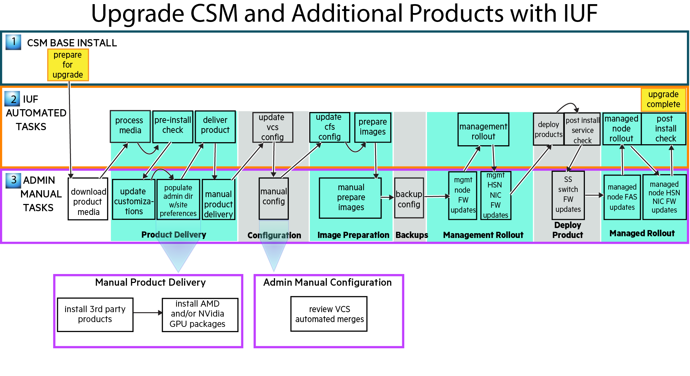

# Upgrade CSM and Additional Products with IUF

**Note: The CSM upgrade to CSM 1.6 is done with IUF.**

This procedure is used when performing an upgrade of Cray System Management (CSM) along with
additional HPE Cray EX software products at the same time. This procedure would be used when
upgrading from one HPC CSM Software Recipe release to another.

This procedure is _not_ used to perform an initial install or upgrade of HPE Cray EX software products
when CSM itself is not being upgraded. See
[Install or Upgrade Additional Products with IUF](install_or_upgrade_additional_products_with_iuf.md) for that procedure.

This procedure streamlines the rollout of new images to management nodes. These images are based
on the new images provided by the CSM product and customized by the additional HPE Cray EX software
products, including the [User Services Software (USS)](../../../glossary.md#user-services-software-uss)
and [Slingshot Host Software (SHS)](../../../glossary.md#slingshot-host-software-shs).

All stages of `iuf` are executed in this option. All of the new product software provided in the
recipe release is deployed and all [management NCNs](../../../glossary.md#management-nodes) and managed
[compute nodes](../../../glossary.md#compute-node-cn) and [application nodes](../../../glossary.md#application-node-an) are
rebooted to new images and [Configuration Framework Service (CFS)](../../../glossary.md#configuration-framework-service-cfs)
configurations. Manual operations are documented for procedures that are not currently managed by IUF.

The upgrade workflow comprises the following procedures. The diagram shows the workflow and
the steps below it provide detailed instructions which must be executed in the order shown.

The CSM upgrade steps are run automatically, either directly through IUF stages or by a hook automatically executed at the beginning or end of an IUF stage.

1. Read the _Important Notes_ section of the
   [CSM 1.5.0 or later to 1.6 Upgrade Process](../../../upgrade/Upgrade_Management_Nodes_and_CSM_Services.md)
   documentation.

1. [Prepare for Upgrade to Next CSM Major Version](https://github.com/Cray-HPE/docs-csm/tree/release/1.5/upgrade/Prepare_for_Upgrade_to_Next_CSM_Major_Version.md)
   in the CSM 1.5 documentation.

1. Prepare for the upgrade procedure and download product media

   1. Follow the IUF [Prepare for the Install or Upgrade](preparation.md) instructions to set
      environment variables used during the upgrade process.

   1. Download the desired HPE product media defined by the HPC CSM Software Recipe to `${MEDIA_DIR}`, which was defined in the previous step.

1. Product delivery

   Follow the IUF [Product Delivery](product_delivery.md) instructions.

   SMA 1.10.15 and later includes an upgraded LDMS that introduces an incompatibility with configuration files used in prior versions.
    - When upgrading from an older SMA version to a version with this new LDMS, the administrator must change the configuration files.
    - A workaround is presented as an Action in the deliver-product stage in the **IUF Stage Details for SMA** section of the _HPE Cray Supercomputing EX System Monitoring Application Installation Guide_.

1. Configuration

   Follow the IUF [Configuration](configuration.md) instructions.

1. Image preparation

   Follow the IUF [Image Preparation](image_preparation.md) instructions.

1. Backup

   Follow the IUF [Backup](backup.md) instructions.

1. Management rollout

   Follow the IUF [Management Rollout](management_rollout.md) instructions.

1. Deploy product

   Follow these IUF instructions in order:

   1. [Deploy Product](deploy_product.md)
   1. [Validate Deployment](validate_deployment.md)
   1. [Perform Slingshot Switch and Management Network Switch Firmware Updates](slingshot_management_network_switch_updates.md)

1. Managed rollout

   Follow the IUF [Managed Rollout](managed_rollout.md) instructions.

The IUF upgrade workflow is now complete. Exit any typescript sessions created during the upgrade
procedure and remove any installation artifacts, if desired.
