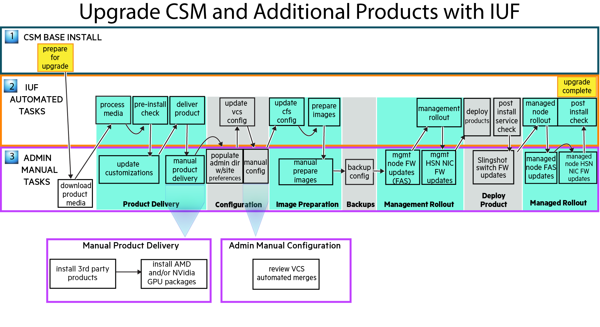

# Upgrade CSM and additional products with IUF

**Note: From CSM 1.6, CSM supports upgrade through IUF. All CSM-specific steps mentioned in [Upgrade CSM manually and additional products with IUF](upgrade_csm_manual_and_additional_products_with_iuf.md) are now part of CSM Upgrade with IUF.**

All stages of `iuf` are executed in this option. All of the new product software provided in the
recipe release is deployed and all [management NCNs](../../../glossary.md#management-nodes) and managed
[compute nodes](../../../glossary.md#compute-node-cn) and [application nodes](../../../glossary.md#application-node-an) are
rebooted to new images and [Configuration Framework Service (CFS)](../../../glossary.md#configuration-framework-service-cfs)
configurations. Manual operations are documented for procedures that are not currently managed by IUF.

The upgrade workflow comprises the following procedures. The diagram shows the workflow and
the steps below it provide detailed instructions which must be executed in the order shown.

1. CSM preparation

   Read the _Important Notes_ section of the
   [CSM 1.5.0 or later to 1.6.0 Upgrade Process](../../../upgrade/Upgrade_Management_Nodes_and_CSM_Services.md)
   documentation and then follow only these CSM instructions in order:

   1. [Prepare for Upgrade](../../../upgrade/prepare_for_upgrade.md)

1. Prepare for the upgrade procedure and download product media

   1. Follow the IUF [Prepare for the install or upgrade](preparation.md) instructions to set
      environment variables used during the upgrade process.

   1. Download the desired HPE product media defined by the HPC CSM Software Recipe to `${MEDIA_DIR}`, which was defined in the previous step.

1. Product delivery

   Follow the IUF [Product delivery](product_delivery.md) instructions.

1. Configuration

   Follow the IUF [Configuration](configuration.md) instructions.

1. Image preparation

   Follow the IUF [Image preparation](image_preparation.md) instructions.

1. Backup

   Follow the IUF [Backup](backup.md) instructions.

1. Management rollout

   Follow the IUF [Management rollout](management_rollout.md) instructions.

1. Deploy product

   Follow these IUF instructions in order:

   1. [Deploy product](deploy_product.md)
   1. [Validate deployment](validate_deployment.md)

1. Managed rollout

   Follow the IUF [Managed rollout](managed_rollout.md) instructions.

The IUF upgrade workflow is now complete. Exit any typescript sessions created during the upgrade
procedure and remove any installation artifacts, if desired.
