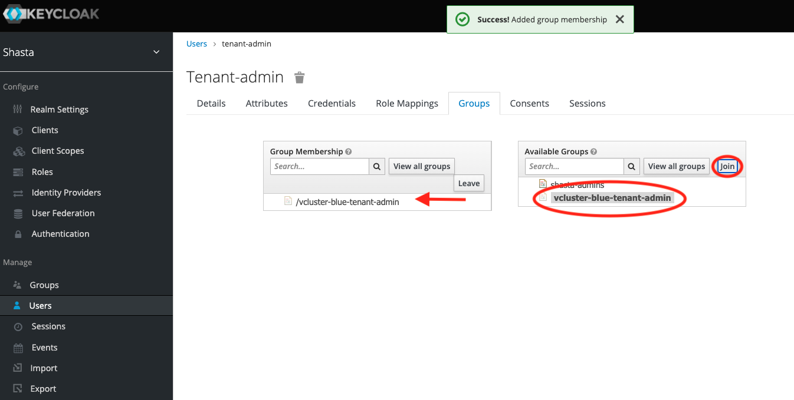
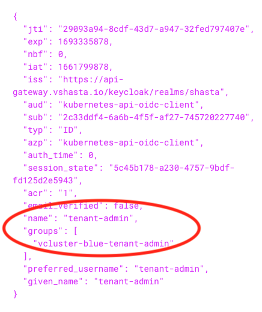

# Tenant Administrator Configuration

- [Tenant Administrator Configuration](#tenant-administrator-configuration)
  - [Overview](#overview)
  - [Cray CLI Integration](#cray-cli-integration)
  - [Kubernetes OIDC API integration](#kubernetes-oidc-api-integration)
  - [Tenant-specific Keycloak groups](#tenant-specific-keycloak-groups)
  - [`Roles` and `Rolebindings`](#roles-and-rolebindings)
  - [Retrieve an OIDC token](#retrieve-an-oidc-token)
  - [Using `kubelogin`](#using-kubelogin)

## Overview

This page describes how to configure a user as a `Tenant Administrator`, allowing that person to perform administrative functions on one or more tenants,
without giving them the same permissions an `Infrastructure Administrator` would have.

## Cray CLI Integration

When using the `cray` CLI for various operations specific to tenant-owned resources (Compute/Application Nodes), the CLI should be scoped to the appropriate tenant when `cray init` is executed.
The CLI supports the optional `--tenant <tenant-name>` argument, which subsequently passes the `cray-tenant-name` value in the header for API requests to the respective service.

## Kubernetes OIDC API integration

When CSM is installed, the Keycloak Helm chart will run a setup script which creates a Keycloak client for OIDC integration.
This is visible in the Keycloak UI (see below). This client has two mappers which will add the user name and groups to an OIDC token generated by Keycloak:


The Kubernetes API server is then configured to reference this client for token and user/group claim validation:

```text
    - --oidc-ca-file=/etc/kubernetes/pki/oidc.pem
    - --oidc-client-id=kubernetes-api-oidc-client
    - --oidc-groups-claim=groups
    - --oidc-issuer-url=https://api-gateway.vshasta.io/keycloak/realms/shasta
    - --oidc-username-claim=name
```

## Tenant-specific Keycloak groups

When a tenant is created, `tapms` will create a Keycloak group specific for that tenant. In the below example, `vcluster-blue` is the name of the tenant, and `tapms` has created a group with the name `vcluster-blue-tenant-admin`:


For the initial release of multi-tenancy, assigning this group to a user is a manual process. Select the desired user and add them as a member of the new group as follows:



Users can be added to more than one tenant using the same procedure.

## `Roles` and `Rolebindings`

Ultimately, the operations the tenant administrator is authorized to perform are controlled by [Kubernetes RBAC](https://kubernetes.io/docs/reference/access-authn-authz/rbac/).
By default when a tenant is created and a Keycloak user is added to a tenant's Keycloak group, that user will have no permissions configured.
The `Infrastructure Administrator` needs to create the desired/appropriate `Roles` and `RoleBindings` for the tenant administrator.
Below is an example of a YAML file which will give a user some basic permissions for both the `tenants` and `vcluster-blue` namespaces:

```yaml
kind: ClusterRole
apiVersion: rbac.authorization.k8s.io/v1beta1
metadata:
  name: tenant-admin-role
rules:
  - apiGroups: [""]
    resources: ["secrets", "namespaces","pods"]
    verbs: ["get", "watch", "list"]
  - apiGroups: ["tapms.hpe.com"]
    resources: ["tenants"]
    verbs: ["patch", "get", "watch", "list"]
---
kind: RoleBinding
apiVersion: rbac.authorization.k8s.io/v1beta1
metadata:
  name: tenant-admin-rb-blue
  namespace: vcluster-blue
roleRef:
  apiGroup: rbac.authorization.k8s.io
  kind: ClusterRole
  name: tenant-admin-role
subjects:
- kind: Group
  name: "vcluster-blue-tenant-admin"
  apiGroup: rbac.authorization.k8s.io
---
kind: RoleBinding
apiVersion: rbac.authorization.k8s.io/v1beta1
metadata:
  name: tenant-admin-tenants-blue-rb
  namespace: tenants
roleRef:
  apiGroup: rbac.authorization.k8s.io
  kind: ClusterRole
  name: tenant-admin-role
subjects:
- kind: Group
  name: "vcluster-blue-tenant-admin"
  apiGroup: rbac.authorization.k8s.io
```

Note the reference to the Keycloak group `vcluster-blue-tenant-admin` in each of the `RoleBinding` sections. Administrators can create the appropriate `rules` in the `ClusterRole` which control the actions the tenant administrator is allowed to perform.

## Retrieve an OIDC token

(`ncn-mw#`) The following command is an example of how to retrieve an OIDC token for interacting directly with the Kubernetes API:

```bash
TOKEN=$(curl -k -s -d scope=openid -d response_type=id_token -d grant_type=password -d client_id=kubernetes-api-oidc-client -d password=<REDACTED> -d username=tenant-admin https://api-gateway.vshasta.io/keycloak/realms/shasta/protocol/openid-connect/token | jq -r '.id_token')
```

Decoding this token will illustrate the `groups` and `name` claims added by Keycloak:



This token can now be used by a the tenant administrator to interact with Kubernetes.

- (`ncn-mw#`) The following is an example of listing pods in the `vcluster-blue` namespace (which was specified in the `ClusterRole` above as allowed):

  ```bash
  curl -k -H "Authorization: Bearer $TOKEN"  https://kubernetes-api.vshasta.io:6443/api/v1/namespaces/vcluster-blue/pods
  ```

  Example output:

  ```text
  {
    "kind": "PodList",
    "apiVersion": "v1",
    "metadata": {
    "resourceVersion": "5860840"
  },
  "items": []
  ```

- (`ncn-mw#`) Note that this token could not be used to list pods in a different namespace (`services` for example):

    ```bash
    curl -k -H "Authorization: Bearer $TOKEN"  https://kubernetes-api.vshasta.io:643/api/v1/namespaces/services/pods
    ```

    Example output:

    ```text
    {
    "kind": "Status",
    "apiVersion": "v1",
    "metadata": {
  
    },
    "status": "Failure",
    "message": "pods is forbidden: User \"https://api-gateway.vshasta.io/keycloak/realms/shasta#tenant-admin\" cannot list resource \"pods\" in API group \"\" in the namespace \"services\"",
    "reason": "Forbidden",
    "details": {
      "kind": "pods"
    },
    "code": 403
    ```

## Using `kubelogin`

CSM deploys a [`kubelogin`](https://github.com/int128/kubelogin) plugin on NCNs as well as a sample Kubernetes configuration file (`/etc/kubernetes/tenant-admin.conf/tenant-admin.conf`)
file, which will allow tenant administrators to log in and perform operations using `kubectl`.

(`ncn-mw#`) Here is an example of using `kubectl` and this configuration file to perform tenant administrator actions:

```bash
KUBECONFIG=/etc/kubernetes/tenant-admin.conf kubectl get pod -n vcluster-blue
```

Example output and typed input:

```text
Username: tenant-admin
Password: <REDACTED>
No resources found in vcluster-blue namespace.
```
