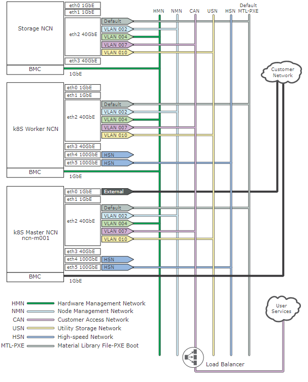

# Connect to the HPE Cray EX Environment

The HPE Cray EX Management Network \(SMNet\) has multiple separate physical and logical links that are used to segregate traffic.

The diagram below shows the available connections from within the SMNet, as well as the connections to the customer network:

There are multiple ways to connect to the HPE Cray EX environment. The various methods are described in the following table:

| Role                            | Description                                                                                           |
|---------------------------------|-------------------------------------------------------------------------------------------------------|
| Administrative                  | External customer network connection to the worker node's hardware management and administrative port |
| Application node access         | External customer network connection to an Application Node                                           |
| Customer Access Network \(CAN\) | Customer connection to the CAN gateway to access the HPE Cray EX CAN                                  |

There are also several ways to physically connect to the nodes on the system. The following table describes the physical connections to the administrative and application nodes:

| Role                | Description                                                                                                      |
|---------------------|------------------------------------------------------------------------------------------------------------------|
| Administrative node | 1GB copper connection made from the customer network that provides administrative access and hardware management |
| Application node    | Different interconnect types are available from the customer network based on customer requirements              |

For more information on connecting to the CAN, see [Connect to the CMN and CAN](customer_accessible_networks/Connect_to_the_CMN_CAN.md).
