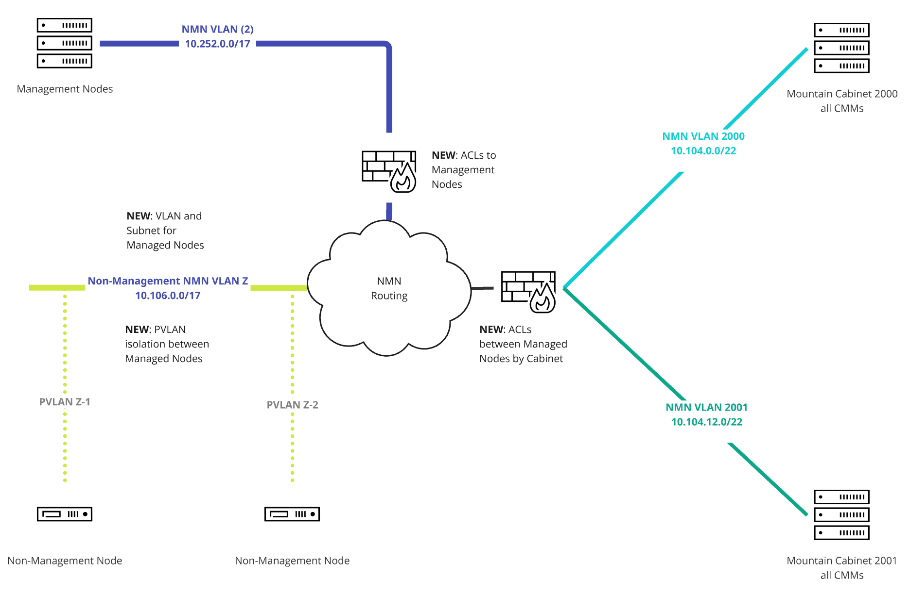

# NMN Isolation

## NMN Isolation Overview

NMN Isolation on the management network limits traffic on the Node Management Network to only types and directions required for the operation of CSM and user workloads.  **NMN Isolation is only available on systems with Aruba switches**. The feature consists of three main sub-features:

- ACLs allowing access to only required CSM services from managed nodes (compute, UAN, etc..)
- ACLs preventing Mountain compute cabinets (EX) from communicating with each other
- PVLAN to prevent River managed nodes (compute, UAN, etc...) from communicating with each other

NMN Isolation alleviates the need for most host-based firewalls on management nodes (managers, workers, and storage NCN). The PVLAN sub-feature also removes the need for host-based firewalls on UAN (and other River managed nodes) by limiting access over the NMN.

NMN Isolation is available in the following commands of CANU via the `--enable-nmn-isolation --enable-pvlan` options:

- `canu generate switch config` generates a configuration file for a _single switch_ on the management network
- `canu generate network config` generates all configuration files for _all switches_ on the management network
- `canu validate switch config` compares the running configuration of a _single switch_ with a configuration generated by CANU - a configuration diff
- `canu validate network config` provides a summary comparison between generated and running configurations for _all switches_ in the management network
- `canu test` runs a full diagnostic on all management network switches, including tests for NMN Isolation ACLs

Details of allowed services and the network changes involved in the NMN Isolation feature can be found in [NMN Isolation Details](#nmn-isolation-details).

## Enabling NMN Isolation

A network outage window is required to configure NMN Isolation on a system.  NMN Isolation changes are decoupled from other changes to CSM and the network outage window could be prior or after the CSM upgrade.  However, if IPv6 is being enabled as part of a system upgrade, enabling NMN Isolation at the same time as IPv6, and prior to the CSM upgrade is required to avoid multiple network outage windows.

### 1. Preparation

All preparation steps can be performed prior to an established window.  Preparation steps do not change the running network configurations.

1. (`ncn-m#`) Gather a list of switches.

    - For an upgrade the list of switches can be found from the command `grep sw- /etc/hosts`
    - For a fresh installation the switches can be found in the latest system SHCD spreadsheet

2. Determine if the system is a TDS or Full system to be used in CANU commands.

    - If there are leaf switches the system is `Full`
    - Otherwise, the system is a `TDS`

3. (`ncn-m#`) Ensure the CANU version is `2.0.2` or greater, otherwise [upgrade to the latest version](management_network/canu_install_update.md)
.

    ```bash
    canu --version
    ```

4. (`ncn-m#`) Retrieve or generate an up-to-date cabling topology file (CCJ). Accuracy at this step is critical otherwise nodes may be misconfigured or entirely disconnected from the network.

    - A CCJ file from a previous install or upgrade may be used as long as there have been no node additions, removals or cabling changes to the system.
    - [Generate a CCJ file from the latest SHCD for the system](management_network/validate_shcd.md) including the `--json --out ccj.json` option after full SHCD validation has taken place.

5. Retrieve any switch [custom configurations](management_network/canu/custom_config.md) file
    used in previous installations or upgrades. This file includes any site network
    customizations, including uplinks to site networks, SNMP configurations, or port
    configurations that are not generated as part of CANU.

6. (`ncn-m#`) Retrieve the SLS file from the system in JSON format. If IPv6 features are to be enabled on the system, then ensure SLS has been updated with IPv6 data prior to retrieving SLS.

    - For an upgrade this can be retrieved via `cray sls dumpstate list --format json > sls.json`
    - For a new installation this is output from `csi config init` in the file `sls_input_file.json`

7. (`ncn-m#`) For a system upgrade, analyze the current network state.

    ```bash
    time canu test --sls-file sls.json 
    ```

    - Prior to configuration of NMN Isolation, expect the test `SERVICES ACL TEST` to FAIL
    - All other tests should PASS, or be reviewed by the site network engineer
    - NOTE: Log the running time of the command if it's over 10 minutes

8. (`ncn-m#`) For a system upgrade, back up the _running switch configurations_. Note that the backup will have passwords removed unless the `--no-sanitize` option is used. Storing sensitive data locally should be carefully considered based on site policy.  Not storing passwords in the switch configuration means recovery procedures will require extra steps to reset and reconfigure passwords.

    ```bash
    canu backup network --sls-file sls.json --folder backup
    ```

9.  (`ncn-m#`) For new installations and upgrades, generate switch configurations using previously collected information and files, and enable NMN Isolation.

    ```bash
    canu generate network config --csm 1.7 -a tds --ccj ccj.json --sls-file sls.json --custom-config custom_config.yaml --folder generated  --enable-nmn-isolation --nmn-pvlan
    ```

    - The command flags `--enable-nmn-isolation` and `--nmn-pvlan` enable all three NMN isolation features described previously.
    - Details of the changes to the configuration files and optional input parameters to `--nmn-pvlan` are describe in [NMN Isolation Details](#nmn-isolation-details)
    - Note: While the CANU  will typically not overwrite password or SNMP configurations that are applied to the management switches, there are certain cases where configurations can be over-written or lost. To persist the password settings settings, see [CANU Custom Configuration](management_network/canu/custom_config.md).

10. (`ncn-m#`) For an upgrade, analyze the changes required to go from the running configurations to the new configuration. The switch `sw-spine-001` is used in the command below, but the command must be run and analysis performed for each switch on the system.  The list of switches was collected previously.

    ```bash
    canu validate switch config --vendor aruba --running backup/sw-spine-001.cfg --generated generated/sw-spine-001.cfg
    ```

    - Lines in red will be removed from the running configuration.  Lines in green will be added.  Both removal and additions will change the switch configuration and will impact system operation.
    - Details on expected changes can be found below in [NMN Isolation Details](#nmn-isolation-details).  These include the following
      - Addition of `object group` and the ACL named `MANAGED_NODE_ISOLATION` for limiting access of managed nodes to only required CSM services.
      - In systems with Mountain compute cabinets (EX), addition of ACLs to the existing ACL `nmn-hmn`
      - Creation of a new VLAN, `502` unless overridden, for use in PVLAN for UAN isolation
    - It is critical to understand the changes being applied to the network.  Any questions should be answered by the site network engineer.

### 2. Deployment

Deploying the network configuration should be completed in a network outage window.  This means no running user workloads, and the network upgrade not running concurrently with a CSM upgrade.

Two means of upgrade are available:

- Out-of-band where a console cable, USB or otherwise, is physically connected to each switch during update.  This requires an personnel on the data center floor, but prevents a misconfiguration from locking out the administrator applying the switch changes.
- In-band upgrade where administrative access to one switch is through other switches.  This method is faster, but can result in a switch lockout and require a console connection from the data center floor.

The following procedure can be used in either in-band or out-of-band upgrades, and minimizes the risks of misconfiguration and lockout by using Aruba checkpoints and configuration rollbacks.

Configurations should be deployed in the following order, starting from the periphery of the network and move inward:

- `sw-leaf-bmc` switches, then
- `sw-cdu` switch pairs (`001` and `002` are a pair, `003` and `004` are a pair, etc...)
- `sw-leaf` switch pairs, being particularly careful to the pair connected to `ncn-m001` where the upgrade is being performed.
- `sw-spine` switch pairs

Repeat the following procedure for every switch (pair) in the network. The example procedure below uses `sw-spine-001`, but use the procedure for each switch using the order described previously.

1. (`ncn-m#`) Copy the generated switch configuration to the local laptop or desktop paste buffer.
   - As an _example_ `cat generated/sw-spine-001.cfg` in the current terminal window
   - Scroll to the top of the output
   - Select the the configuration and `Ctrl+C` in Windows or `Cmd+C` in MacOS
   - NOTE: Some configurations may require the configuration to be copy-and-pasted in sections

2. (`ncn-m#`) Log in to the switch. As an example:

    ```bash
    ssh admin@sw-spine-001
    ```

3. (`ncn-m#`) Save the running configuration to the startup configuration. Differences in the running configuration and startup configuration would have been noted as a `FAIL` in the switch's `canu test` output for the test `Running-Config Different from Startup-Config`.

    ```console
    copy running-config startup-config
    ```

4. (`ncn-m#`) Enter switch configuration mode, allow new configurations without questions and set up a safety net with a rollback to the working running configuration in 15 minutes. NOTE: Increase the 15 minute timeout if the preparation `canu test` was over 10 minutes - use the test runtime, plus 10 minutes.

    ```console
    configure terminal
    auto-confirm
    checkpoint auto 15
    ```

5. (`ncn-m#`) Paste in the new generated switch configuration with `Ctrl+V` for Windows or `Cmd+V` for MacOS.

6. (`ncn-m#`) Open a new terminal window and test the switch runtime.  Do not exit the terminal window logged into the switch.

    ```bash
    canu test --sls-file sls.json 
    ```

    - Review the output of the test for the switch - all tests should PASS
    - Should `canu test` result in exceptions while running or the switch not be accessible, wait for the rollback timeout period of 15 minutes, contact the network administrator for detailed troubleshooting and resolve issues before moving on to other switches on the system.

7. (`ncn-m#`) If `canu test` succeeds, confirm the changes and save the configuration.

    ```console
    checkpoint auto confirm
    copy running-config startup-config
    ```

Repeat the procedure for each switch on the system using the previously described ordering.

## NMN Isolation Details

As noted previously, NMN Isolation consists of three sub-features.  These are listed and shown in the diagram below.

- New ACLs on the spine switches that limit the access of managed nodes (compute, UAN, etc...) to only the required CSM services on the management nodes
- New ACLs on CDU switches that prevent Mountain compute nodes from communicating with each other
- New use of PVLAN on the NMN to prevent Application nodes (UAN) from communicating with each other



Each component is described in more detail below.

### Management Node Access Controls

Managed nodes are limited to access only CSM services on the management nodes. The ACLs of this sub-feature are named `MANAGED_NODE_ISOLATION` and replace the existing `nmn-hmn` ACL on the NMN.  The list of allowed services is as follows:

```text
    10 comment Permit Unrestricted NCN to NCN Communication
    20 permit any NCN NCN count
    30 comment Permit DHCP traffic
    40 permit udp any range 67 68 any count
    50 comment Permit node to request TFTP file
    60 permit udp TFTP_SERVERS MANAGED_NODES count
    70 permit udp MANAGED_NODES TFTP_SERVERS count
    80 comment Permit node to perform DNS lookups
    90 permit udp any eq dns any count
    100 permit tcp any eq dns any count
    110 permit udp MANAGED_NODES NMN_K8S_SERVICE eq dns count
    120 permit udp MANAGED_NODES NCN group NMN_UDP_SERVICES count
    130 comment Permit NTP replies from NCNs
    140 permit udp NCN eq ntp MANAGED_NODES count
    150 comment Permit access to NMN_TCP_SERVICES
    160 permit tcp MANAGED_NODES NMN_K8S_SERVICE group NMN_TCP_SERVICES count
    170 permit tcp NMN_K8S_SERVICE MANAGED_NODES group NMN_TCP_SERVICES count
    180 permit tcp MANAGED_NODES NCN group NMN_TCP_SERVICES count
    190 permit tcp NCN MANAGED_NODES group NMN_TCP_SERVICES count
    200 comment Allow SSH from NCNs to Managed Nodes
    210 permit tcp NCN MANAGED_NODES eq ssh count
    220 permit tcp MANAGED_NODES eq ssh NCN count
    230 comment Allow ping
    240 permit icmp any any count
    250 comment Permit OSPF from switches
    260 permit ospf ALL_SWITCHES any count
    270 comment Permit BGP (port 179) between spines and NCNs
    280 permit tcp SPINE_SWITCHES NCN eq bgp count
    290 permit tcp NCN SPINE_SWITCHES eq bgp count
    300 permit any NMN_K8S_SERVICE NMN_K8S_SERVICE count
    310 permit any NMN_K8S_SERVICE NCN count
    320 permit any NCN NMN_K8S_SERVICE count
    330 comment Permit VRRP from NCNs
    340 permit 112 NCN 224.0.0.18 count
    350 comment --- FINAL CATCH-ALL DENY ---
    360 deny any any any count
```

The new ACL employs a deny-by-default methodology and applies to specific sets of of IPs and subnets defined in multiple `object-group` lists like `NCN` or `NMN_K8S_SERVICE` shown above. The new ACL is applied on both the NMN `vlan 2` and the Managed node `pvlan` (502 by default).

### Mountain Cabinet Node Access Controls

Mountain compute nodes are denied access to each other via new ACLs within the existing `nmn-hmn` ACL and are generated dynamically by CANU for all Mountain cabinets in the SLS configuration file.  These ACLs are applied on CDU switches to most directly control traffic, but also on spine and leaf switches.

### River Managed Node Access Controls

To limit access of managed nodes on the NMN (UAN) from each other, Private VLAN was implemented on the NMN.  By default `vlan 502` is used, but a custom VLAN not used anywhere else on the system can be used to override this default with the `--nmn-pvlan <vlan>` option in CANU.  PVLAN limits access between UAN without requiring larger and more impacting subnetting of the NMN and addition of new ACLs.  A PVLAN in `isolated` mode is a lightweight means of separation for UAN.
