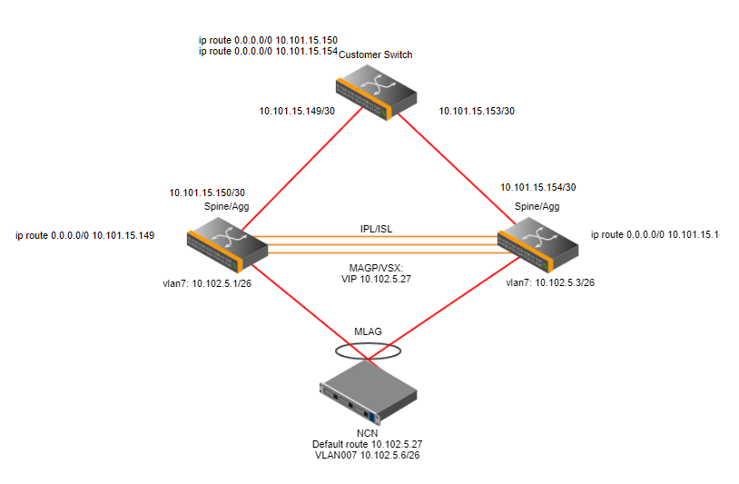

## CAN with Dual-Spine Configuration

The Customer Access Network \(CAN\) needs to be connected to both spines in a dual-spine configuration so that each spine can access the outside network. However, the NCNs should only have one default gateway. Therefore, the multi-active gateway protocol \(MAGP\) on the Mellanox spines can be used to create a virtual router gateway IP address that can direct to either of the spines, depending on the state of the spines. The Virtual Switching Extension \(VSX\) for Aruba spines serve the same purpose.

For more information:

-   Mellanox: [https://community.mellanox.com/s/article/howto-configure-magp-on-mellanox-switches](https://community.mellanox.com/s/article/howto-configure-magp-on-mellanox-switches)
-   Aruba: [https://www.arubanetworks.com/techdocs/AOS-CX/10.04/HTML/5200-6728/index.html\#book.html](https://www.arubanetworks.com/techdocs/AOS-CX/10.04/HTML/5200-6728/index.html#book.html)



The following is an example of the point-to-point configuration on the spine switches. The IP address should be replaced with the IP address chosen by the customer that matches the switch configuration.

-   Mellanox:

    ```screen
    interface ethernet 1/11 speed auto force
    interface ethernet 1/11 description to-can
    interface ethernet 1/11 no switchport force
    interface ethernet 1/11 ip address 10.101.15.150/30 primary
    ```

-   Aruba:

    ```screen
    interface 1/1/36
        no shutdown
        description to-can
        ip address 10.101.15.150/30
        exit
    ```


There must then be two routes on the customer's switch directing traffic for the `customer_access_network` subnet to the endpoint on the spine switch. The following is an example of the route configuration on the customer switch.

There must be a default route on each spine switch that will direct traffic that does not match other routes to the endpoint on the customer switch. The following examples are for the route configuration on sw-spine-001.

-   Mellanox:

    ```screen
    ip route vrf default 0.0.0.0/0 10.101.15.149
    ```

-   Aruba:

    ```screen
    ip route 0.0.0.0/0 10.101.15.149
    ```


The spine switch must also have the `customer_access_gateway` IP address assigned to the `vlan 7` interface on the switch. This provides a gateway for the default route on the NCNs and UANs, as well as a direct route to the `customer_access_network` from the spine switch. For example:

-   Mellanox:

    ```screen
    interface vlan 7 ip address 10.101.8.2/26 primary
    ```

-   Aruba:

    ```screen
    sw-spine-002(config)# int vlan 7
    sw-spine-002(config-if-vlan)# ip address 10.102.11.3/24
    ```


### Distribution Spine/Switch Connection

The connection between the distribution switch and the spines require two separate uplinks from the spine switch to the distribution switch. Two static routes need to be created on the distribution switch to route the CAN subnet to each of the spine switches. These routes will have equal cost \(ECMP\) to split the load across the two spines and provide redundancy if one of the spines should go down.

```screen
interface 1/1/41
    no shutdown
    description WASP spine-001 1/11
    ip address 10.101.15.149/30
interface 1/1/42
    no shutdown
    description WASP spine-002 1/11
    ip address 10.101.15.153/30


ip route 10.102.5/26 10.101.15.150
ip route 10.102.5/26 10.101.15.154
```

### NCN/Spine Connection

Each of the NCNs has a connection to each spine. These ports on the NCN will be configured as bonded. The spine ports on the other end of these connections will be configured as a multi-chassis link aggregation group \(MLAG\) port channel.

The NCN will also need to configure a default route pointing to a gateway IP address on the CAN. In a dual-spine configuration, this will continue to use the IP address specified in the `can-gateway` value. The main difference in the dual-spine configuration is that this IP address will now be a virtual IP address on the spine switches rather than the `vlan 7` IP address. This virtual IP address is part of MAGP configuration. Each spine will have an IP address on its `vlan 7` interface that is not the `can-gateway` IP address.

Then the following MAGP configuration will be added \(same configuration on each of the spines\):

-   virtual-router address = can-gateway
-   virtual-router mac-address = 00:00:5E:00:01:07.
    -   The MAC used here follows [RFC 3768 Section 7.3](https://tools.ietf.org/html/rfc3768#section-7.3) in the external documentation.


MAGP on the spine:

```screen
   protocol magp
   interface vlan 7 magp 7
   interface vlan 7 magp 7 ip virtual-router address 10.102.5.57
   interface vlan 7 magp 7 ip virtual-router mac-address 00:00:5E:00:01:07
```

Vlan 7 on the spine:

```screen
   interface vlan 7 ip address 10.102.5.1/26 primary
```

In the example above, spine-001 is showed.

Default route on the NCN \(configured by the can-network role\):

```screen
ncn-m001# ip route
default via 10.102.5.27 dev vlan007
```


