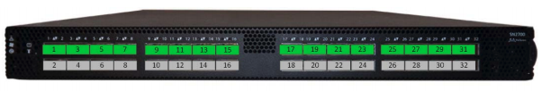
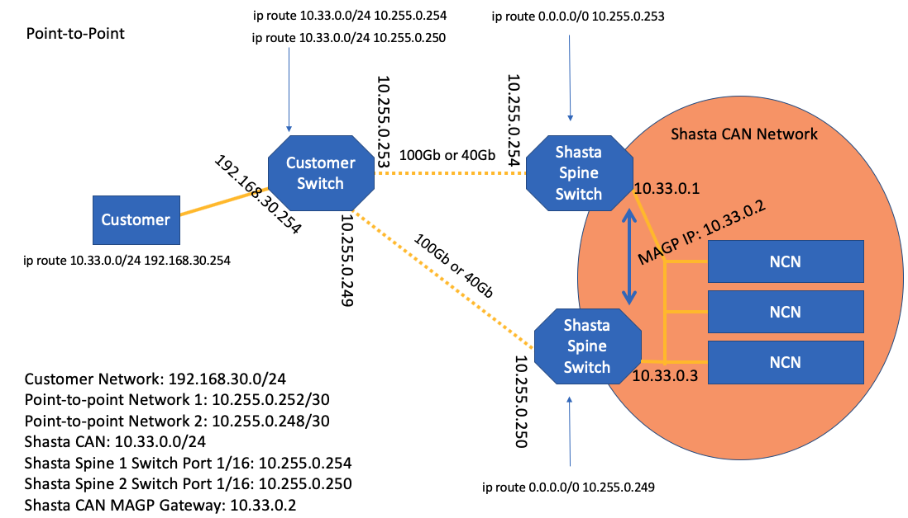
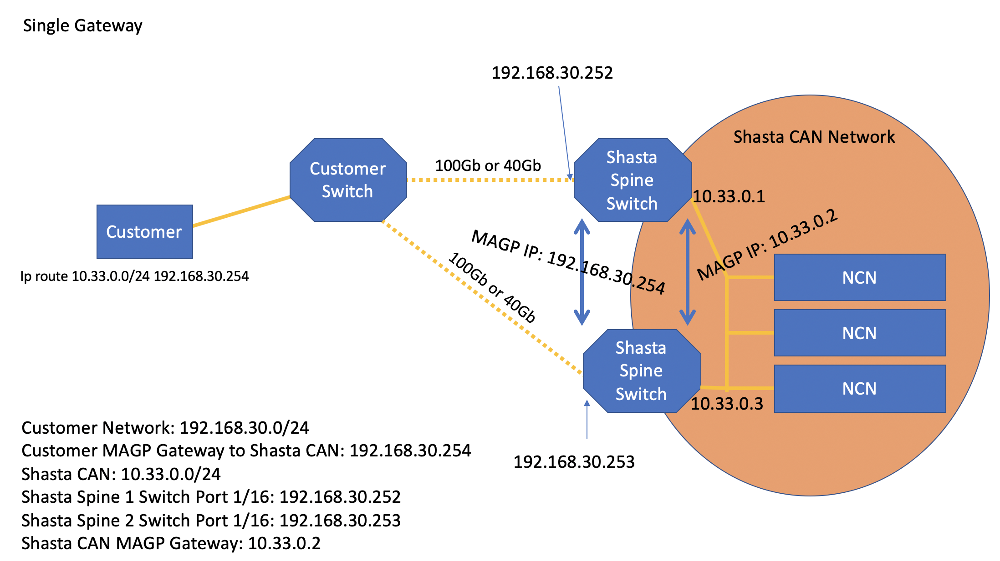

# Connect to the CAN

How to connect to the CAN physically and via layer 3.

There are multiple ways to connect to the Customer Access Network \(CAN\), both physically and via a layer 3 connection.

### Physical Connection to the CAN

The physical connection to the CAN is made via the load balancer or the spine switches. The uplink connection from the system to the customer network is achieved by using the highest numbered port\(s\). Customer can select a single uplink port or multiple uplink ports.

In the example below, a Mellanox SN2700 with a single uplink connection is being used. The cable would connect to port 32 as shown in the diagram below:

### Layer 3 Connection to the CAN

The CAN clients in the system require a routing topology that is setup to route traffic to the customer network. This can be done in a variety of ways and will vary depending on the system setup and configuration. The different options for connecting to the CAN from layer 3 are described below.

**Option 1: Point-to-Point**

This option provides a point-to-point routing topology between the customer switch and the HPE Cray EX TOR Spine Switch. See [CAN with Dual-Spine Configuration](Dual_Spine_Configuration.md) for more information on using this topology for a dual-spine configuration.

The diagram below shows how the point-to-point routing topology works:

**Option 2: Single Gateway**

The single gateway options requires the customer to provide an IP address that is on a `/24` network. This IP address will act as the gateway for traffic bound to the HPE Cray EX CAN.

For example, a customer could use the 192.168.30.0/24 network to connect via the HPE Cray EX CAN uplink connection. The customer also needs to provide an IP address on this network, such as 192.168.30.253. This IP address will be assigned to the uplink port on the HPE Cray EX TOR Spine Switch.

For a dual-spine configuration, the admin would need to extended the customer network to both switches using one IP address for each switch. After extending the network, two equal routes need to be configured. The spine switches are configured to support multi-chassis link aggregation group \(MLAG\) from NCNs and UANs. These nodes are configured for bonding mode layer 2 and layer 3. See [CAN with Dual-Spine Configuration](Dual_Spine_Configuration.md) for more information.

The diagram below shows how the connection is established:

**Option 3: Customer Specific**

The system can be setup using other customer requirements. In order to do so, the following information will be needed:

|Item|Description|
|----|-----------|
|Customer network IP address|Specifies an IP address on the customer network that is routable to the customer network gateway|
|CAN IP address space|Specifies a dedicated network \(typically `/24`\) that is routable from the customer network to be used for the CAN|
|System name|Specifies the system name to be used and configured|
|Domain namespace extension|Specifies the domain extension to be used; for example, HPE Cray EX.customer.com|
|Customer network IP address for `ncn-m001`|Specifies an IP address for administrative access on the customer network for `ncn-m001`|
|\(Optional\) BMC customer network IP address for `ncn-m001`|Specifies an IP address for BMC access on the customer network for `ncn-m001`|

