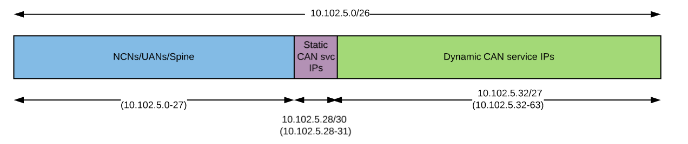
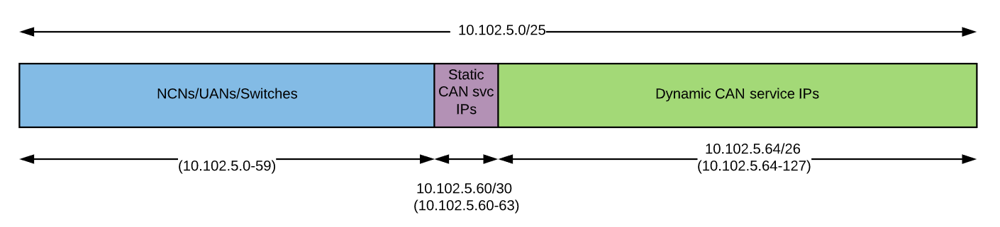

# Customer Access Network

The Customer Access Network \(CAN\) provides access from outside the customer network to services, non-compute nodes \(NCNs\), and User Access Nodes \(UANs\) in the system. This allows for the following:

- Clients outside of the system:
  - Log in to each of the NCNs and UANs.
  - Access web UIs within the system \(e.g. Prometheus, Grafana, and more\).
  - Access the Rest APIs within the system.
  - Access a DNS server within the system for resolution of names for the webUI and REST API services.
  - Run Cray CLI commands from outside the system.
  - Access the User Access Instances \(UAI\).
- NCNs and UANs to access systems outside the cluster \(e.g. LDAP, license servers, and more\).
- Services within the cluster to access systems outside the cluster.

These nodes and services need an IP address that routes to the customer's network in order to be accessed from outside the network.

### Implications if CAN is not Configured

- No direct access to the NCNs other than `ncn-m001`. Will need to hop through `ncn-m001` to get to the rest of the NCNs.
- No direct access to the UANs unless the UAN has a direct connection to the customer network.
- NCNs other than `ncn-m001` do not have access to services outside of the system \(e.g. LDAP, license servers, and more\).
  - These nodes will not have an interface on any network with access outside of the HPE Cray EX system.
  - These nodes will not have a default route.
  - This includes access to any of the externally exposed services from these nodes.
- Pods running on NCNs other than `ncn-m001` will not have access to services outside of the system.
- No access to externally exposed services. See [Externally Exposed Services](Externally_Exposed_Services.md) for more information.

### CAN Subnets

IP addresses are allocated from a single IP subnet that is configured as the `can-cidr` value in the `csi config init` input. This subnet is further divided into three smaller subnets:

- Subnet for NCNs, UANs, and switches.
- Subnet for the MetalLB static pool \(can-static-pool\).
  - This is used for services that need to be pinned to the same IP address. For example, the external DNS service that needs to be configured in the upstream DNS server.
  - This subnet currently needs only a few IP addresses.
- Subnet for the MetalLB dynamic pool \(can-dynamic-pool\).
  - This is the largest subnet because it is used for most of the other services, which includes UAIs. These IP addresses can be allocated differently across deployments because these services are accessed by DNS name rather than by IP.
  - The size of this subnet depends on how many UAI and Image Management Service \(IMS\) pods are needed at a given time because these IP addresses will come out of this subnet.

The minimum size for the CAN subnet is /26. The CAN /26 subnet allows for the following:

- 27 IP addresses for the NCNs, UANs, and Switches.
- 4 IP addresses for the CAN static service IP addresses.
- 32 IP addresses for the rest of the external CAN services.

    The 32 service IP addresses will be used for the 5 standard customer-access service IP addresses and the remaining 27 IP addresses are for UAI and/or IMS services.




If there are more than 27 IP addresses needed for NCNs, UANs, and switches, and/or more than 32 IP addresses needed for the external CAN services, then the CAN subnet will need to be larger than a /26.



### Customer Variables

The following variables are defined in the `csi config init` input. This example uses values for the /26 layout described above. The `can-gateway` value should be an IP address at the end of the range for NCNs, UANs, and switches. For example, the IP address would be 10.102.5.27 using the figure shown above.

```
linux# csi config init
```

Example output:

```
[...]

     --can-cidr 10.102.5.0/26
     --can-gateway  10.102.5.27
     --can-static-pool 10.102.5.28/30
     --can-dynamic-pool 10.102.5.32/27
     --can-external-dns 10.102.5.29
     --system-name testsystem
     --site-domain example.com

[...]
```

