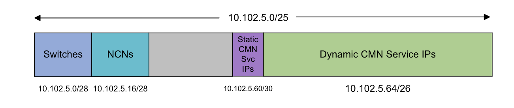
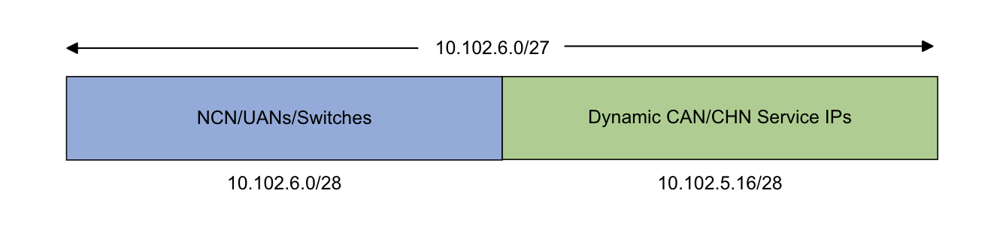

# Customer Accessible Networks

There are generally two networks accessible by devices outside of the CSM cluster.  One network is for administrators managing the cluster and one is for users accessing user services provided by the cluster.

## Customer Management Network

The Customer Management Network \(CMN\) provides access from outside the customer network to administrative services and non-compute nodes \(NCNs\). This allows for the following:

- Administrator clients outside of the system:
  - Log in to NCNs.
  - Access administrative web UIs within the system \(e.g. Prometheus, Grafana, and more\).
  - Access the administrative REST APIs.
  - Access a DNS server within the system for resolution of names for the webUI and REST API services.
  - Run administrative Cray CLI commands from outside the system.
- NCNs to access systems outside the cluster \(e.g. LDAP, license servers, and more\).
- Services within the cluster to access systems outside the cluster.

These nodes and services need an IP address that routes to the customer's network in order to be accessed from outside the network.

### Implications if CMN is not Configured

- No direct access to the NCNs other than `ncn-m001`. Will need to hop through `ncn-m001` to get to the rest of the NCNs.
- No direct access to the UANs unless the UAN has a direct connection to the customer network.
- NCNs other than `ncn-m001` do not have access to services outside of the system \(e.g. LDAP, license servers, and more\).
  - These nodes will not have an interface on any network with access outside of the HPE Cray EX system.
  - These nodes will not have a default route.
  - This includes access to any of the externally exposed services from these nodes.
- Pods running on NCNs other than `ncn-m001` will not have access to services outside of the system.
- No access to externally exposed services. See [Externally Exposed Services](Externally_Exposed_Services.md) for more information.

## Customer User Networks (CAN/CHN)

The CSM cluster can be configured with a user network that uses either the management network or the high-speed network.  The cluster cannot have both CAN and CHN.

The Customer Access Network (CAN) will use a VLAN on the management switches.   The Customer High-Speed Network (CHN) will use the high-speed network.

The user network will allow for the following:

- User clients outside of the system:
  - Log in to UANs.
  - Access user web UIs within the system \(e.g. Capsules\).
  - Access the user REST APIs.
  - Run user Cray CLI commands from outside the system.
  - Access the User Access Instances \(UAI\).
- UANs to access systems outside the cluster \(e.g. LDAP, license servers, and more\).

## Subnet Configuration

### CMN Subnets

CMN IP addresses are allocated from a single IP subnet that is configured as the `cmn-cidr` value in the `csi config init` input. This subnet is further divided into three smaller subnets:

- Subnet for NCNs and switches.
- Subnet for the MetalLB static pool \(`cmn-static-pool`\).
  - This is used for services that need to be pinned to the same IP address. For example, the PowerDNS service that needs to be configured in the upstream DNS server.
  - This subnet currently needs only a few IP addresses.
- Subnet for the MetalLB dynamic pool \(`cmn-dynamic-pool`\).
  - This is used for the rest of the externally exposed services and are allocated dynamically. These IP addresses can be allocated differently across deployments because these services are accessed by DNS name rather than by IP.

The minimum size for the CMN subnet is /25. The CMN /25 subnet allows for the following:

- 16 IP addresses for NCNs
- 16 IP Addresses for Switches.
- 4 IP addresses for the CMN static service IP addresses.
- 64 IP addresses for the rest of the external CMN services.

    The 64 service IP addresses will be used for the 6 standard CMN service IP addresses and the remaining 58 IP addresses are for IMS services.



If there are more IP addresses needed for any of those sections, then the CMN subnet will need to be larger than a /25.

### CAN/CHN Subnets

CAN or CHN IP addresses are allocated from a single IP subnet that is configured as the `can-cidr` or `chn-cidr` value in the `csi config init` input. Only one of these two networks should be defined. The user
network subnet is further divided into two smaller subnets:

- Subnet for NCNs, UANs, and switches.
- Subnet for the MetalLB dynamic pool \(`can-dynamic-pool`\) or \(`chn-dynamic-pool`\).
  - This is used for all of the externally exposed services and are allocated dynamically. These IP addresses can be allocated differently across deployments because these services are accessed by DNS name rather than by IP.

The minimum size for the CAN or CHN subnet is /27. The /27 subnet allows for the following:

- 16 IP addresses for NCNs, UANs, and Switches
- 16 IP addresses for the external CAN or CHN services.

    The 16 service IP addresses will be used for the 2 standard CAN/CHN service IP addresses and the remaining 14 IP addresses are for UAI services.



If there are more than 16 IP addresses needed for either of those sections, then the CAN/CHN subnet will need to be larger than a /27.

### Customer Variables

The following variables are defined in the `csi config init` input. These examples use values for the layouts described above. `cmn-external-dns` must be an IP within the `cmn-static-pool` CIDR.

`bican-user-network-name` specifies whether the user network is on the management network (CAN) or the high-speed network (CHN).

```bash
csi config init
```

Example output with CAN:

```text
[...]

     --system-name testsystem
     --site-domain example.com
     --bican-user-network-name CAN
     --cmn-cidr 10.102.5.0/25
     --cmn-gateway 10.102.5.1
     --cmn-static-pool 10.102.5.60/30
     --cmn-dynamic-pool 10.102.5.64/26
     --cmn-external-dns 10.102.5.61
     --can-cidr 10.102.6.0/27
     --can-gateway 10.102.6.1
     --can-dynamic-pool 10.102.6.16/28

[...]
```

Example output with CHN:

```text
[...]

     --system-name testsystem
     --site-domain example.com
     --bican-user-network-name CHN
     --cmn-cidr 10.102.5.0/25
     --cmn-gateway  10.102.5.1
     --cmn-static-pool 10.102.5.60/30
     --cmn-dynamic-pool 10.102.5.64/26
     --cmn-external-dns 10.102.5.61
     --chn-cidr 10.102.6.0/27
     --chn-gateway  10.102.6.1
     --chn-dynamic-pool 10.102.6.16/28

[...]
```
