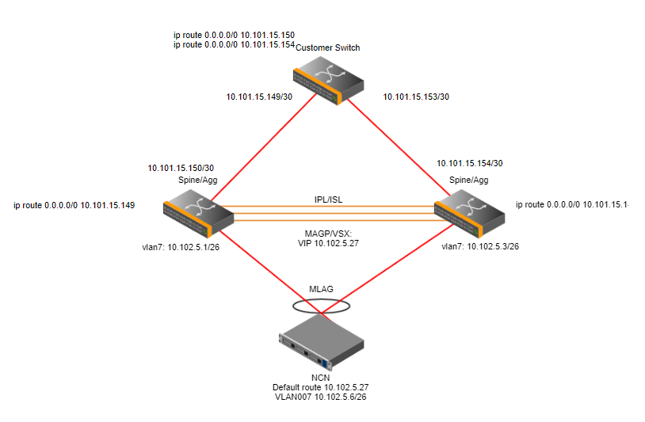

# CAN/CMN with Dual-Spine Configuration

The Customer Access Network \(CAN\) and Customer Management Network \(CMN\) needs to be connected to both spines in a dual-spine configuration so that each spine can access the outside network. However, the NCNs
should only have one default gateway. Therefore, the multi-active gateway protocol \(MAGP\) on the Mellanox spines can be used to create a virtual router gateway IP address that can direct to either of the spines,
depending on the state of the spines. The Virtual Switching Extension \(VSX\) for Aruba spines serve the same purpose.



The following is an example of the point-to-point configuration on the spine switches. The IP address should be replaced with the IP address chosen by the customer that matches the switch configuration.

In CSM 1.2 the Customer VRF is introduced, this requires the interface that is connected to the site to be configured to use this VRF.

- Mellanox:

    ```screen
    interface ethernet 1/11 speed auto force
    interface ethernet 1/11 description to-can
    interface ethernet 1/11 no switchport force
    interface ethernet 1/11 vrf forwarding Customer
    interface ethernet 1/11 ip address 10.101.15.150/30 primary
    ```

- Aruba:

    ```screen
    interface 1/1/36
        no shutdown
        vrf attach Customer
        description to-can
        ip address 10.101.15.150/30
        exit
    ```

There must then be two routes on the customer's switch directing traffic for the `customer_access_network` and `customer_management_network` subnet to the endpoint on the spine switch. The following is an example
of the route configuration on the customer switch.

```text
ip route 10.103.9.0/25 10.101.15.150
ip route 10.103.9.0/25 10.101.15.152
```

The next hop IP address `10.101.15.150` would be the interface IP address on the Spine switch.

There must be a default route on each spine switch that will direct traffic that does not match other routes to the endpoint on the customer switch. The following examples are for the route configuration on `sw-spine-001`.

- Mellanox:

    ```screen
    ip route vrf Customer 0.0.0.0/0 10.101.15.149
    ```

- Aruba:

    ```screen
    ip route 0.0.0.0/0 10.101.15.149 vrf Customer
    ```

## Distribution/Site Spine Switch Connection

The connection between the distribution/site switch and the spines require two separate uplinks from the spine switch to the distribution switch. Two static routes need to be created on the distribution switch to
route the CAN subnet to each of the spine switches. These routes will have equal cost \(ECMP\) to split the load across the two spines and provide redundancy if one of the spines should go down.

Example

```screen
interface 1/1/41
    no shutdown
    description WASP spine-001 1/11
    ip address 10.101.15.149/30
interface 1/1/42
    no shutdown
    description WASP spine-002 1/11
    ip address 10.101.15.153/30

ip route 10.102.5/26 10.101.15.150
ip route 10.102.5/26 10.101.15.154
```
