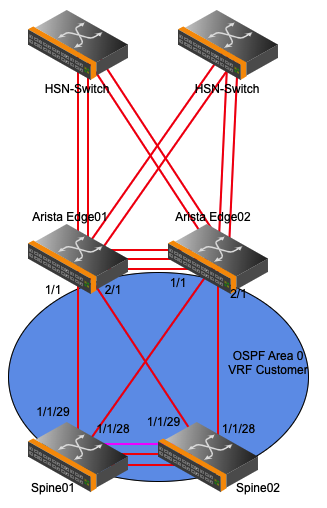

# BI-CAN Aruba/Arista Configuration

This is an example configuration of how to connect two Aruba spine switches to two Arista switches. This example is from a running system utilizing the bifurcated CAN feature offered in CSM 1.2.

Summary:

- Two Aruba 8325 switches running in a VSX cluster.
- Two Arista 7060CX2-32S switches running MLAG.
- The Arista switches are connected to the Slingshot/HSN network via static MLAG.
- The Aruba Spine switches are connected to the Arista switches with point-to-point OSPF links.
- The Arista Edge switches are redistributing the default route to the Aruba switches via OSPF. This allows the Shasta cluster to have external access.
- The Arista switches are utilizing a static default route.

This is an example only, it should only be used as a reference only. DO NOT copy any configuration from the examples in this section.

## Topology



## Configurations

### `sw-edge-001`

```text
! device: sw-edge-001 (DCS-7060CX2-32S, EOS-4.23.0F)
!
! boot system flash:EOS-4.23.0F.swi
!
transceiver qsfp default-mode 4x10G
!
hostname sw-edge-001
!
spanning-tree mode none
no spanning-tree vlan-id 4094
!
port-channel load-balance trident fields mac src-mac dst-mac
port-channel load-balance trident fields ip source-ip destination-ip source-port destination-port
!
service unsupported-transceiver PGSPermanentUnlock <removed>
!
no aaa root
!
username admin privilege 15 role network-admin secret sha512 <removed>
!
vlan 5
   name CHN
!
vlan 4094
   trunk group mlagpeer
!
interface Port-Channel10
   switchport mode trunk
   switchport trunk group mlagpeer
!
interface Port-Channel64
   mtu 9214
   switchport access vlan 5
   mlag 64
!
interface Port-Channel251
   mtu 9214
   switchport access vlan 5
!
interface Ethernet1/1
   mtu 9198
   speed auto 100gfull
   no switchport
   ip address 192.168.80.0/31
   ip ospf network point-to-point
   ip ospf area 0.0.0.0
!
interface Ethernet2/1
   mtu 9198
   speed auto 100gfull
   no switchport
   ip address 192.168.80.2/31
   ip ospf network point-to-point
   ip ospf area 0.0.0.0
!
interface Ethernet3/1
   channel-group 10 mode active
!
interface Ethernet4/1
   channel-group 10 mode active
!
interface Ethernet17/1
   speed forced 10000full
   no switchport
   ip address 10.103.15.234/30
!
interface Ethernet29/1
   mtu 9214
   flowcontrol send on
   flowcontrol receive on
   speed forced 100gfull
   error-correction encoding reed-solomon
   channel-group 64 mode on
!
interface Ethernet30/1
   mtu 9214
   flowcontrol send on
   flowcontrol receive on
   speed forced 100gfull
   error-correction encoding reed-solomon
   channel-group 64 mode on
!
interface Ethernet31/1
   mtu 9214
   flowcontrol send on
   flowcontrol receive on
   speed forced 100gfull
   error-correction encoding reed-solomon
   channel-group 64 mode on
!
interface Ethernet32/1
   mtu 9214
   flowcontrol send on
   flowcontrol receive on
   speed forced 100gfull
   error-correction encoding reed-solomon
   channel-group 64 mode on
!
interface Management1
!
interface Vlan5
   mtu 9214
   ip address 10.103.0.194/26
   ip virtual-router address 10.103.0.193
   mac address virtual-router
!
interface Vlan4094
   ip address 10.0.0.1/30
!
ip virtual-router mac-address 00:1c:73:00:0a:13
!
ip route 0.0.0.0/0 10.103.15.233
!
ip routing
!
mlag configuration
   domain-id mlag1
   local-interface Vlan4094
   peer-address 10.0.0.2
   peer-link Port-Channel10
!
router ospf 1
   router-id 10.103.15.234
   max-lsa 12000
   default-information originate
!
end
```

## `sw-edge-002`

```text
! device: sw-edge-002 (DCS-7060CX2-32S, EOS-4.23.0F)
!
! boot system flash:EOS-4.23.0F.swi
!
transceiver qsfp default-mode 4x10G
!
hostname sw-edge-002
!
spanning-tree mode none
no spanning-tree vlan-id 4094
!
port-channel load-balance trident fields mac src-mac dst-mac
port-channel load-balance trident fields ip source-ip destination-ip source-port destination-port
!
service unsupported-transceiver PGSPermanentUnlock <removed>
!
no aaa root
!
username admin privilege 15 role network-admin secret sha512 <removed>
!
vlan 5
   name CHN
!
vlan 4094
   trunk group mlagpeer
!
interface Port-Channel10
   switchport mode trunk
   switchport trunk group mlagpeer
!
interface Port-Channel64
   mtu 9214
   switchport access vlan 5
   mlag 64
!
interface Port-Channel252
   mtu 9214
   switchport access vlan 5
!
interface Ethernet1/1
   mtu 9198
   speed auto 100gfull
   no switchport
   ip address 192.168.80.4/31
   ip ospf network point-to-point
   ip ospf area 0.0.0.0
!
interface Ethernet2/1
   mtu 9198
   speed auto 100gfull
   no switchport
   ip address 192.168.80.6/31
   ip ospf network point-to-point
   ip ospf area 0.0.0.0
!
interface Ethernet3/1
   channel-group 10 mode active
!
interface Ethernet4/1
   channel-group 10 mode active
!
interface Ethernet18/1
   speed forced 10000full
   no switchport
   ip address 10.103.15.238/30
!
interface Ethernet29/1
   mtu 9214
   flowcontrol send on
   flowcontrol receive on
   speed forced 100gfull
   error-correction encoding reed-solomon
   channel-group 64 mode on
!
interface Ethernet30/1
   mtu 9214
   flowcontrol send on
   flowcontrol receive on
   speed forced 100gfull
   error-correction encoding reed-solomon
   channel-group 64 mode on
!
interface Ethernet31/1
   mtu 9214
   flowcontrol send on
   flowcontrol receive on
   speed forced 100gfull
   error-correction encoding reed-solomon
   channel-group 64 mode on
!
interface Ethernet32/1
   mtu 9214
   flowcontrol send on
   flowcontrol receive on
   speed forced 100gfull
   error-correction encoding reed-solomon
   channel-group 64 mode on
!
interface Management1
!
interface Vlan5
   description HSN
   mtu 9214
   ip address 10.103.0.195/26
   ip virtual-router address 10.103.0.193
   mac address virtual-router
!
interface Vlan4094
   ip address 10.0.0.2/30
!
ip virtual-router mac-address 00:1c:73:00:0a:13
!
ip route 0.0.0.0/0 10.103.15.237
!
ip routing
!
mlag configuration
   domain-id mlag1
   local-interface Vlan4094
   peer-address 10.0.0.1
   peer-link Port-Channel10
!
router ospf 1
   router-id 10.103.15.238
   max-lsa 12000
   default-information originate
!
end
```

### `sw-spine-001`

```text
Current configuration:
!
!Version ArubaOS-CX GL.10.09.0010
!export-password: default
hostname sw-spine-001
no ip icmp redirect
profile leaf
vrf Customer
vrf keepalive
ntp server 10.252.1.10
ntp server 10.252.1.8
ntp server 10.252.1.9
ntp enable
!
!
!
!
!
ssh server vrf Customer
ssh server vrf default
ssh server vrf keepalive
ssh server vrf mgmt
access-list ip cmn-can
    10 deny any 10.103.0.0/255.255.255.128 10.103.0.128/255.255.255.192
    20 deny any 10.103.0.128/255.255.255.192 10.103.0.0/255.255.255.128
    30 permit any any any
access-list ip mgmt
    10 comment ALLOW SSH, HTTPS, AND SNMP ON HMN SUBNET and CMN
    20 permit tcp 10.254.0.0/255.255.128.0 any eq ssh
    30 permit tcp 10.254.0.0/255.255.128.0 any eq https
    40 permit udp 10.254.0.0/255.255.128.0 any eq snmp
    50 permit udp 10.254.0.0/255.255.128.0 any eq snmp-trap
    60 permit tcp 10.103.0.0/255.255.255.128 any eq ssh
    70 permit tcp 10.103.0.0/255.255.255.128 any eq https
    80 permit udp 10.103.0.0/255.255.255.128 any eq snmp
    90 permit udp 10.103.0.0/255.255.255.128 any eq snmp-trap
    100 comment ALLOW SNMP FROM HMN METALLB SUBNET
    110 permit udp 10.94.100.0/255.255.255.0 any eq snmp
    120 permit udp 10.94.100.0/255.255.255.0 any eq snmp-trap
    130 comment BLOCK SSH, HTTPS, AND SNMP FROM EVERYWHERE ELSE
    140 deny tcp any any eq ssh
    150 deny tcp any any eq https
    160 deny udp any any eq snmp
    170 deny udp any any eq snmp-trap
    180 comment ALLOW ANYTHING ELSE
    190 permit any any any
access-list ip nmn-hmn
    10 deny any 10.252.0.0/255.255.128.0 10.254.0.0/255.255.128.0
    20 deny any 10.254.0.0/255.255.128.0 10.252.0.0/255.255.128.0
    30 deny any 10.252.0.0/255.255.128.0 10.104.0.0/255.255.128.0
    40 deny any 10.254.0.0/255.255.128.0 10.100.0.0/255.255.128.0
    50 deny any 10.100.0.0/255.255.128.0 10.254.0.0/255.255.128.0
    60 deny any 10.100.0.0/255.255.128.0 10.104.0.0/255.255.128.0
    70 deny any 10.104.0.0/255.255.128.0 10.252.0.0/255.255.128.0
    80 deny any 10.104.0.0/255.255.128.0 10.100.0.0/255.255.128.0
    90 deny any 10.92.100.0/255.255.255.0 10.254.0.0/255.255.128.0
    100 deny any 10.94.100.0/255.255.255.0 10.252.0.0/255.255.128.0
    110 deny any 10.254.0.0/255.255.128.0 10.92.100.0/255.255.255.0
    120 deny any 10.252.0.0/255.255.128.0 10.94.100.0/255.255.255.0
    130 permit any any any
apply access-list ip mgmt control-plane vrf default
vlan 1
vlan 2
    name NMN
    apply access-list ip nmn-hmn in
    apply access-list ip nmn-hmn out
vlan 4
    name HMN
    apply access-list ip nmn-hmn in
    apply access-list ip nmn-hmn out
vlan 6
    name CAN
    apply access-list ip cmn-can in
    apply access-list ip cmn-can out
vlan 7
    name CMN
    apply access-list ip cmn-can in
    apply access-list ip cmn-can out
vlan 10
    name SUN
spanning-tree
spanning-tree priority 0
spanning-tree config-name MST0
spanning-tree config-revision 1
interface mgmt
    shutdown
    ip dhcp
interface lag 101 multi-chassis
    no shutdown
    description spine_to_leaf_lag
    no routing
    vlan trunk native 1
    vlan trunk allowed 1-2,4,6-7
    lacp mode active
    spanning-tree root-guard
interface lag 103 multi-chassis
    no shutdown
    description spine_to_leaf_lag
    no routing
    vlan trunk native 1
    vlan trunk allowed 1-2,4,6-7
    lacp mode active
    spanning-tree root-guard
interface lag 201 multi-chassis
    no shutdown
    description sw-spine-001:15==>sw-cdu-001:49
    no routing
    vlan trunk native 1
    vlan trunk allowed 1-2,4,7
    lacp mode active
    spanning-tree root-guard
interface lag 256
    no shutdown
    description ISL link
    no routing
    vlan trunk native 1 tag
    vlan trunk allowed all
    lacp mode active
interface 1/1/1
    no shutdown
    mtu 9198
    description sw-spine-001:1==>sw-leaf-002:53
    lag 101
interface 1/1/2
    no shutdown
    mtu 9198
    description sw-spine-001:2==>sw-leaf-001:53
    lag 101
interface 1/1/3
    no shutdown
    mtu 9198
    description sw-spine-001:3==>sw-leaf-004:53
    lag 103
interface 1/1/4
    no shutdown
    mtu 9198
    description sw-spine-001:4==>sw-leaf-003:53
    lag 103
interface 1/1/15
    no shutdown
    mtu 9198
    description sw-spine-001:15==>sw-cdu-001:49
    lag 201
interface 1/1/16
    no shutdown
    mtu 9198
    description sw-spine-001:16==>sw-cdu-002:49
    lag 201
interface 1/1/18
    description UNUSED
interface 1/1/28
    no shutdown
    vrf attach Customer
    ip mtu 9198
    ip address 192.168.80.5/31
    ip ospf 2 area 0.0.0.0
    ip ospf network point-to-point
interface 1/1/29
    no shutdown
    vrf attach Customer
    ip mtu 9198
    ip address 192.168.80.1/31
    ip ospf 2 area 0.0.0.0
    ip ospf network point-to-point
interface 1/1/30
    no shutdown
    vrf attach keepalive
    description VSX keepalive
    ip address 192.168.255.0/31
interface 1/1/31
    no shutdown
    mtu 9198
    description vsx isl
    lag 256
interface 1/1/32
    no shutdown
    mtu 9198
    description vsx isl
    lag 256
interface loopback 0
    ip address 10.2.0.2/32
    ip ospf 1 area 0.0.0.0
interface vlan 1
    description MGMT
    ip mtu 9198
    ip address 10.1.0.2/16
    active-gateway ip mac 12:00:00:00:6b:00
    active-gateway ip 10.1.0.1
    ip helper-address 10.92.100.222
interface vlan 2
    description NMN
    ip mtu 9198
    ip address 10.252.0.2/17
    active-gateway ip mac 12:00:00:00:6b:00
    active-gateway ip 10.252.0.1
    ip helper-address 10.92.100.222
    ip ospf 1 area 0.0.0.0
interface vlan 4
    description HMN
    ip mtu 9198
    ip address 10.254.0.2/17
    active-gateway ip mac 12:00:00:00:6b:00
    active-gateway ip 10.254.0.1
    ip helper-address 10.94.100.222
    ip ospf 1 area 0.0.0.0
interface vlan 6
    vrf attach Customer
    description CAN
    ip mtu 9198
    ip address 10.103.0.130/26
    active-gateway ip mac 12:00:00:00:6b:00
    active-gateway ip 10.103.0.129
interface vlan 7
    vrf attach Customer
    description CMN
    ip mtu 9198
    ip address 10.103.0.2/25
    active-gateway ip mac 12:00:00:00:6b:00
    active-gateway ip 10.103.0.1
    ip ospf 2 area 0.0.0.0
vsx
    system-mac 02:00:00:00:6b:00
    inter-switch-link lag 256
    role primary
    keepalive peer 192.168.255.1 source 192.168.255.0 vrf keepalive
    linkup-delay-timer 600
    vsx-sync vsx-global
ip dns server-address 10.92.100.225
ip prefix-list pl-cmn seq 10 permit 10.103.0.0/25 ge 25
ip prefix-list pl-hmn seq 20 permit 10.94.100.0/24 ge 24
ip prefix-list pl-nmn seq 30 permit 10.92.100.0/24 ge 24
ip prefix-list tftp seq 10 permit 10.92.100.60/32 ge 32 le 32
ip prefix-list tftp seq 20 permit 10.94.100.60/32 ge 32 le 32
!
!
!
!
route-map CMN permit seq 10
     match interface vlan7
route-map ncn-w001 permit seq 10
     match ip address prefix-list tftp
     match ip next-hop 10.252.1.8
     set local-preference 1000
route-map ncn-w001 permit seq 20
     match ip address prefix-list tftp
     match ip next-hop 10.252.1.9
     set local-preference 1100
route-map ncn-w001 permit seq 30
     match ip address prefix-list tftp
     match ip next-hop 10.252.1.10
     set local-preference 1200
route-map ncn-w001 permit seq 40
     match ip address prefix-list pl-cmn
     set ip next-hop 10.103.0.25
route-map ncn-w001 permit seq 50
     match ip address prefix-list pl-hmn
     set ip next-hop 10.254.1.16
route-map ncn-w001 permit seq 60
     match ip address prefix-list pl-nmn
     set ip next-hop 10.252.1.10
route-map ncn-w002 permit seq 10
     match ip address prefix-list tftp
     match ip next-hop 10.252.1.8
     set local-preference 1000
route-map ncn-w002 permit seq 20
     match ip address prefix-list tftp
     match ip next-hop 10.252.1.9
     set local-preference 1100
route-map ncn-w002 permit seq 30
     match ip address prefix-list tftp
     match ip next-hop 10.252.1.10
     set local-preference 1200
route-map ncn-w002 permit seq 40
     match ip address prefix-list pl-cmn
     set ip next-hop 10.103.0.24
route-map ncn-w002 permit seq 50
     match ip address prefix-list pl-hmn
     set ip next-hop 10.254.1.14
route-map ncn-w002 permit seq 60
     match ip address prefix-list pl-nmn
     set ip next-hop 10.252.1.9
route-map ncn-w003 permit seq 10
     match ip address prefix-list tftp
     match ip next-hop 10.252.1.8
     set local-preference 1000
route-map ncn-w003 permit seq 20
     match ip address prefix-list tftp
     match ip next-hop 10.252.1.9
     set local-preference 1100
route-map ncn-w003 permit seq 30
     match ip address prefix-list tftp
     match ip next-hop 10.252.1.10
     set local-preference 1200
route-map ncn-w003 permit seq 40
     match ip address prefix-list pl-cmn
     set ip next-hop 10.103.0.23
route-map ncn-w003 permit seq 50
     match ip address prefix-list pl-hmn
     set ip next-hop 10.254.1.12
route-map ncn-w003 permit seq 60
     match ip address prefix-list pl-nmn
     set ip next-hop 10.252.1.8
route-map ncn-w004 permit seq 10
     match ip address prefix-list tftp
     match ip next-hop 10.252.1.8
     set local-preference 1000
route-map ncn-w004 permit seq 20
     match ip address prefix-list tftp
     match ip next-hop 10.252.1.9
     set local-preference 1100
route-map ncn-w004 permit seq 30
     match ip address prefix-list tftp
     match ip next-hop 10.252.1.10
     set local-preference 1200
route-map ncn-w004 permit seq 40
     match ip address prefix-list pl-cmn
     set ip next-hop 10.103.0.22
route-map ncn-w004 permit seq 50
     match ip address prefix-list pl-hmn
     set ip next-hop 10.254.1.10
route-map ncn-w004 permit seq 60
     match ip address prefix-list pl-nmn
     set ip next-hop 10.252.1.7
!
router ospf 2 vrf Customer
    router-id 10.2.0.2
    redistribute connected route-map CMN
    area 0.0.0.0
router ospf 1
    router-id 10.2.0.2
    redistribute bgp
    area 0.0.0.0
router ospfv3 1
    router-id 10.2.0.2
    area 0.0.0.0
router bgp 65533
    bgp router-id 10.2.0.2
    maximum-paths 8
    timers bgp 1 3
    distance bgp 20 70
    neighbor 10.252.0.3 remote-as 65533
    neighbor 10.252.1.7 remote-as 65533
    neighbor 10.252.1.7 passive
    neighbor 10.252.1.8 remote-as 65533
    neighbor 10.252.1.8 passive
    neighbor 10.252.1.9 remote-as 65533
    neighbor 10.252.1.9 passive
    neighbor 10.252.1.10 remote-as 65533
    neighbor 10.252.1.10 passive
    address-family ipv4 unicast
        neighbor 10.252.0.3 activate
        neighbor 10.252.1.7 activate
        neighbor 10.252.1.7 route-map ncn-w004 in
        neighbor 10.252.1.8 activate
        neighbor 10.252.1.8 route-map ncn-w003 in
        neighbor 10.252.1.9 activate
        neighbor 10.252.1.9 route-map ncn-w002 in
        neighbor 10.252.1.10 activate
        neighbor 10.252.1.10 route-map ncn-w001 in
    exit-address-family
!
    vrf Customer
        bgp router-id 10.2.0.2
        maximum-paths 8
        timers bgp 1 3
        distance bgp 20 70
        neighbor 10.103.0.3 remote-as 65533
        neighbor 10.103.0.22 remote-as 65536
        neighbor 10.103.0.22 passive
        neighbor 10.103.0.23 remote-as 65536
        neighbor 10.103.0.23 passive
        neighbor 10.103.0.24 remote-as 65536
        neighbor 10.103.0.24 passive
        neighbor 10.103.0.25 remote-as 65536
        neighbor 10.103.0.25 passive
        address-family ipv4 unicast
            neighbor 10.103.0.3 activate
            neighbor 10.103.0.22 activate
            neighbor 10.103.0.23 activate
            neighbor 10.103.0.24 activate
            neighbor 10.103.0.25 activate
        exit-address-family
!
https-server vrf Customer
https-server vrf default
https-server vrf mgmt
```

### `sw-spine-002`

```text
Current configuration:
!
!Version ArubaOS-CX GL.10.09.0010
!export-password: default
hostname sw-spine-002
no ip icmp redirect
profile leaf
vrf Customer
vrf keepalive
ntp server 10.252.1.10
ntp server 10.252.1.8
ntp server 10.252.1.9
ntp enable
!
!
!
!
!
ssh server vrf Customer
ssh server vrf default
ssh server vrf keepalive
ssh server vrf mgmt
access-list ip cmn-can
    10 deny any 10.103.0.0/255.255.255.128 10.103.0.128/255.255.255.192
    20 deny any 10.103.0.128/255.255.255.192 10.103.0.0/255.255.255.128
    30 permit any any any
access-list ip mgmt
    10 comment ALLOW SSH, HTTPS, AND SNMP ON HMN SUBNET and CMN
    20 permit tcp 10.254.0.0/255.255.128.0 any eq ssh
    30 permit tcp 10.254.0.0/255.255.128.0 any eq https
    40 permit udp 10.254.0.0/255.255.128.0 any eq snmp
    50 permit udp 10.254.0.0/255.255.128.0 any eq snmp-trap
    60 permit tcp 10.103.0.0/255.255.255.128 any eq ssh
    70 permit tcp 10.103.0.0/255.255.255.128 any eq https
    80 permit udp 10.103.0.0/255.255.255.128 any eq snmp
    90 permit udp 10.103.0.0/255.255.255.128 any eq snmp-trap
    100 comment ALLOW SNMP FROM HMN METALLB SUBNET
    110 permit udp 10.94.100.0/255.255.255.0 any eq snmp
    120 permit udp 10.94.100.0/255.255.255.0 any eq snmp-trap
    130 comment BLOCK SSH, HTTPS, AND SNMP FROM EVERYWHERE ELSE
    140 deny tcp any any eq ssh
    150 deny tcp any any eq https
    160 deny udp any any eq snmp
    170 deny udp any any eq snmp-trap
    180 comment ALLOW ANYTHING ELSE
    190 permit any any any
access-list ip nmn-hmn
    10 deny any 10.252.0.0/255.255.128.0 10.254.0.0/255.255.128.0
    20 deny any 10.254.0.0/255.255.128.0 10.252.0.0/255.255.128.0
    30 deny any 10.252.0.0/255.255.128.0 10.104.0.0/255.255.128.0
    40 deny any 10.254.0.0/255.255.128.0 10.100.0.0/255.255.128.0
    50 deny any 10.100.0.0/255.255.128.0 10.254.0.0/255.255.128.0
    60 deny any 10.100.0.0/255.255.128.0 10.104.0.0/255.255.128.0
    70 deny any 10.104.0.0/255.255.128.0 10.252.0.0/255.255.128.0
    80 deny any 10.104.0.0/255.255.128.0 10.100.0.0/255.255.128.0
    90 deny any 10.92.100.0/255.255.255.0 10.254.0.0/255.255.128.0
    100 deny any 10.94.100.0/255.255.255.0 10.252.0.0/255.255.128.0
    110 deny any 10.254.0.0/255.255.128.0 10.92.100.0/255.255.255.0
    120 deny any 10.252.0.0/255.255.128.0 10.94.100.0/255.255.255.0
    130 permit any any any
apply access-list ip mgmt control-plane vrf default
vlan 1
vlan 2
    name NMN
    apply access-list ip nmn-hmn in
    apply access-list ip nmn-hmn out
vlan 4
    name HMN
    apply access-list ip nmn-hmn in
    apply access-list ip nmn-hmn out
vlan 6
    name CAN
    apply access-list ip cmn-can in
    apply access-list ip cmn-can out
vlan 7
    name CMN
    apply access-list ip cmn-can in
    apply access-list ip cmn-can out
vlan 10
    name SUN
spanning-tree
spanning-tree priority 0
spanning-tree config-name MST0
spanning-tree config-revision 1
interface mgmt
    shutdown
    ip dhcp
interface lag 101 multi-chassis
    no shutdown
    description spine_to_leaf_lag
    no routing
    vlan trunk native 1
    vlan trunk allowed 1-2,4,6-7
    lacp mode active
    spanning-tree root-guard
interface lag 103 multi-chassis
    no shutdown
    description spine_to_leaf_lag
    no routing
    vlan trunk native 1
    vlan trunk allowed 1-2,4,6-7
    lacp mode active
    spanning-tree root-guard
interface lag 201 multi-chassis
    no shutdown
    description sw-spine-002:15==>sw-cdu-001:50
    no routing
    vlan trunk native 1
    vlan trunk allowed 1-2,4,7
    lacp mode active
    spanning-tree root-guard
interface lag 256
    no shutdown
    description ISL link
    no routing
    vlan trunk native 1 tag
    vlan trunk allowed all
    lacp mode active
interface 1/1/1
    no shutdown
    mtu 9198
    description sw-spine-002:1==>sw-leaf-002:54
    lag 101
interface 1/1/2
    no shutdown
    mtu 9198
    description sw-spine-002:2==>sw-leaf-001:54
    lag 101
interface 1/1/3
    no shutdown
    mtu 9198
    description sw-spine-002:3==>sw-leaf-004:54
    lag 103
interface 1/1/4
    no shutdown
    mtu 9198
    description sw-spine-002:4==>sw-leaf-003:54
    lag 103
interface 1/1/15
    no shutdown
    mtu 9198
    description sw-spine-002:15==>sw-cdu-001:50
    lag 201
interface 1/1/16
    no shutdown
    mtu 9198
    description sw-spine-002:16==>sw-cdu-002:50
    lag 201
interface 1/1/28
    no shutdown
    mtu 9198
    vrf attach Customer
    ip mtu 9198
    ip address 192.168.80.7/31
    ip ospf 2 area 0.0.0.0
    ip ospf network point-to-point
interface 1/1/29
    no shutdown
    mtu 9198
    vrf attach Customer
    ip mtu 9198
    ip address 192.168.80.3/31
    ip ospf 2 area 0.0.0.0
    ip ospf network point-to-point
interface 1/1/30
    no shutdown
    vrf attach keepalive
    description VSX keepalive
    ip address 192.168.255.1/31
interface 1/1/31
    no shutdown
    mtu 9198
    description vsx isl
    lag 256
interface 1/1/32
    no shutdown
    mtu 9198
    description vsx isl
    lag 256
interface loopback 0
    ip address 10.2.0.3/32
    ip ospf 1 area 0.0.0.0
interface vlan 1
    description MGMT
    ip mtu 9198
    ip address 10.1.0.3/16
    active-gateway ip mac 12:00:00:00:6b:00
    active-gateway ip 10.1.0.1
    ip helper-address 10.92.100.222
interface vlan 2
    description NMN
    ip mtu 9198
    ip address 10.252.0.3/17
    active-gateway ip mac 12:00:00:00:6b:00
    active-gateway ip 10.252.0.1
    ip helper-address 10.92.100.222
    ip ospf 1 area 0.0.0.0
interface vlan 4
    description HMN
    ip mtu 9198
    ip address 10.254.0.3/17
    active-gateway ip mac 12:00:00:00:6b:00
    active-gateway ip 10.254.0.1
    ip helper-address 10.94.100.222
    ip ospf 1 area 0.0.0.0
interface vlan 6
    vrf attach Customer
    description CAN
    ip mtu 9198
    ip address 10.103.0.131/26
    active-gateway ip mac 12:00:00:00:6b:00
    active-gateway ip 10.103.0.129
interface vlan 7
    vrf attach Customer
    description CMN
    ip mtu 9198
    ip address 10.103.0.3/25
    active-gateway ip mac 12:00:00:00:6b:00
    active-gateway ip 10.103.0.1
    ip ospf 2 area 0.0.0.0
vsx
    system-mac 02:00:00:00:6b:00
    inter-switch-link lag 256
    role secondary
    keepalive peer 192.168.255.0 source 192.168.255.1 vrf keepalive
    linkup-delay-timer 600
    vsx-sync vsx-global
ip dns server-address 10.92.100.225
ip prefix-list pl-cmn seq 10 permit 10.103.0.0/25 ge 25
ip prefix-list pl-hmn seq 20 permit 10.94.100.0/24 ge 24
ip prefix-list pl-nmn seq 30 permit 10.92.100.0/24 ge 24
ip prefix-list tftp seq 10 permit 10.92.100.60/32 ge 32 le 32
ip prefix-list tftp seq 20 permit 10.94.100.60/32 ge 32 le 32
!
!
!
!
route-map CMN permit seq 10
     match interface vlan7
route-map ncn-w001 permit seq 10
     match ip address prefix-list tftp
     match ip next-hop 10.252.1.8
     set local-preference 1000
route-map ncn-w001 permit seq 20
     match ip address prefix-list tftp
     match ip next-hop 10.252.1.9
     set local-preference 1100
route-map ncn-w001 permit seq 30
     match ip address prefix-list tftp
     match ip next-hop 10.252.1.10
     set local-preference 1200
route-map ncn-w001 permit seq 40
     match ip address prefix-list pl-cmn
     set ip next-hop 10.103.0.25
route-map ncn-w001 permit seq 50
     match ip address prefix-list pl-hmn
     set ip next-hop 10.254.1.16
route-map ncn-w001 permit seq 60
     match ip address prefix-list pl-nmn
     set ip next-hop 10.252.1.10
route-map ncn-w002 permit seq 10
     match ip address prefix-list tftp
     match ip next-hop 10.252.1.8
     set local-preference 1000
route-map ncn-w002 permit seq 20
     match ip address prefix-list tftp
     match ip next-hop 10.252.1.9
     set local-preference 1100
route-map ncn-w002 permit seq 30
     match ip address prefix-list tftp
     match ip next-hop 10.252.1.10
     set local-preference 1200
route-map ncn-w002 permit seq 40
     match ip address prefix-list pl-cmn
     set ip next-hop 10.103.0.24
route-map ncn-w002 permit seq 50
     match ip address prefix-list pl-hmn
     set ip next-hop 10.254.1.14
route-map ncn-w002 permit seq 60
     match ip address prefix-list pl-nmn
     set ip next-hop 10.252.1.9
route-map ncn-w003 permit seq 10
     match ip address prefix-list tftp
     match ip next-hop 10.252.1.8
     set local-preference 1000
route-map ncn-w003 permit seq 20
     match ip address prefix-list tftp
     match ip next-hop 10.252.1.9
     set local-preference 1100
route-map ncn-w003 permit seq 30
     match ip address prefix-list tftp
     match ip next-hop 10.252.1.10
     set local-preference 1200
route-map ncn-w003 permit seq 40
     match ip address prefix-list pl-cmn
     set ip next-hop 10.103.0.23
route-map ncn-w003 permit seq 50
     match ip address prefix-list pl-hmn
     set ip next-hop 10.254.1.12
route-map ncn-w003 permit seq 60
     match ip address prefix-list pl-nmn
     set ip next-hop 10.252.1.8
route-map ncn-w004 permit seq 10
     match ip address prefix-list tftp
     match ip next-hop 10.252.1.8
     set local-preference 1000
route-map ncn-w004 permit seq 20
     match ip address prefix-list tftp
     match ip next-hop 10.252.1.9
     set local-preference 1100
route-map ncn-w004 permit seq 30
     match ip address prefix-list tftp
     match ip next-hop 10.252.1.10
     set local-preference 1200
route-map ncn-w004 permit seq 40
     match ip address prefix-list pl-cmn
     set ip next-hop 10.103.0.22
route-map ncn-w004 permit seq 50
     match ip address prefix-list pl-hmn
     set ip next-hop 10.254.1.10
route-map ncn-w004 permit seq 60
     match ip address prefix-list pl-nmn
     set ip next-hop 10.252.1.7
!
router ospf 2 vrf Customer
    router-id 10.2.0.3
    redistribute connected route-map CMN
    area 0.0.0.0
router ospf 1
    router-id 10.2.0.3
    redistribute bgp
    area 0.0.0.0
router ospfv3 1
    router-id 10.2.0.3
    area 0.0.0.0
router bgp 65533
    bgp router-id 10.2.0.3
    maximum-paths 8
    timers bgp 1 3
    distance bgp 20 70
    neighbor 10.252.0.2 remote-as 65533
    neighbor 10.252.1.7 remote-as 65533
    neighbor 10.252.1.7 passive
    neighbor 10.252.1.8 remote-as 65533
    neighbor 10.252.1.8 passive
    neighbor 10.252.1.9 remote-as 65533
    neighbor 10.252.1.9 passive
    neighbor 10.252.1.10 remote-as 65533
    neighbor 10.252.1.10 passive
    address-family ipv4 unicast
        neighbor 10.252.0.2 activate
        neighbor 10.252.1.7 activate
        neighbor 10.252.1.7 route-map ncn-w004 in
        neighbor 10.252.1.8 activate
        neighbor 10.252.1.8 route-map ncn-w003 in
        neighbor 10.252.1.9 activate
        neighbor 10.252.1.9 route-map ncn-w002 in
        neighbor 10.252.1.10 activate
        neighbor 10.252.1.10 route-map ncn-w001 in
    exit-address-family
!
    vrf Customer
        bgp router-id 10.2.0.3
        maximum-paths 8
        timers bgp 1 3
        distance bgp 20 70
        neighbor 10.103.0.2 remote-as 65533
        neighbor 10.103.0.22 remote-as 65536
        neighbor 10.103.0.22 passive
        neighbor 10.103.0.23 remote-as 65536
        neighbor 10.103.0.23 passive
        neighbor 10.103.0.24 remote-as 65536
        neighbor 10.103.0.24 passive
        neighbor 10.103.0.25 remote-as 65536
        neighbor 10.103.0.25 passive
        address-family ipv4 unicast
            neighbor 10.103.0.2 activate
            neighbor 10.103.0.22 activate
            neighbor 10.103.0.23 activate
            neighbor 10.103.0.24 activate
            neighbor 10.103.0.25 activate
        exit-address-family
!
https-server vrf Customer
https-server vrf default
https-server vrf mgmt
```

### Below is the desired state of a system running this configuration

- two OSPF neighbors on the Customer VRF.
- two default routes.

```text
sw-spine-001# show ip ospf neighbors vrf Customer
VRF : Customer                         Process : 2
===================================================

Total Number of Neighbors : 11

Neighbor ID      Priority  State             Nbr Address       Interface
-------------------------------------------------------------------------
10.103.15.238    n/a       FULL              192.168.80.4       1/1/28

10.103.15.234    n/a       FULL              192.168.80.0       1/1/29
```

```text
sw-spine-001# show ip route vrf Customer

Displaying ipv4 routes selected for forwarding

Origin Codes: C - connected, S - static, L - local
              R - RIP, B - BGP, O - OSPF
Type Codes:   E - External BGP, I - Internal BGP, V - VPN, EV - EVPN
              IA - OSPF internal area, E1 - OSPF external type 1
              E2 - OSPF external type 2

VRF: Customer

Prefix              Nexthop          Interface     VRF(egress)       Origin/   Distance/    Age
                                                                     Type      Metric
--------------------------------------------------------------------------------------------------------
0.0.0.0/0           192.168.80.0     1/1/29        -                 O/E2      [110/1]      00m:01w:01d
                    192.168.80.4     1/1/28        -                           [110/1]      00m:01w:01d
```

```text
sw-spine-002# show ip ospf neighbors vrf Customer
VRF : Customer                         Process : 2
===================================================

Total Number of Neighbors : 11

Neighbor ID      Priority  State             Nbr Address       Interface
-------------------------------------------------------------------------
10.103.15.238    n/a       FULL              192.168.80.6       1/1/28

10.103.15.234    n/a       FULL              192.168.80.2       1/1/29
```

```text
sw-spine-002# show ip route vrf Customer

Displaying ipv4 routes selected for forwarding

Origin Codes: C - connected, S - static, L - local
              R - RIP, B - BGP, O - OSPF
Type Codes:   E - External BGP, I - Internal BGP, V - VPN, EV - EVPN
              IA - OSPF internal area, E1 - OSPF external type 1
              E2 - OSPF external type 2

VRF: Customer

Prefix              Nexthop          Interface     VRF(egress)       Origin/   Distance/    Age
                                                                     Type      Metric
--------------------------------------------------------------------------------------------------------
0.0.0.0/0           192.168.80.6     1/1/28        -                 O/E2      [110/1]      00m:01w:01d
                    192.168.80.2     1/1/29        -                           [110/1]      00m:01w:01d
```
