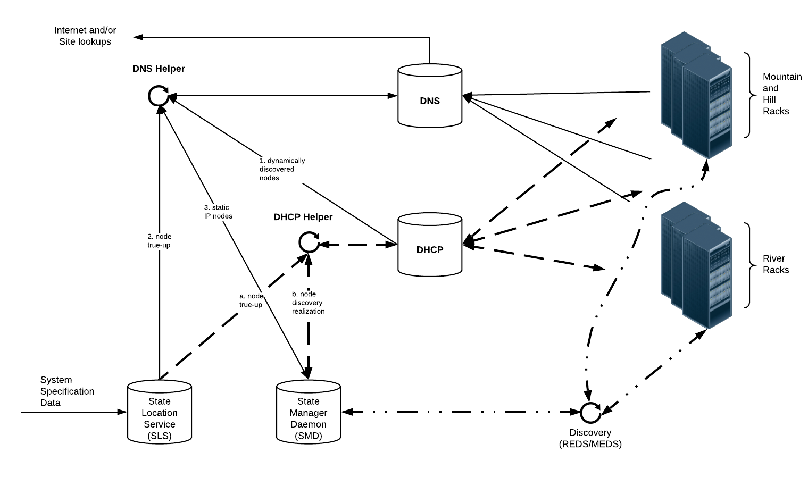

## DHCP

The Dynamic Host Configuration Protocol \(DHCP\) service on the HPE Cray EX system uses the Internet Systems Consortium \(ISC\) Kea tool. Kea provides more robust management capabilities for DHCP servers.

For more information: [https://www.isc.org/kea/](https://www.isc.org/kea/).

The following improvements to the DHCP service are included:

- Persistent and resilient data store for DHCP leases in Postgres
- API access to manage DHCP
- Scalable pod that uses metalLB instead of host networking
- Options for updates to HPE Cray EX management system IP addresses

### DHCP Helper Workflow

The DHCP-Helper uses the following workflow:

The order can vary in the workflow outlined below, and the services in this workflow can run asynchronously.

1.  Retrieve the network information.
    - Query the System Layout Service \(SLS\)
    - Update Kea
2.  Query Kea for active leases to check if SMD knows about the NIC.
    - Check MACs in KEA active lease against SMD known NIC MACs.
3.  Query SMD for all known NICs and create DHCP leases.
    - Each NIC in SMD create DHCP reservation in Kea
    - Create DHCP reservation in Kea
    - Create hostname/MAC/IP address DHCP reservations
    - Create hostname\(alias\)/MAC in DHCP reservation
4.  Check to see if the NIC in SMD needs to have an IP added.
    - Update the IP address from Kea if NIC in SMD does not have an IP address set
5.  Remove any potential race conditions between the DHCP reservation in Kea and the NIC information in SMD.
    - Compare information in NIC information in SMD and Kea DHCP reservation configurations
    - Delete any active leases that did not match SMD

