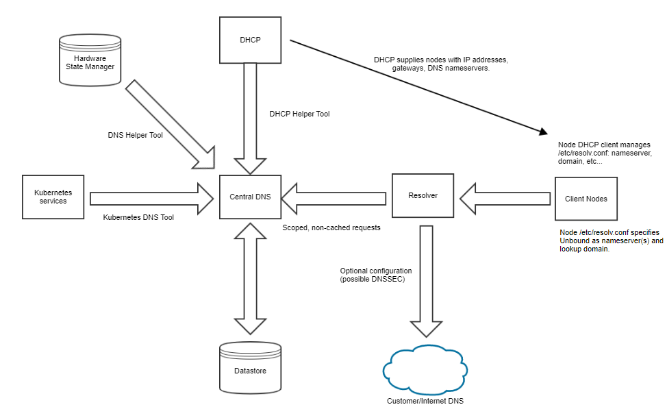

## Domain Name Service (DNS)

The central DNS infrastructure provides the structural networking hierarchy and datastore for the system. All DNS requests are managed by resolvers, not by the central DNS infrastructure. Resolvers provide the following within DNS:

-   Security by scoping requests from clients.

    For example, disallowing cross-network DNS lookups.

-   Load reduction on the central DNS infrastructure:
    -   Caching requests and handling scoping requests.
    -   Providing request recursion where necessary.

The Data Helper Tools are used to update records, and takes in changes from the following sources:

-   Hardware State Manager \(HSM\): Uses the System Layout Service \(SLS\) and the State Manager Daemon \(SMD\) to create a system-of-record for all machine hardware resources. The tooling creates and updates DNS records upon system install or during hardware changes.
-   Kubernetes: DNS records are created and updated dynamically.

The following figure shows a high-level overview of the various components used in the DNS infrastructure.

