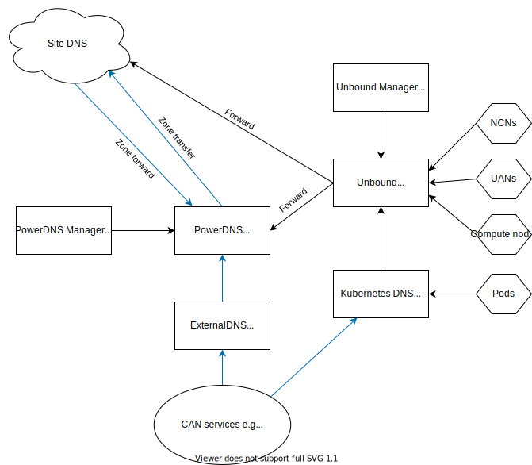

# Domain Name Service (DNS) Overview

## DNS Architecture

This diagram shows how the various components of the DNS infrastructure interact.

## DNS Components

The DNS infrastructure is comprised of a number of components.

### Unbound (`cray-dns-unbound`)

Unbound is a caching DNS resolver which is also used as the primary DNS server.

The DNS records served by Unbound include system component names (xnames), node hostnames,
and service names. These records are read from the `cray-dns-unbound` ConfigMap which is populated by `cray-dns-unbound-manager`.

The DNS server functionality will be migrated to PowerDNS in a future release leaving Unbound acting purely as a caching DNS resolver.

Unbound also forwards queries to PowerDNS or the site DNS server if the query cannot be answered by local data.

### Unbound Manager (`cray-dns-unbound-manager`)

The `cray-dns-unbound-manager` cron job runs every three minutes and queries the System Layout Service (SLS), the Hardware State Manager (HSM),
and the Kea DHCP server for new or changed hardware components and creates DNS records for these components in the `cray-dns-unbound` ConfigMap.

This job also initiates a rolling restart of Unbound if the `cray-dns-unbound` ConfigMap was modified.

### Kubernetes DNS (`coredns`)

Kubernetes creates DNS records for services and pods. A CoreDNS server running in the `kube-system` namespace is used for this purpose.

The CoreDNS service is also configured to forward DNS requests to Unbound in order to allow pods to resolve system hardware components and other services.
This configuration is performed by the `cray-dns-unbound-coredns` job which is invoked whenever the `cray-dns-unbound` Helm chart is deployed or upgraded.

See the [Kubernetes documentation](https://kubernetes.io/docs/concepts/services-networking/dns-pod-service/) for more information.

### ExternalDNS (`cray-externaldns-external-dns`)

ExternalDNS creates DNS records for services that are intended to be accessible via the Customer Access Network (CAN), Customer Management Network (CMN),
and Customer High-Speed Network (CHN). For example, `grafana.cmn.wasp.dev.cray.com`.

Kubernetes Services annotated with `external-dns.alpha.kubernetes.io/hostname` have DNS records created.

Starting with CSM version 1.2 these DNS records are created in the PowerDNS server. Earlier versions of CSM used a dedicated CoreDNS server for ExternalDNS.

> Only DNS A records are created as ExternalDNS currently does not support the creation of the PTR records required for reverse lookup.

### PowerDNS (`cray-dns-powerdns`)

PowerDNS is an authoritative DNS server which over the next few CSM releases will replace Unbound as the primary DNS server within a CSM system.

PowerDNS is able to respond to queries for services accessible via the CAN, CMN, or CHN. Records are externally accessible via the Kubernetes `LoadBalancer` IP address specified for the CSI `--cmn-external-dns` option.

As with earlier CSM releases it is possible to delegate to PowerDNS to resolve services and it is also possible to configure zone transfer to sync the DNS records from PowerDNS to Site DNS.

### PowerDNS Manager (`cray-powerdns-manager`)

The PowerDNS Manager serves a similar purpose to the Unbound Manager. It runs in the background and periodically queries the SLS, HSM,
and the Kea DHCP server for new or changed hardware components and creates DNS records for these components in PowerDNS. It also creates and removes reverse DNS PTR records
that correspond to the records that are created by ExternalDNS.

The PowerDNS Manager also configures the PowerDNS server for zone transfer and DNSSEC if required.

### Site DNS

This term is used to refer the external DNS server specified the CSI `--site-dns` option.
