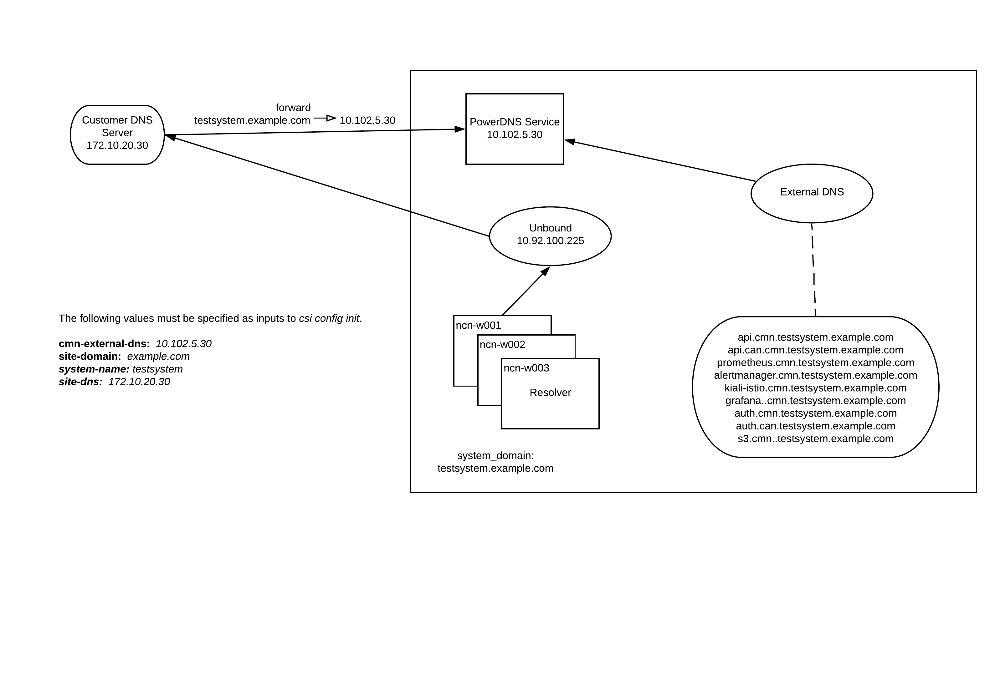

## External DNS

External DNS, along with the Customer Access Network \(CAN\), Border Gateway Protocol \(BGP\), and MetalLB, makes it simpler to access the HPE Cray EX API and system management services. Services are accessible directly from a laptop without needing to tunnel into a non-compute node \(NCN\) or override /etc/hosts settings. Some services may require a JSON Web Token \(JWT\) to access them, while others may require Keycloak to login using a DC LDAP password.

The following services are currently available:

-   HPE Cray EX API \(requires valid JWT\)
-   Keycloak
-   Ceph RADOS gateway \(requires valid JWT\)
-   Nexus
-   System Management Health Prometheus \(redirects to Keycloak for SSO\)
-   System Management Health Grafana \(redirects to Keycloak for SSO\)
-   System Management Health Alertmanager \(redirects to Keycloak for SSO\)
-   Kiali, for Istio service mesh visibility \(redirects to Keycloak for SSO\)
-   Jaeger, for Istio tracing \(redirects to Keycloak for SSO\)

In general, external hostnames should resolve to a CAN external IP address for the following services:

-   `istio-system/istio-ingressgateway-can` - Istio's ingress gateway.
-   `services/cray-keycloak-gatekeeper-ingress` - Keycloak Gatekeeper's ingress reverse proxy that redirects browsers to Keycloak for log in, and then to Istio's ingress gateway with a valid JWT for authorized access.

This can be verified using the dig command to resolve the external hostname and compare it with Kubernetes.

### What Happens if External DNS is not Used?

Without forwarding to External DNS, administrators will not have the ability to use the externally exposed services, such as Prometheus, Grafana, the HPE Cray EX REST API, and more. See [Externally Exposed Services](../customer_access_network/Externally_Exposed_Services.md) for more information.

Accessing most of these services by IP address will not work because the Ingress Gateway uses the name to direct requests to the appropriate service.

### DNS for HPE Cray EX Systems

There is a separate set of DNS instances within HPE Cray EX that is used by the nodes and pods within the system for resolving names.

-   **Unbound**

    The unbound DNS instance is used to resolve names for the physical equipment on the management networks within HPE Cray EX, such as NCNs, UANs, switches, compute nodes, and more. This instance is accessible only within the system.

-   **K8s CoreDNS**

    There is a CoreDNS instance within Kubernetes that is used by Kubernetes pods to resolve names for internal pods and services. This instance is accessible only within the HPE Cray EX Kubernetes cluster.

### Connect Customer DNS to External DNS

The DNS instance at the customer site should use DNS forwarding to forward the subdomain specified by the `system-name` and `site-domain` values \(combined to make the `system-name.site-domain` value\) to the IP address specified by the `can-external-dns` value. These values are defined with the `csi config init` command. The specifics on how to do the forwarding configuration is dependent on the type of DNS used by the customer.

The External DNS instance currently does not support zone transfer.

### Table of Contents

* [External DNS csi config init Input Values](External_DNS_csi_config_init_Input_Values.md)
* [Update the can-external-dns Value Post-Installation](Update_the_can-external-dns_Value_Post-Installation.md)
* [Ingress Routing](Ingress_Routing.md)
* [Add NCNs and UANs to External DNS](Add_NCNs_and_UANs_to_External_DNS.md)
* [External DNS Failing to Discover Services Workaround](External_DNS_Failing_to_Discover_Services_Workaround.md)
* [Troubleshoot Connectivity to Services with External IP addresses](Troubleshoot_Systems_Not_Provisioned_with_External_IP_Addresses.md)
* [Troubleshoot DNS Configuration Issues](Troubleshoot_DNS_Configuration_Issues.md)

