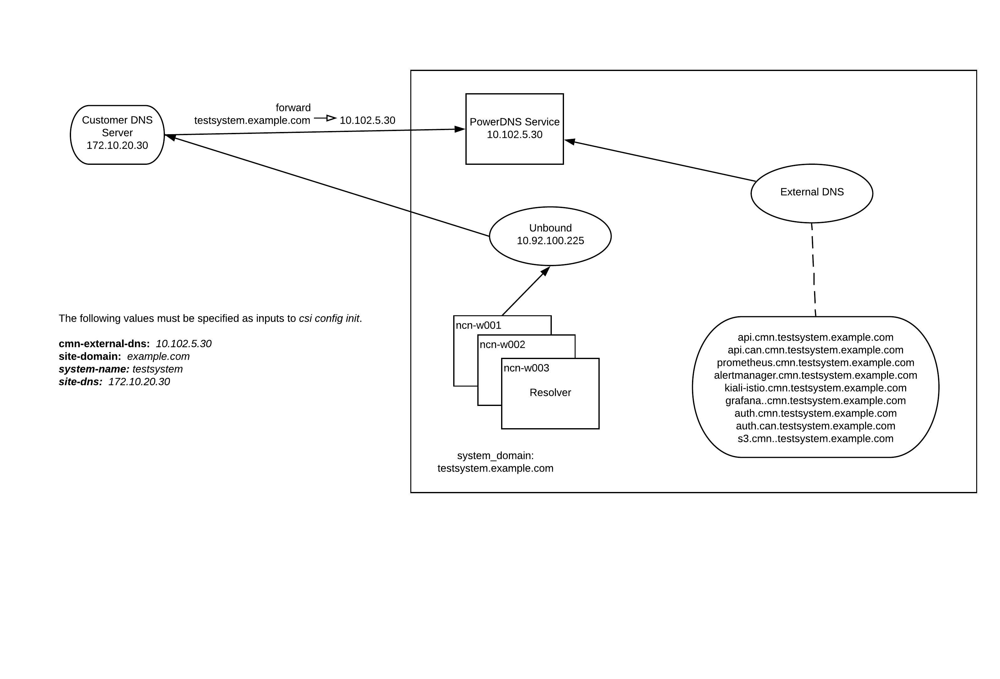

# External DNS

External DNS, along with the customer accessible networks CMN and CAN/CHN, PowerDNS,
Border Gateway Protocol (BGP), and MetalLB, simplifies access to the HPE Cray EX API
and system management services. Services are accessible directly from a laptop without
needing to tunnel into a [non-compute node (NCN)][ncn] or override `/etc/hosts` settings.
Some services may require a JSON Web Token (JWT) to access them, while others may require
OAuth2 to login using a DC LDAP password.

The following services are currently available:

- HPE Cray EX API (requires valid JWT)
- Keycloak
- Ceph RADOS gateway (requires valid JWT)
- Nexus
- System Management Health Prometheus (redirects to OAuth2 Proxy for SSO)
- System Management Health Grafana (redirects to OAuth2 Proxy for SSO)
- System Management Health Alertmanager (redirects to OAuth2 Proxy for SSO)
- Kiali, for Istio service mesh visibility (redirects to OAuth2 Proxy for SSO)

In general, external hostnames should resolve to an external IP address for one of the following services:

- `istio-system/istio-ingressgateway-cmn` - Istio's ingress gateway on CMN.
- `istio-system/istio-ingressgateway-can` - Istio's ingress gateway on CAN.
- `istio-system/istio-ingressgateway-chn` - Istio's ingress gateway on CHN.
- `services/cray-oauth2-proxies-customer-access-ingress` - OAuth2 Proxy's ingress on CMN that redirects browsers to Keycloak for log in, and then to Istio's ingress gateway with a valid JWT for authorized access.
- `services/cray-oauth2-proxies-customer-management-ingress` - OAuth2 Proxy's ingress on CAN that redirects browsers to Keycloak for log in, and then to Istio's ingress gateway with a valid JWT for authorized access.
- `services/cray-oauth2-proxies-customer-high-speed-ingress` - OAuth2 Proxy's ingress on CHN that redirects browsers to Keycloak for log in, and then to Istio's ingress gateway with a valid JWT for authorized access.

This can be verified using the `dig` command to resolve the external hostname and compare it with Kubernetes.

## What happens if external DNS is not used?

Without forwarding to external DNS, administrators will not have the ability to use the externally exposed services, such as Prometheus, Grafana, the HPE Cray EX REST API, and more.
See [Externally Exposed Services](../customer_accessible_networks/Externally_Exposed_Services.md) for more information.

Accessing most of these services by IP address will not work because the Ingress Gateway uses the name to direct requests to the appropriate service.

## DNS for HPE Cray EX Systems

There is a separate set of DNS instances within HPE Cray EX that is used by the nodes and pods within the system for resolving names.

### Unbound

The unbound DNS instance is used to resolve names for the physical equipment on the management networks within HPE Cray EX,
such as [NCNs][ncn], [UANs][uan], switches, [compute nodes][cn], and more. This instance is accessible only within the system.

### Kubernetes CoreDNS

There is a CoreDNS instance within Kubernetes that is used by Kubernetes pods to resolve names for internal pods and services.
This instance is accessible only within the HPE Cray EX Kubernetes cluster.

## Connect customer DNS to PowerDNS

The DNS instance at the customer site should use DNS forwarding to forward the subdomain specified by the `system-name` and
`site-domain` values (combined to make the `system-name.site-domain` value) to the IP address specified by the
`cmn-external-dns` value. These values are defined with the [`csi config init`][csi] command. The specifics on how to do
the forwarding configuration is dependent on the type of DNS used by the customer.

<!--- Define the reference-style Markdown links used to make the page easier to edit -->

<!-- markdownlint-disable MD053 -->
<!---
    For references that are likely to appear on a lot of pages (glossary references, for example),
    we allow definitions for entries that are not used on the page, as a convenience.
-->

<!-- non-glossary common links -->

[config-cli]: ../../configure_cray_cli.md
[check-latest-docs]: ../../../update_product_stream/README.md#check-for-latest-documentation

<!-- glossary entries -->

[aee]: ../../../glossary.md#ansible-execution-environment-aee
[an]: ../../../glossary.md#application-node-an
[ara]: ../../../glossary.md#ara-records-ansible-ara
[bmc]: ../../../glossary.md#baseboard-management-controller-bmc
[bos]: ../../../glossary.md#boot-orchestration-service-bos
[bss]: ../../../glossary.md#boot-script-service-bss
[can]: ../../../glossary.md#customer-access-network-can
[canu]: ../../../glossary.md#csm-automatic-network-utility-canu
[capmc]: ../../../glossary.md#cray-advanced-platform-monitoring-and-control-capmc
[cdu]: ../../../glossary.md#coolant-distribution-unit-cdu
[cec]: ../../../glossary.md#cabinet-environmental-controller-cec
[cfs]: ../../../glossary.md#configuration-framework-service-cfs
[chn]: ../../../glossary.md#customer-high-speed-network-chn
[cli]: ../../../glossary.md#cray-cli-cray
[cmn]: ../../../glossary.md#customer-management-network-cmn
[cn]: ../../../glossary.md#compute-node-cn
[csi]: ../../../glossary.md#cray-site-init-csi
[fas]: ../../../glossary.md#firmware-action-service-fas
[hbtd]: ../../../glossary.md#heartbeat-tracker-daemon-hbtd
[hmn]: ../../../glossary.md#hardware-management-network-hmn
[hsm]: ../../../glossary.md#hardware-state-manager-hsm
[hsn]: ../../../glossary.md#high-speed-network-hsn
[ims]: ../../../glossary.md#image-management-service-ims
[iuf]: ../../../glossary.md#install-and-upgrade-framework-iuf
[meds]: ../../../glossary.md#mountain-endpoint-discovery-service-meds
[mgmt-ncns]: ../../../glossary.md#management-nodes
[mountain]: ../../../glossary.md#mountain-cabinet
[ncn]: ../../../glossary.md#non-compute-node-ncn
[nid]: ../../../glossary.md#node-id-nid
[nmn]: ../../../glossary.md#node-management-network-nmn
[pcs]: ../../../glossary.md#power-control-service-pcs
[pdu]: ../../../glossary.md#power-distribution-unit-pdu
[pit]: ../../../glossary.md#pre-install-toolkit-pit
[river]: ../../../glossary.md#river-cabinet
[rts]: ../../../glossary.md#redfish-translation-service-rts
[s3]: ../../../glossary.md#simple-storage-service-s3
[sat]: ../../../glossary.md#system-admin-toolkit-sat
[sbps]: ../../../glossary.md#scalable-boot-projection-service-sbps
[scsd]: ../../../glossary.md#system-configuration-service-scsd
[shcd]: ../../../glossary.md#shasta-cabling-diagram-shcd
[slingshot]: ../../../glossary.md#slingshot
[sls]: ../../../glossary.md#system-layout-service-sls
[sma]: ../../../glossary.md#system-monitoring-application-sma
[smd]: ../../../glossary.md#hardware-state-manager-smd
[sops]: ../../../glossary.md#secrets-operations-sops
[tapms]: ../../../glossary.md#tenant-and-partition-management-system-tapms
[uan]: ../../../glossary.md#user-access-node-uan
[uss]: ../../../glossary.md#user-services-software-uss
[vcs]: ../../../glossary.md#version-control-service-vcs
[vnid]: ../../../glossary.md#virtual-network-identifier-daemon-vnid
[xname]: ../../../glossary.md#xname

<!-- markdownlint-restore -->
