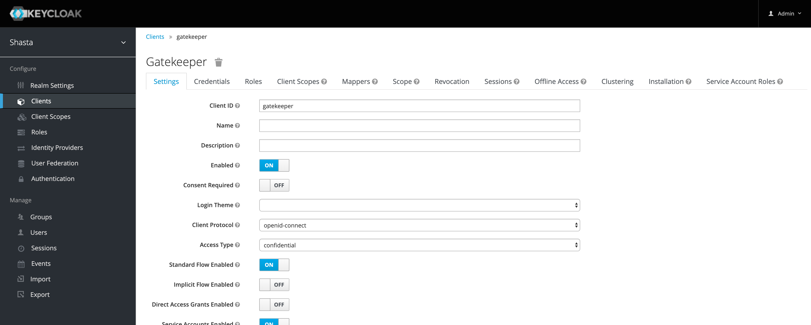
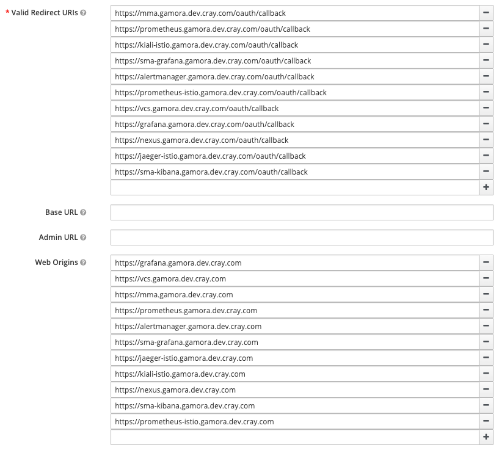

## Update the system-name.site-domain Value Post-Installation

Update the domain name specified by the `csi config init` input. Updating the system-name.site-domain value without reinstalling the platform involves the following actions:

  -   Edit the Service object definitions and update all `external-dns.alpha.kubernetes.io/hostname` annotations.
  -   Edit the VirtualService \(and possibly Gateway\) object definitions and update `spec.hosts` and `spec.http[].match[].authority` settings.

Enables access to services that are accessible from the Customer Access Network \(CAN\) by updating the external domain for external hostnames.

### Prerequisites

The system is installed.

### Procedure

1.  Update the VirtualService object definitions for cray-sysmgmt-health-prometheus.

    ```bash
    ncn-w001# kubectl get vs -n sysmgmt-health cray-sysmgmt-health-prometheus -o yaml
    ```

    Example output:

    ```
    apiVersion: networking.istio.io/v1beta1
    kind: VirtualService
    metadata:
      creationTimestamp: "2020-07-09T17:49:07Z"
      generation: 1
      labels:
        app: cray-sysmgmt-health-prometheus
        app.kubernetes.io/instance: cray-sysmgmt-health
        app.kubernetes.io/managed-by: Tiller
        app.kubernetes.io/name: cray-sysmgmt-health
        app.kubernetes.io/version: 8.15.4
        helm.sh/chart: cray-sysmgmt-health-0.3.1
      name: cray-sysmgmt-health-prometheus
      namespace: sysmgmt-health
      resourceVersion: "41620"
      selfLink: /apis/networking.istio.io/v1beta1/namespaces/sysmgmt-health/virtualservices/cray-sysmgmt-health-prometheus
      uid: d239dfcc-a827-4a51-9b73-6eccfb937088
    spec:
      gateways:
      - services/services-gateway
      hosts:
      - prometheus.vshasta.io
      http:
      - match:
        - authority:
            exact: prometheus.vshasta.io
        route:
        - destination:
            host: cray-sysmgmt-health-promet-prometheus
            port:
              number: 9090
    ```

2.  Edit the CoreDNS configmap and update the domain name for any hostnames being managed by etcd.

    ```bash
    ncn-w001# kubectl get configmap -n services cray-externaldns-coredns -o yaml
    ```

    Example output:

    ```
    apiVersion: v1
    data:
      Corefile: |-
        .:53 {
            errors
            health
            log
            ready
            kubernetes cluster.local
            k8s_external internal.shasta
            prometheus 0.0.0.0:9153
            etcd SYSTEM_DOMAIN_NAME {
                stubzones
                path /skydns
                endpoint http://cray-externaldns-etcd-client:2379
            }
        }
    kind: ConfigMap
    metadata:
      creationTimestamp: "2020-01-11T17:35:21Z"
      labels:
        app.kubernetes.io/instance: cray-externaldns
        app.kubernetes.io/managed-by: Tiller
        app.kubernetes.io/name: coredns
        helm.sh/chart: coredns-1.5.6
      name: cray-externaldns-coredns
      namespace: services
      resourceVersion: "4495"
      selfLink: /api/v1/namespaces/services/configmaps/cray-externaldns-coredns
      uid: bdaeb7ff-3498-11ea-8143-a4bf01581d70
    ```

3.  Restart the `cray-externaldns-coredns` deployment.

    1.  Delete the current deployment.

        ```bash
        ncn-w001# kubectl delete -f cray-externaldns-coredns.yaml
        ```

    2.  Restart the deployment.

        ```bash
        ncn-w001# kubectl apply -f cray-externaldns-coredns.yaml
        ```

4.  Update Keycloak for the gatekeeper client.

    1.  Log into Keycloak.

        The URL for accessing keycloak is listed below. Replace the variables in the URL with the actual NCN's DNS name.

        ```bash
        https://auth.SYSTEM_DOMAIN_NAME/keycloak
        ```

    2.  Navigate to the gatekeeper client.

        

    3.  Update the **Valid Redirect URIs** and **Web Origins** sections for the gatekeeper client.

        

5.  Update the hostnames listed in the `--self-signed-tls-hostname` arguments in the `cray-keycloak-gatekeeper-ingress` deployment configuration, as well as`spec.template.spec.containers.hostAliases[].hostnames[]`.

    ```bash
    ncn-w001# kubectl get deployment -n services cray-keycloak-gatekeeper-ingress -o yaml
    ```

    Example output:

    ```
    apiVersion: extensions/v1beta1
    kind: Deployment
    metadata:
      annotations:
        deployment.kubernetes.io/revision: "1"
      creationTimestamp: "2020-01-11T17:41:05Z"
      generation: 1
      labels:
        app.kubernetes.io/instance: cray-keycloak-gatekeeper
        app.kubernetes.io/managed-by: Tiller
        app.kubernetes.io/name: cray-keycloak-gatekeeper
        app.kubernetes.io/version: "1.0"
        helm.sh/chart: cray-keycloak-gatekeeper-0.1.2-shasta-1.1
      name: cray-keycloak-gatekeeper-ingress
      namespace: services
      resourceVersion: "9024"
      selfLink: /apis/extensions/v1beta1/namespaces/services/deployments/cray-keycloak-gatekeeper-ingress
      uid: 8afd3780-3499-11ea-8143-a4bf01581d70
    spec:
      progressDeadlineSeconds: 600
      replicas: 1
      revisionHistoryLimit: 10
      selector:
        matchLabels:
          app: cray-keycloak-gatekeeper-ingress
      strategy:
        rollingUpdate:
          maxSurge: 25%
          maxUnavailable: 25%
        type: RollingUpdate
      template:
        metadata:
          annotations:
            sidecar.istio.io/inject: "false"
          creationTimestamp: null
          labels:
            app: cray-keycloak-gatekeeper-ingress
        spec:
          containers:
          - args:
            - --enable-logging=true
            - --verbose
            - --skip-openid-provider-tls-verify
            - --skip-upstream-tls-verify
            - --enable-self-signed-tls
            - --self-signed-tls-hostnames
            - $(INSTANCE_IP)
            - --self-signed-tls-hostnames
            - prometheus.SYSTEM_DOMAIN_NAME
            - --self-signed-tls-hostnames
            - alertmanager.SYSTEM_DOMAIN_NAME
            - --self-signed-tls-hostnames
            - grafana.SYSTEM_DOMAIN_NAME
            - --self-signed-tls-hostnames
            - prometheus-istio.SYSTEM_DOMAIN_NAME
            - --self-signed-tls-hostnames
            - grafana-istio.SYSTEM_DOMAIN_NAME
            - --self-signed-tls-hostnames
            - kiali-istio.SYSTEM_DOMAIN_NAME
            - --self-signed-tls-hostnames
            - jaeger-istio.SYSTEM_DOMAIN_NAME
            - --self-signed-tls-hostnames
            - prometheus-kube.SYSTEM_DOMAIN_NAME
            - --self-signed-tls-hostnames
            - alertmanager-kube.SYSTEM_DOMAIN_NAME
            - --self-signed-tls-hostnames
            - grafana-kube.SYSTEM_DOMAIN_NAME
            - --self-signed-tls-hostnames
            - prometheus-ceph.SYSTEM_DOMAIN_NAME
            - --self-signed-tls-hostnames
            - vcs.SYSTEM_DOMAIN_NAME
            - --secure-cookie=false
            - --preserve-host
            - --resources
            - uri=/*
            env:
            - name: PROXY_LISTEN
              value: 0.0.0.0:443
            - name: PROXY_DISCOVERY_URL
              valueFrom:
                secretKeyRef:
                  key: discovery-url
                  name: keycloak-gatekeeper-client
            - name: PROXY_CLIENT_ID
              valueFrom:
                secretKeyRef:
                  key: client-id
                  name: keycloak-gatekeeper-client
            - name: PROXY_CLIENT_SECRET
              valueFrom:
                secretKeyRef:
                  key: client-secret
                  name: keycloak-gatekeeper-client
            - name: PROXY_UPSTREAM_URL
              value: https://istio-ingressgateway.istio-system.svc.cluster.local/
            - name: INSTANCE_IP
              valueFrom:
                fieldRef:
                  apiVersion: v1
                  fieldPath: status.podIP
            - name: GODEBUG
              value: netdns=cgo
            image: registry.local/keycloak/keycloak-gatekeeper:latest
            imagePullPolicy: IfNotPresent
            livenessProbe:
              failureThreshold: 10
              httpGet:
                path: /oauth/health
                port: 443
                scheme: HTTPS
              initialDelaySeconds: 10
              periodSeconds: 10
              successThreshold: 1
              timeoutSeconds: 5
            name: keycloak-gatekeeper
            ports:
            - containerPort: 443
              name: https
              protocol: TCP
            readinessProbe:
              failureThreshold: 3
              httpGet:
                path: /oauth/health
                port: 443
                scheme: HTTPS
              periodSeconds: 10
              successThreshold: 1
              timeoutSeconds: 1
            resources: {}
            terminationMessagePath: /dev/termination-log
            terminationMessagePolicy: File
          dnsPolicy: ClusterFirst
          hostAliases:
          - hostnames:
            - auth.SYSTEM_DOMAIN_NAME
            ip: 10.92.100.50
          restartPolicy: Always
          schedulerName: default-scheduler
          securityContext: {}
          terminationGracePeriodSeconds: 30
    status:
      availableReplicas: 1
      conditions:
      - lastTransitionTime: "2020-01-11T17:41:12Z"
        lastUpdateTime: "2020-01-11T17:41:12Z"
        message: Deployment has minimum availability.
        reason: MinimumReplicasAvailable
        status: "True"
        type: Available
      - lastTransitionTime: "2020-01-11T17:41:05Z"
        lastUpdateTime: "2020-01-11T17:41:12Z"
        message: ReplicaSet "cray-keycloak-gatekeeper-ingress-6c89dd9654" has successfully
          progressed.
        reason: NewReplicaSetAvailable
        status: "True"
        type: Progressing
      observedGeneration: 1
      readyReplicas: 1
      replicas: 1
      updatedReplicas: 1
    ```

6.  Restart the `cray-keycloak-gatekeeper-ingress` deployment.

    1.  Delete the current deployment.

        ```bash
        ncn-w001# kubectl delete -f cray-keycloak-gatekeeper-ingress.yaml
        ```

    2.  Restart the deployment.

        ```bash
        ncn-w001# kubectl apply -f cray-keycloak-gatekeeper-ingress.yaml
        ```

7.  Generate and install new certificates for Istio.

    The existing certificate has a SAN that includes \*.\{\{shasta\_domain\}\}.

    ```bash
    ncn-w001# kubectl -n istio-system get secrets istio-ingressgateway-certs -o jsonpath='{.data.tls\.crt}'| \
    base64 -d | openssl x509 -text -noout
    ```

    Example output:

    ```
    Certificate:
        Data:
            Version: 3 (0x2)
            Serial Number: 1 (0x1)
        Signature Algorithm: sha256WithRSAEncryption
            Issuer: C = XX, ST = XX, L = XX, O = XX, OU = XX, CN = 07bc1749-f2e0-4e03-ac57-0150af38ace4
            Validity
                Not Before: Jan 11 17:28:22 2020 GMT
                Not After : Jan  8 17:28:22 2030 GMT
            Subject: C = XX, ST = XX, O = XX, OU = XX, CN = sms
            Subject Public Key Info:
                Public Key Algorithm: rsaEncryption
                    Public-Key: (2048 bit)
                    Modulus:
                        00:fe:90:1c:16:26:8c:d7:7f:9d:61:81:e7:97:70:
                        30:38:bf:c6:ea:e9:ed:4d:57:93:27:f1:c0:df:6e:
                        6a:51:f2:55:e1:c7:29:e4:c2:8f:b7:46:14:ba:34:
                        4a:7b:19:c0:a1:65:e4:ee:67:36:ad:91:d5:9c:08:
                        fb:b7:53:31:72:4b:e6:7b:78:38:d0:02:7e:24:d7:
                        a7:e6:0d:71:7e:94:66:a8:d4:94:87:bc:6a:8c:ea:
                        1f:9a:a0:89:27:63:de:33:a3:8f:0d:b6:54:f8:08:
                        d8:4a:c1:a3:6a:f7:03:2a:a8:6c:a9:69:ba:ca:b5:
                        55:4d:06:fa:4a:34:74:e1:b2:8c:b6:a8:b2:06:33:
                        ce:04:a7:cc:07:e5:a5:33:e1:4c:bf:88:19:66:ab:
                        ee:a6:1c:69:3a:36:f0:13:59:78:e2:c6:04:37:44:
                        01:5e:72:81:86:39:f2:5b:99:22:9a:38:13:4b:fc:
                        f3:9c:06:80:04:38:e3:7d:13:14:99:aa:7b:42:dd:
                        c1:4c:bc:75:ba:5c:a1:6f:e9:9e:16:5b:b8:26:ff:
                        0d:e2:8b:65:83:e0:1c:e1:82:1e:8d:5a:d0:95:0b:
                        f1:9a:25:3f:00:20:16:ab:e4:c8:b5:e8:e1:74:83:
                        75:22:23:df:d8:40:cb:1e:8c:be:8d:7e:fd:a9:36:
                        f5:4b
                    Exponent: 65537 (0x10001)
            X509v3 extensions:
                X509v3 Basic Constraints:
                    CA:FALSE
                X509v3 Subject Key Identifier:
                    2B:2C:75:24:55:37:7E:EE:D5:8B:EB:75:FC:6B:6C:7E:50:B3:40:E2
                X509v3 Authority Key Identifier:
                    keyid:E2:A3:D6:77:B9:BB:98:55:D6:15:00:2A:A7:6F:AA:E0:56:82:CE:D0
                X509v3 Subject Alternative Name:
                    DNS:ncn-m001.local, DNS:ncn-m002.local, DNS:ncn-m003.local, DNS:istio-ingressgateway.istio-system.svc.cluster.local, DNS:*.SYSTEM_DOMAIN_NAME, DNS:mgmt-plane-cmn.local, DNS:api-gw-service-nmn.local
        Signature Algorithm: sha256WithRSAEncryption
             0c:e9:a5:9b:58:2f:b3:c8:4c:c8:20:4b:0f:7d:07:f0:4a:7b:
             f4:8f:31:de:27:1a:59:17:bc:d6:c3:a5:af:ff:8d:f5:a9:58:
             a2:47:ed:e1:8d:3e:48:30:8d:b1:2d:76:be:5e:35:25:34:57:
             0d:93:bc:bb:db:ef:dc:9a:30:c6:8b:a7:7d:6e:fa:c8:64:c9:
             e8:fc:d7:39:30:d1:b2:d4:59:32:f2:c3:0b:17:8c:b0:58:2e:
             f0:1f:29:ac:65:2f:ad:ca:eb:25:18:15:e4:9b:18:c0:17:bb:
             20:f0:2c:a6:1f:11:b1:b3:0c:1e:8d:ba:09:08:32:9e:16:cb:
             a7:e6:48:d9:fc:f2:e7:0c:82:20:88:a9:c4:7a:83:7a:b0:b5:
             36:dd:4e:a0:ae:0b:c4:11:56:db:97:fd:47:c5:63:c8:8d:76:
             91:47:d5:6b:08:4b:00:99:cc:4b:f6:d8:82:9c:dd:a8:37:73:
             71:18:64:41:e7:8f:a8:26:ed:fe:4f:64:ce:50:76:3c:aa:ff:
             ae:cb:6e:d0:24:47:40:16:ab:29:6e:f2:50:9b:24:46:d0:1d:
             58:41:32:eb:3c:aa:e4:4f:25:b1:f5:92:05:b4:1c:fa:14:2c:
             d9:b5:39:40:28:21:35:92:3d:79:96:96:22:f4:42:85:ef:63:
             bb:c0:10:4e
    ```


