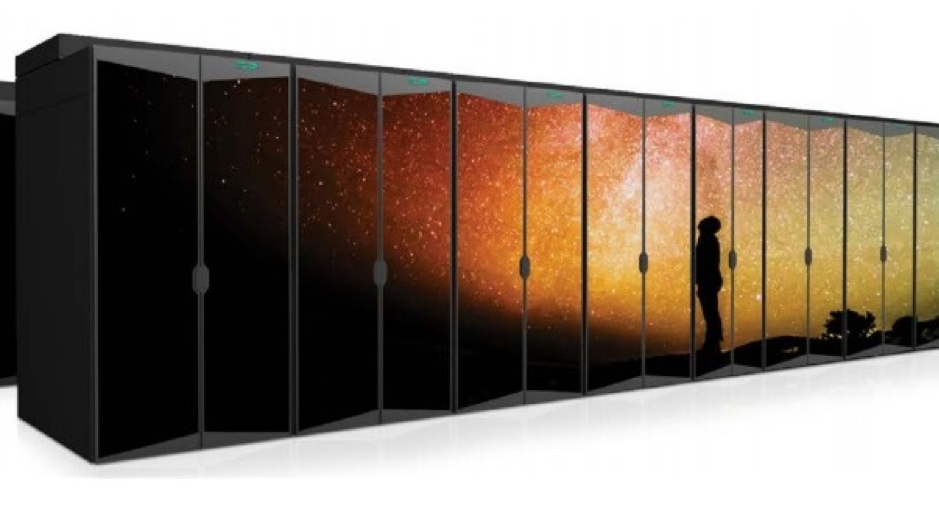

# Aruba Installation and Configuration Guide

### ARUBA - CX Platform based networks

© 2021 Hewlett Packard Enterprise Development LP

## Introduction

The intent for the this documentation is to help install and manage Aruba CX network devices in an HPE Cray EX system installation.

The HPE Cray recommended way of configuring the network is with the CANU tool. Thus, this guide will not go to into a level of detail of how to configure each switch with the CLI in the topology. However, it will provide examples of how to configure and use features generated by CANU to provide administrators with an easy way to customize their installation.

This guide also includes the current documented and supported network scenarios.

> **NOTE:** Not every configuration option is covered here, and for any configuration outside of the scope of this document, refer to the official Aruba user manuals.

Aruba documentation and software can be found from:

[https://asp.arubanetworks.com/]()

This document is intended for network administrators and support personnel.

__________________________________
The display and command line illustrated in this document are examples and might not exactly match your particular environment. The switch and accessory drawings in this document are for illustration only, and may not exactly match your installed products.
__________________________________

# Table of contents

### Introduction

   1. [Introduction](./index.md)
   1. [Notice](./index.md)
   1. [Index](./index.md)
   1. [Introduction to CANU](./introduction_to_canu.md)

### CANU

The CSM Automatic Network Utility (CANU) is a tool used to generate/validate/test the Shasta management network.
Documentation for CANU can be found at https://github.com/Cray-HPE/canu

### Examples of Network Topologies

   1. [Very Large](./very_large.md)
   1. [Large](./large.md)
   1. [Medium](./medium.md)
   1. [Small](./small.md)

### Network Design Explained

   1. [What is Spine-Leaf Architecture?](./spine_leaf_architecture.md#what-is-spine-leaf-architecture)
   1. [How does a spine-leaf architecture differ from traditional network designs?](./spine_leaf_architecture.md#how-does-a-spine-leaf-architecture-differ-from-traditional-network-designs)
   1. [Why are spine-leaf architectures becoming more popular?](./spine_leaf_architecture.md#why-are-spine-leaf-architectures-becoming-more-popular)
   1. [What is VSX?](./vsx_architecture.md)
   1. [What are the benefits of VSX?](./vsx_architecture.md#what-are-the-benefits-of-vsx)
   1. [VSX summary](./vsx_architecture.md#vsx-summary)

### Built in High-Availability

   1. [VSX: MCLAG link HA	](./mclag_link_ha.md)
   1. [VSX: ISL HA](./mclag_isl_ha.md)
   1. [VSX: Split](./mclag_split.md)
   1. [VSX: Member Power Failure](./mclag_power_failure.md)

### Management Network Overview

   1. [Network Types – Naming and segment Function](./network_naming_function.md)
   1. [Network traffic pattern inside of the system](./network_traffic_pattern.md)
   1. [System management network functions in more detail](./manegement_network_function_in_detail.md)

### Key Features in the Management Network Configuration

   1. [Key Feature list](./key_features.md)
   1. [Typical configuration of VSX](./typical_VSX_configuration.md)
   1. [Typical MCLAG port configuration connecting to dual homed devices](./typical_mclag_port_configuration.md)
   1. [Typical edge port configuration connecting single homed devices](./typical_edge_port_configuration.md)

### How to Connect Management Network to a Campus Network

   1. [Requirements and optional configuration](./requirements_and_optional_configuration.md)
   1. [Scenario A: network connection via management network](./scenario-a.md)
   1. [Scenario B: network connection via high speed network](./scenario-b.md)
   1. [Example of how to configure Scenario A or B](./management_network_configuration_example.md)

## Manage Switches with the CLI

### Device Management

  1. [Management Interface](./management_interface.md)
  1. [Network Time Protocol (NTP) Client](./ntp.md)
  1. [Domain Name System (DNS) Client](./dns-client.md)
  1. [Message-Of-The-Day (MOTD)](./motd.md)
  1. [Exec Banners](./exec_banner.md)
  1. [Hostname](./hostname.md)
  1. [Domain Name](./domain_name.md)
  1. [Secure Shell (SSH)](./ssh.md)
  1. [Remote Logging](./remote_logging.md)
  1. [Web User Interface (WebUI)](./web-ui.md)
  1. [Simple Network Management Protocol (SNMP) Agent](./snmp_agent.md)
  1. [SNMPv2c Community](./snmp-community.md)
  1. [SNMP Traps](./snmp_trap.md)
  1. [SNMPv3 Users](./snmpv3_users.md)
  1. [System images](./system_images.md)
  1. [Bluetooth Capabilities](./bluetooth.md)

### Layer One Features

  1. [Physical Interfaces](./physical_interfaces.md)
  1. [Redundant Power Supplies](./redundant_power_supplies.md)
  1. [Locator LED](./locator_led.md)
  1. [Cable Diagnostics](./cable_diagnostics.md)

### Layer Two Features

  1. [Unidirectional Link Detection (UDLD)](./udld.md)
  1. [Link Layer Discovery Protocol (LLDP)](./lldp.md)
  1. [Virtual Local Access Networks (VLANs)](./vlan.md)
  1. [Native VLAN](./native_vlan.md)
  1. [VLAN Trunking 802.1Q](./vlan_trunking_8021q.md)
  1. [Link Aggregation Group (LAG)](./lag.md)
  1. [Virtual Switching Extension (VSX)](./vsx.md)
  1. [Multi-Chassis Link Aggregation Group (MCLAG)](./mlag.md)
  1. [VSX Sync](./vsx_sync.md)
  1. [Virtual Switching Framework (VSF) 6300 Only](./vsf.md)
  1. [Multiple Spanning Tree Protocol (MSTP)](./mstp.md)

### Layer Three Features

  1. [Routed Interfaces](./routed_interface.md)
  1. [VLAN Interface](./vlan_interface.md)
  1. [Address Resolution Protocol (ARP)](./arp.md)
  1. [Static Routing](./static_routing.md)
  1. [Loopback Interface](./loopback.md)
  1. [Open Shortest Path First (OSPF) v2](./ospfv2.md)
  1. [BGP Basics](./bgp_basic.md)

### Multicast

  1. [IGMP](./igmp.md)
  1. [MSDP](./msdp.md)
  1. [PIM-SM Bootstrap Router (BSR) and Rendezvous-Point (RP)](./pim.md)

### Security

  1. [Access Control Lists (ACLs)](./acl.md)
  1. [TACACS](./tacacs.md)
  1. [RADIUS](./radius.md)
  1. [Port Security](./port_security.md)
  1. [802.1X](./8021x.md)
  1. [MAC Authentication](./mac_auth.md)

### Quality of Service

  1. [Initial Prioritization)](./initial_prioritization.md)
  1. [Classifier Policies](./classifier_policies.md)
  1. [Queuing and Scheduling](./queuing_and_scheduling.md)

### Perform VSX Upgrades on Aruba Switches

  1. [VSX Upgrade](./upgrade.md)

### Switch Replacement in the VSX Cluster

  1. [Switch replacement in the VSX Cluster](./vsx_switch_replacement.md)

### Backup a Switch Configuration

  1. [Backing up switch configuration](./backup.md)

### Erase All zeroize

  1. [Erase all zeroize](./zeroize.md)
 
## Troubleshooting

### Port mirroring on Aruba CX

  1. [Port Mirroring](./port_mirroring.md)

### DHCP

  1. [Confirm the status of the cray-dhcp-kea pods/services](./status_of_cray-dhcp-kea_pods.md)
  1. [Check current DHCP leases](./check_current_dhcp_leases.md)
  1. [Check HSM](./check_hsm.md)
  1. [Check Kea DHPC logs](./check_kea_dhcp_logs.md)
  1. [TCPDUMP](./ncn_tcpdump.md)
  1. [Check BGP and MetalLB](./check_bgp_and_metallb.md)
  1. [You are getting IP, but not the correct one. Duplicate IP check](./duplicate_ip.md)
  1. [Large number of DHCP declines during a node boot](./dhcp_decline.md)

## DNS

### PXE Boot

  1. [NCNs on install](./ncns_on_install.md)
  1. [Rebooting NCN and PXE fails](./reboot_pxe_fail.md)
  1. [Verify BGP](./verify_bgp.md)
  1. [Verify route to TFTP](./verify_route_to_tftp.md)
  1. [Test TFTP traffic (Aruba Only)](./test_tftp_traffic.md)
  1. [Check DHCP lease is getting allocated](./check_dhcp_lease_is_getting_allocated.md)
  1. [Verify DHCP traffic on workers](./verify_dhcp_traffic_on_workers.md)
  1. [Verify switches are forwarding DHCP traffic](./verify-switches_are_forwarding_dhcp_traffic.md)
  1. [Computes/UANs/Application Nodes](./compute_uan_application_nodes.md)

