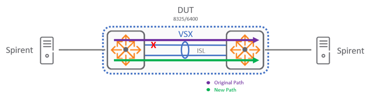

# VSX: ISL HA

The intent here is to show case a ISL (inter-switch-link) link failover scenario where one of the two links between spine switches goes down but ISL is still connected with single link.

In below a visualization of disconnected ISL link:

 
What would you expect to see in this scenario?

*  After disconnecting one ISL Link the VSX functionality should not be affected.
* A small percentage of packets will be dropped when disconnecting the cable where traffic is flowing. A sub second value is expected during this event.
* When connecting back the cable, the hashing needs to be recalculated and some packets may be dropped during this event as well. A sub second value is expected during this event.

[Back to Index](./index.md)