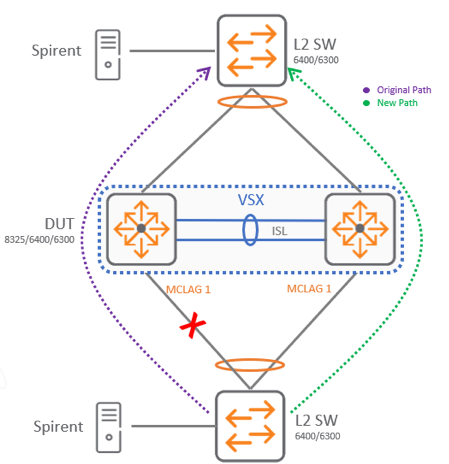

# VSX: MCLAG Link HA

The intent here is to showcase a typical MCLAG link failover scenario, where one of the links goes to the edge device, whether that is the connected switch or server. 
 
In the following image, a typical traffic pattern coming off from MCLAG connected device is shown. The traffic is going north to south and ISL is not carrying any traffic. The only time ISL will carry traffic is if one of the links to downstream devices is down. 

 

The network is now fully configured up, and you decide to test HA functionality by pulling MCLAG link off from Spine-02 and the bottom switch, what would you be expected to see?

* A small percentage of packets will be dropped when disconnecting the cable where traffic is flowing. A sub second value is expected during this event.
* When connecting back the cable, the hashing needs to be recalculated and some packets may be dropped during this event as well. A sub second value is expected during this event.

[Back to Index](../index_aruba.md)