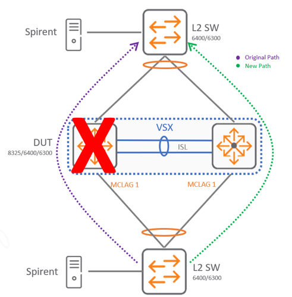

# VSX: member power failure

The intent here is to show case a complete member failure scenario where spine-01 switch is completely down. 

In below a visualization of the powered down spine-01:

 
What would you expect to see in this scenario?

* After disconnecting the power supply from one member the other member should be able to detect the member is down and continue a normal operation without any problems.
* If traffic was originally flowing through the member that was shut down, a small percentage of packets may be dropped. A sub second value is expected during this event.
* When restoring the power, the hashing needs to be recalculated and some packets may be dropped during this event as well. A sub second value is expected during this event.

[Back to Index](../index.md)