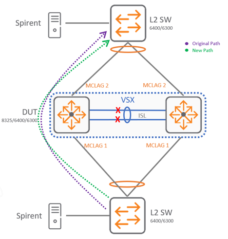

# VSX: Split

The intent here is to showcase a complete inter-switch-link (ISL) link failure scenario where both of the ISL links between spine switches goes down.

The following is a visualization of a disconnected ISL link and how the traffic pattern would look:

 
The following is expected in this scenario:

* After disconnecting both ISL Links and Keepalive is up and properly configured the VSX Secondary Switch should put all its MCLAGs into lacp-blocked state and traffic should only flow through VSX Primary.
* VSX Primary switch should continue to operate without any problems.
* If traffic was originally flowing through secondary VSX member a small percentage of packets may be dropped when disconnecting the ISL. A sub second value is expected during this event.
* When connecting back ISL link, the hashing needs to be recalculated and some packets may be dropped during this event as well. A sub second value is expected during this event.

[Back to Index](../index.md)
