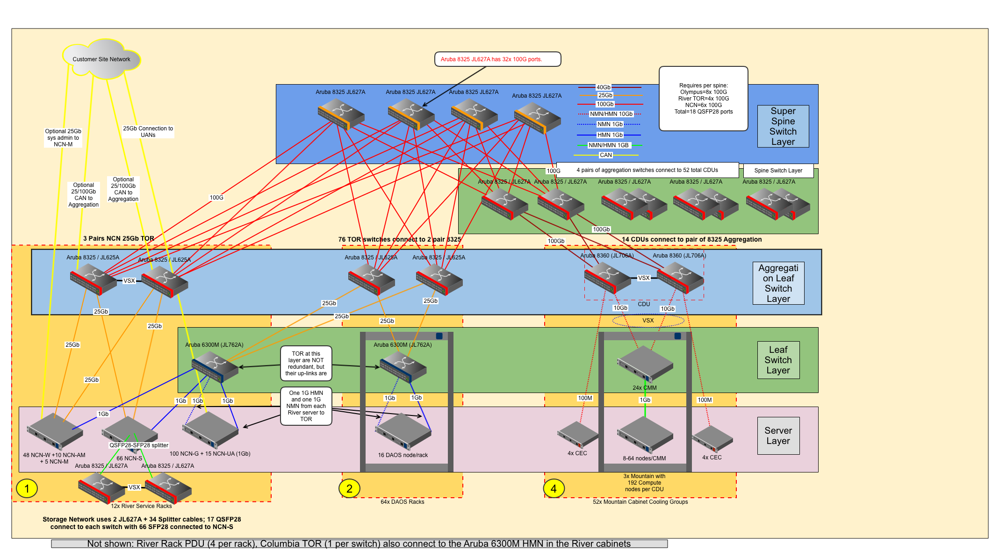
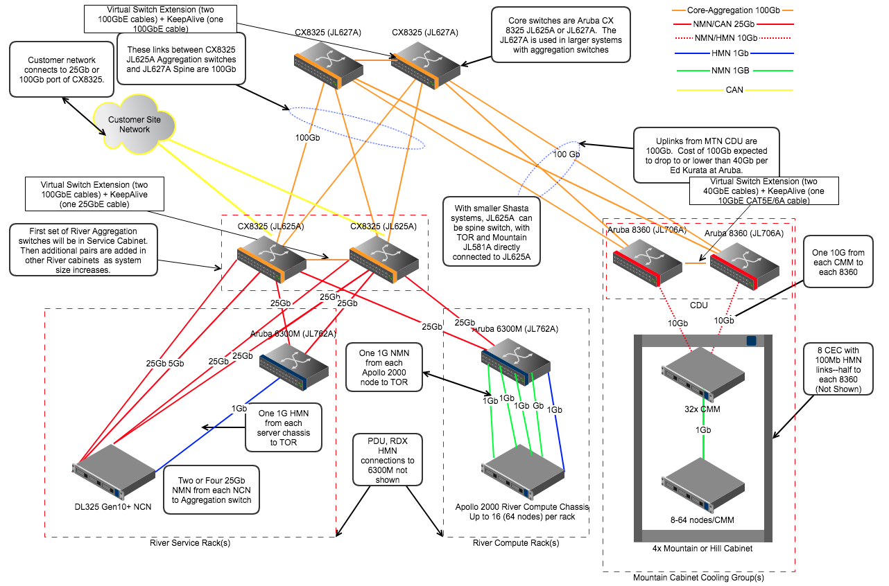
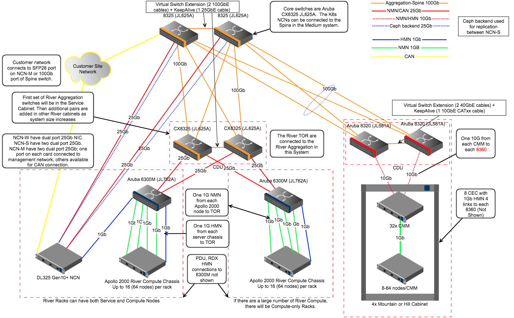
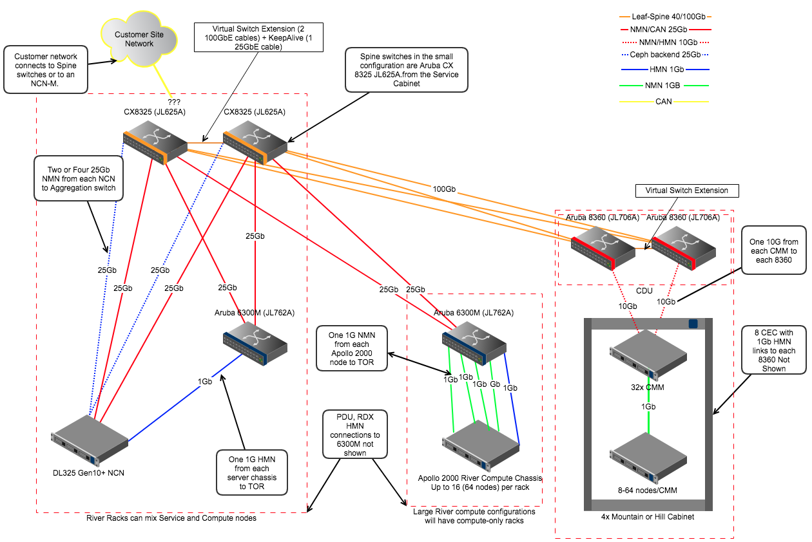

# Network Topologies

The following images are example network topologies for systems of various sizes.

### Very Large

### Large

### Medium

### Small

[operations/network/management_network/aruba/network_topologies.md](#large)

[operations/network/management_network/aruba/network_topologies.md](#medium)

[operations/network/management_network/aruba/network_topologies.md](#small)

[operations/network/management_network/aruba/network_topologies.md](#very-large)
