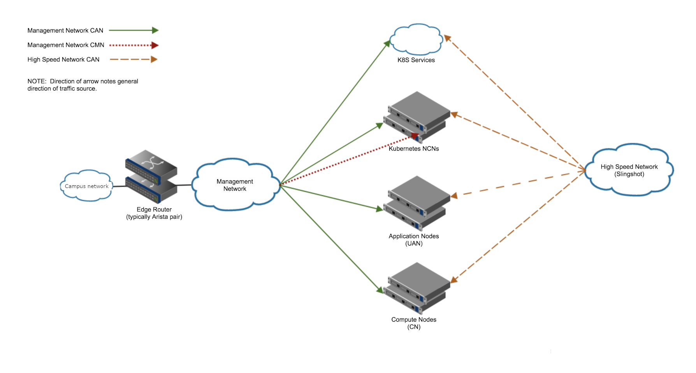

# Scenario A: Network Connection via Management Network

The example here covers outside connections achieved with the management network.

### Summary

* Create a new VRF
* Move interfaces to the new VRF
* Create a new BGP process for the new VRF
* Setup the edge router
* Configure MetalLB
* Verification step for BGP routes
* Configure default route for workers
* Verification of external communication

### Topology

The following is an example topology:

[Back to Index](../index.md)