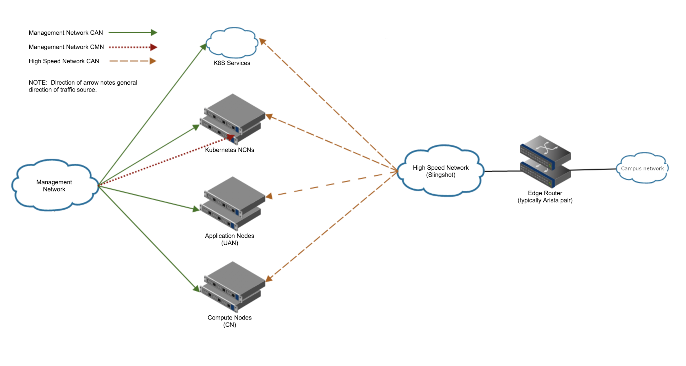

# Scenario B: Network Connection via High-Speed Network

This example covers outside connections achieved via highspeed network. 

### Summary

* Create a new VRF
* Move interfaces to the new VRF
* Create a new BGP process for the new VRF
* Setup the edge router
* Configure MetalLB
* Verification step for BGP routes
* Configure default route for workers
* Verification of external communication

### Topology

The following is an example topology:

[Back to Index](../index_aruba.md)
