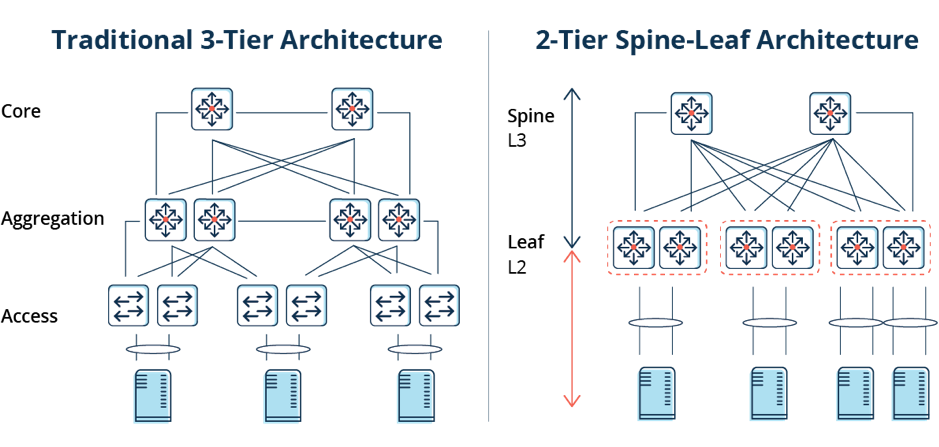

# Spine-Leaf Architecture

The network design used in majority of HPE Cray EX installations is spine leaf architecture. In more sizeable systems, we also utilize super-spine to accommodate the number of spines that connect the network to provide additional HA capabilities. 

## What is Spine-Leaf Architecture?

A spine-leaf architecture is data center network topology that consists of two switching layers—a spine and leaf. The leaf layer consists of access switches that aggregate traffic from servers and connect directly into the spine or network core. Spine switches interconnect all leaf switches in a full-mesh topology.

## How Does a Spine-Leaf Architecture Differ from Traditional Network Designs?

Traditionally, data center networks were based on a three-tier model:

1. Access switches connect to servers
2. Aggregation or distribution switches provide redundant connections to access switches
3. Core switches provide fast transport between aggregation switches, typically connected in a redundant pair for high availability

At the most basic level, a spine-leaf architecture collapses one of these tiers, as depicted in these diagrams.

 
Other common differences in spine-leaf topologies include:

* The removal of Spanning Tree Protocol (STP) where feasible
* A scale-out vs. scale-up of infrastructure

# Why are Spine-Leaf Architectures Becoming More Popular?

Given the prevalence of cloud and containerized infrastructure in modern data centers, east-west traffic continues to increase. East-west traffic moves laterally, from server to server. This shift is primarily explained by modern applications having components that are distributed across more servers or VMs.

With east-west traffic, having low-latency, optimized traffic flows is imperative for performance, especially for time-sensitive or data-intensive applications. A spine-leaf architecture aids this by ensuring traffic is always the same number of hops from its next destination, so latency is lower and predictable.

Capacity also improves because STP is no longer required or at least the impact zones of STP can be limited to the edge. While STP enables redundant paths between two switches, only one can be active at any time. As a result, paths often become oversubscribed. Conversely, spine-leaf architectures rely on protocols such as Equal-Cost Multipath (ECMPM) routing to load balance traffic across all available paths while still preventing network loops.

In addition to higher performance, spine-leaf topologies provide better scalability. Additional spine switches can be added and connected to every leaf, increasing capacity. Likewise, new leaf switches can be seamlessly inserted when port density becomes a problem. In either case, this “scale-out” of infrastructure doesn’t require any re-architecting of the network, and there is no downtime.

[Back to Index](../index.md)