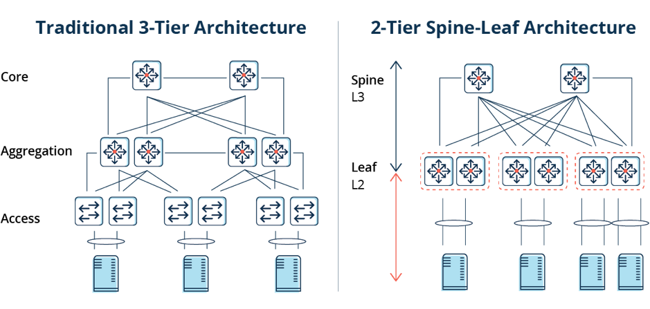

# Spine-leaf architecture

How does a spine-leaf architecture differ from traditional network designs?
Traditionally, data center networks were based on a three-tier model:

1.	Access switches connect to servers
2.	Aggregation or distribution switches provide redundant connections to access switches
3.	Core switches provide fast transport between aggregation switches, typically connected in a redundant pair for high availability

At the most basic level, a spine-leaf architecture collapses one of these tiers, as depicted in these diagrams.

 
Other common differences in spine-leaf topologies include:

* The removal of Spanning Tree Protocol (STP) where feasible
* A scale-out vs. scale-up of infrastructure

[Back to Index](./index.md)
