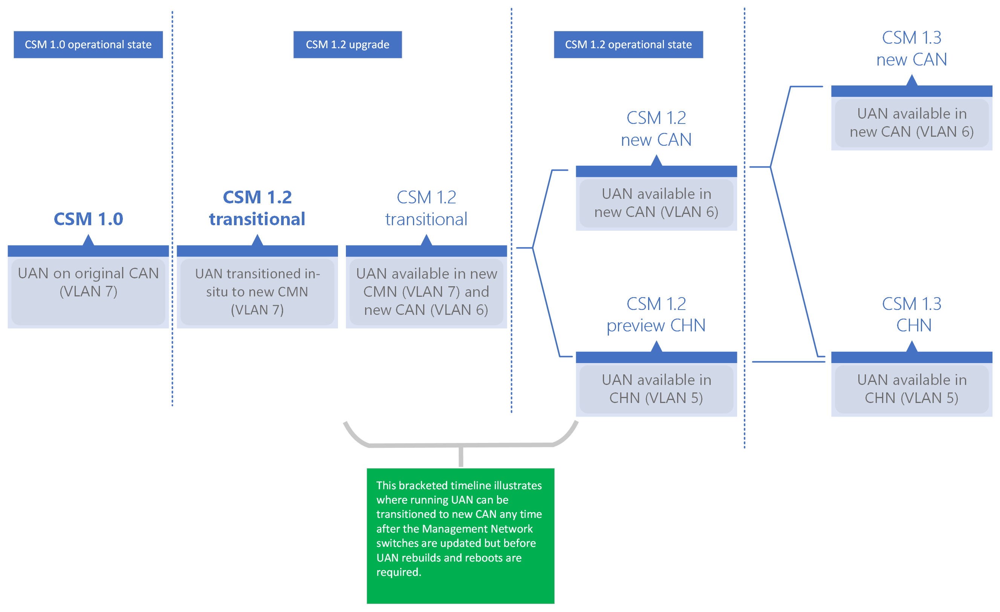

# Enabling Customer High Speed Network Routing

- [Enabling Customer High Speed Network Routing](#enabling-customer-high-speed-network-routing)
  - [Prerequisites](#prerequisites)
  - [Configuration tasks](#configuration-tasks)
    - [Configure SLS](#configure-sls)
    - [Configure Management Network](#configure-management-network)
    - [Configure UAN](#configure-uan)
    - [Minimize UAN downtime](#minimize-uan-downtime)
    - [Configure UAI](#configure-uai)
    - [Configure compute nodes](#configure-compute-nodes)
      - [Retrieve SLS data as JSON](#retrieve-sls-data-as-json)
      - [Add compute IP addresses to CHN SLS data](#add-compute-ip-addresses-to-chn-sls-data)
      - [Upload migrated SLS file to SLS service](#upload-migrated-sls-file-to-sls-service)
      - [Enable CFS layer](#enable-cfs-layer)
    - [Configure NCNs](#configure-ncns)
    - [Configure the API gateways](#configure-the-api-gateways)
  - [Validation tasks](#validation-tasks)
    - [Validating SLS](#validating-sls)
    - [Validating UAN](#validating-uan)
    - [Validating UAI](#validating-uai)
    - [Validate compute nodes](#validate-compute-nodes)
    - [Validate NCNs](#validate-ncns)
    - [Validate the API gateways](#validate-the-api-gateways)

## Prerequisites

- Many of the procedures use the Cray Command Line Interface. These can be identified by their use of the `cray` command. For these procedures, the
  Cray CLI must be configured on the node where the procedure is being followed. See
  [Configure the Cray CLI](../../configure_cray_cli.md).
- Some of the procedures require the CSM documentation RPM to be installed on the node where the procedure is being done.
  This is called out in the procedures where it is a requirement. For information on installing the RPM, see
  [Check for Latest Documentation](../../../update_product_stream/README.md#check-for-latest-documentation).

## Configuration tasks

### Configure SLS

Configuration for the default route of a BICAN enabled system is contained in the System Layout Service (SLS) BICAN data structure in the `SystemDefaultRoute` attribute value.

> The commands in this section can be run on any master or worker NCN with the CSM documentation RPM installed. See
> [Check for Latest Documentation](../../../update_product_stream/README.md#check-for-latest-documentation).

For CSM 1.2, the recommended value for the BICAN `SystemDefaultRoute` is `CAN`.
This allows continued use of UAN, UAI, and API resources over the `CAN` and allows a fully supported transition to `CHN` in a later CSM release.

(`ncn-mw#`) To update SLS with `CAN` as the `SystemDefaultRoute`:

```bash
/usr/share/doc/csm/scripts/operations/bifurcated_can/bican_route.py --route CAN
```

Example output:

```text
Setting SystemDefaultRoute to CAN
```

**Preview:** High Speed Network access by users to UAN, UAI, and API resources is the `CHN` option.
This is available during the CSM 1.2 release for those who wish to forge ahead of release-supported features.

(`ncn-mw#`) To set and use the `CHN` in SLS, update the `SystemDefaultRoute` with:

```bash
/usr/share/doc/csm/scripts/operations/bifurcated_can/bican_route.py --route CHN
```

Example output:

```text
Setting SystemDefaultRoute to CHN
```

### Configure Management Network

If the system is moving from the CAN to CHN, then the management network will need configuration changes to allow connectivity.

Refer to [BICAN switch configuration](bican_switch_configuration.md) to configure management network switches and customer edge switches.

### Configure UAN

During the next CFS run, the UANs will be configured to the network set in the SLS BICAN `SystemDefaultRoute` attribute, if the following Ansible variable is set.

`uan_can_setup: yes`

For more information, see the "HPE Cray User Access Node (UAN) Software Administration Guide (`S-8033`)" document on the [HPE Support Center](https://support.hpe.com).

### Minimize UAN downtime

UANs running before and during an upgrade to CSM 1.2 will continue running with no connectivity or local data impacts until an administrator-scheduled transition takes place.
While access to currently running UANs continues during the upgrade, UAN rebuilds and reboots not supported.

The time frame over which the transition can be scheduled is quite large and the transition requires only that UAN users log out of the UAN (over the old IPv4 address) and log back in (over a new IPv4 address).
The following diagram illustrates the UAN timeline before, during, and after the CSM 1.2 upgrade.



Concretely, users on a running UAN may be transitioned from the CMN to the new CAN before [UANs are booted with new images](../../boot_orchestration/Boot_UANs.md).

### Configure UAI

Newly created User Access Instances (UAI) will use the network configured as the `SystemDefaultRoute` in the SLS BICAN network.

Existing UAIs will continue to use the network that was set when it was created.

### Configure compute nodes

Prerequisites for this task:

- Cray Operating System, Slingshot Host Software, and Slingshot have been installed and configured.
- Egress connection from compute nodes to site resources (e.g. license server) is required.
- A NAT device is not in place to enable use of HSN IP addresses.
- The CHN subnet is large enough to contain all compute nodes.

#### Retrieve SLS data as JSON

1. (`ncn-mw#`) Obtain a token.

   ```bash
   export TOKEN=$(curl -s -k -S -d grant_type=client_credentials -d client_id=admin-client \
                    -d client_secret=`kubectl get secrets admin-client-auth -o jsonpath='{.data.client-secret}' | base64 -d` \
                    https://api-gw-service-nmn.local/keycloak/realms/shasta/protocol/openid-connect/token | jq -r '.access_token')
   ```

1. (`ncn-mw#`) Create a working directory.

   ```bash
   mkdir /root/sls_chn_ips && cd /root/sls_chn_ips
   ```

1. (`ncn-mw#`) Extract SLS data to a file.

   ```bash
   curl -k -H "Authorization: Bearer ${TOKEN}" https://api-gw-service-nmn.local/apis/sls/v1/dumpstate | jq -S . > sls_input_file.json
   ```

#### Add compute IP addresses to CHN SLS data

> The CSM documentation RPM must be installed on the node where this command is run. See
> [Check for Latest Documentation](../../../update_product_stream/README.md#check-for-latest-documentation).

(`ncn-mw#`) Process the SLS file:

   ```bash
   DOCDIR=/usr/share/doc/csm/upgrade/scripts/sls
   ${DOCDIR}/add_computes_to_chn.py --sls-input-file sls_input_file.json
   ```

The default output file name will be `chn_with_computes_added_sls_file.json`, but can be changed by using the flag `--sls-output-file` with the script.

#### Upload migrated SLS file to SLS service

(`ncn-mw#`) If the following command does not complete successfully, check if the `TOKEN` environment variable is set correctly.

   ```bash
   curl --fail -H "Authorization: Bearer ${TOKEN}" -k -L -X POST 'https://api-gw-service-nmn.local/apis/sls/v1/loadstate' -F 'sls_dump=@chn_with_computes_added_sls_file.json'
   ```

#### Enable CFS layer

CHN network configuration of compute nodes is performed by the UAN CFS configuration layer. This procedure describes how to identify the UAN layer and add it to the compute node configuration.

1. Determine the CFS configuration in use on the compute nodes.

   1. (`ncn#`) Identify the compute nodes.

      ```bash
      cray hsm state components list --role Compute --format json | jq -r '.Components[] | .ID'
      ```

      Example output:

      ```text
      x1000c5s1b0n1
      x1000c5s1b0n0
      x1000c5s0b0n0
      x1000c5s0b0n1
      ```

   1. (`ncn#`) Identify CFS configuration in use on the compute nodes.

      ```bash
      cray cfs components describe --format toml x1000c5s1b0n1
      ```

      Example output:

      ```toml
      configurationStatus = "configured"
      desiredConfig = "cos-config-full-2.3-integration"
      enabled = true
      errorCount = 0
      id = "x1000c5s1b0n1"
      ```

   1. (`ncn#`) Extract the CFS configuration.

      ```bash
      cray cfs configurations describe cos-config-full-2.3-integration --format json | jq 'del(.lastUpdated) | del(.name)' > cos-config-full-2.3-integration.json
      ```

1. Identify the UAN CFS configuration.

   1. (`ncn#`) Identify the UAN nodes.

      ```bash
      cray hsm state components list --role Application --subrole UAN --format    json | jq -r '.Components[] | .ID'
      ```

      Example output:

      ```text
      x3000c0s25b0n0
      x3000c0s16b0n0
      x3000c0s15b0n0
      ```

   1. (`ncn#`) Identify the UAN CFS configuration in use.

      ```bash
      cray cfs components describe --format toml x3000c0s25b0n0
      ```

      Example output:

      ```toml
      configurationStatus = "configured"
      desiredConfig = "chn-uan-cn"
      enabled = true
      errorCount = 0
      id = "x3000c0s25b0n0"
      ```

   1. (`ncn#`) Identify the UAN CFS configuration layer.

      ```bash
      cray cfs configurations describe chn-uan-cn --format json
      ```

      The resulting output should look similar to this. Installed products, versions, and commit hashes will vary.

      ```json
      {
        "lastUpdated": "2022-05-27T20:15:10Z",
        "layers": [
          {
            "cloneUrl": "https://api-gw-service-nmn.local/vcs/cray/uan-config-management.git",
            "commit": "359611be2f6893ddd0020841b73a3d4924120bb1",
            "name": "chn-uan-cn",
            "playbook": "site.yml"
          }
        ],
        "name": "chn-uan-cn"
      }
      ```

1. Edit the extracted compute node configuration and add the UAN layer to it.

1. (`ncn#`) Update the compute node CFS configuration.

   ```bash
   cray cfs configurations update cos-config-full-2.3-integration --file cos-config-full-2.3-integration.json --format toml
   ```

   Example output:

   ```toml
   lastUpdated = "2022-05-27T20:47:18Z"
   name = "cos-config-full-2.3-integration"
   [[layers]]
   cloneUrl = "https://api-gw-service-nmn.local/vcs/cray/   slingshot-host-software-config-management.git"
   commit = "dd428854a04a652f825a3abbbf5ae2ff9842dd55"
   name = "shs-integration"
   playbook = "shs_mellanox_install.yml"

   [[layers]]
   cloneUrl = "https://api-gw-service-nmn.local/vcs/cray/csm-config-management.git"
   commit = "92ce2c9988fa092ad05b40057c3ec81af7b0af97"
   name = "csm-1.9.21"
   playbook = "site.yml"

   [[layers]]
   cloneUrl = "https://api-gw-service-nmn.local/vcs/cray/cos-config-management.git"
   commit = "dd2bcbb97e3adbfd604f9aa297fb34baa0dd90f7"
   name = "cos-compute-integration-2.3.75"
   playbook = "cos-compute.yml"

   [[layers]]
   cloneUrl = "https://api-gw-service-nmn.local/vcs/cray/sma-config-management.git"
   commit = "2219ca094c0a2721f3bf52f5bd542d8c4794bfed"
   name = "sma-base-config"
   playbook = "sma-base-config.yml"

   [[layers]]
   cloneUrl = "https://api-gw-service-nmn.local/vcs/cray/sma-config-management.git"
   commit = "2219ca094c0a2721f3bf52f5bd542d8c4794bfed"
   name = "sma-ldms-ncn"
   playbook = "sma-ldms-ncn.yml"

   [[layers]]
   cloneUrl = "https://api-gw-service-nmn.local/vcs/cray/slurm-config-management.git"
   commit = "0982661002a857d743ee5b772520e47c97f63acc"
   name = "slurm master"
   playbook = "site.yml"

   [[layers]]
   cloneUrl = "https://api-gw-service-nmn.local/vcs/cray/pbs-config-management.git"
   commit = "874050c9820cc0752c6424ef35295289487acccc"
   name = "pbs master"
   playbook = "site.yml"

   [[layers]]
   cloneUrl = "https://api-gw-service-nmn.local/vcs/cray/analytics-config-management.git"
   commit = "d4b26b74d08e668e61a1e5ee199e1a235e9efa3b"
   name = "analytics integration"
   playbook = "site.yml"

   [[layers]]
   cloneUrl = "https://api-gw-service-nmn.local/vcs/cray/cos-config-management.git"
   commit = "dd2bcbb97e3adbfd604f9aa297fb34baa0dd90f7"
   name = "cos-compute-last-integration-2.3.75"
   playbook = "cos-compute-last.yml"

   [[layers]]
   cloneUrl = "https://api-gw-service-nmn.local/vcs/cray/uan-config-management.git"
   commit = "359611be2f6893ddd0020841b73a3d4924120bb1"
   name = "chn-uan-cn"
   playbook = "site.yml"
   ```

1. (`ncn#`) Check that CFS configuration of the compute node completes successfully.

   Updating the CFS configuration will cause CFS to schedule the nodes for configuration. Run the following command to verify this has occurred.

   ```bash
   cray cfs components describe --format toml x1000c5s1b0n1
   ```

   Example output:

   ```toml
   configurationStatus = "pending"
   desiredConfig = "cos-config-full-2.3-integration"
   enabled = true
   errorCount = 0
   id = "x1000c5s1b0n1"
   state = []

   [tags]
   ```

   `configurationStatus` should change from `pending` to `configured` once CFS configuration of the node is complete.

For more information on managing node with CFS, see the [Configuration Management](../../README.md#configuration-management) documentation.

### Configure NCNs

Prerequisites for this task:

- CSM NCN personalization has been configured.
- Cray Operating System, Slingshot Host Software, and Slingshot have been installed and configured.

1. Determine the CFS configuration in use on the worker nodes.

   1. (`ncn#`) Identify the worker nodes.

      ```bash
      cray hsm state components list --role Management --subrole Worker --format json | jq -r '.Components[] | .ID'
      ```

      Example output:

      ```text
      x3000c0s4b0n0
      x3000c0s6b0n0
      x3000c0s5b0n0
      x3000c0s7b0n0
      ```

   1. (`ncn#`) Identify CFS configuration in use on the worker nodes.

      ```bash
      cray cfs components describe --format toml x3000c0s4b0n0
      ```

      Example output:

      ```toml
      configurationStatus = "configured"
      desiredConfig = "ncn-personalization"
      enabled = true
      errorCount = 0
      id = "x3000c0s4b0n0"
      ```

1. (`ncn#`) Extract the CFS configuration.

   ```bash
   cray cfs configurations describe ncn-personalization --format json | jq 'del(.lastUpdated) | del(.name)' > ncn-personalization.json
   ```

   The resulting output file should look similar to this. Installed products, versions, and commit hashes will vary.

   ```json
   {
     "layers": [
       {
         "cloneUrl": "https://api-gw-service-nmn.local/vcs/cray/slingshot-host-software-config-management.git",
         "commit": "f4e2bb7e912c39fc63e87a9284d026a5bebb6314",
         "name": "shs-1.7.3-45-1.0.26",
         "playbook": "shs_mellanox_install.yml"
       },
       {
         "cloneUrl": "https://api-gw-service-nmn.local/vcs/cray/csm-config-management.git",
         "commit": "92ce2c9988fa092ad05b40057c3ec81af7b0af97",
         "name": "csm-1.9.21",
         "playbook": "site.yml"
       },
       {
         "cloneUrl": "https://api-gw-service-nmn.local/vcs/cray/sat-config-management.git",
         "commit": "4e14a37b32b0a3b779b7e5f2e70998dde47edde1",
         "name": "sat-2.3.4",
         "playbook": "sat-ncn.yml"
       },
       {
         "cloneUrl": "https://api-gw-service-nmn.local/vcs/cray/cos-config-management.git",
         "commit": "dd2bcbb97e3adbfd604f9aa297fb34baa0dd90f7",
         "name": "cos-integration-2.3.75",
         "playbook": "ncn.yml"
       },
       {
         "cloneUrl": "https://api-gw-service-nmn.local/vcs/cray/cos-config-management.git",
         "commit": "dd2bcbb97e3adbfd604f9aa297fb34baa0dd90f7",
         "name": "cos-integration-2.3.75",
         "playbook": "ncn-final.yml"
       }
     ]
   }
   ```

1. Edit the extracted file and take the existing CSM layer and create an new layer to run the `enable_chn.yml` playbook.

   ```json
   {
     "cloneUrl": "https://api-gw-service-nmn.local/vcs/cray/csm-config-management.git",
     "commit": "92ce2c9988fa092ad05b40057c3ec81af7b0af97",
     "name": "csm-1.9.21",
     "playbook": "enable_chn.yml"
   }
   ```

   **Important:** This new layer *must* run after the SHS and COS `ncn-final.yml` layers, otherwise the HSN interfaces will not be configured correctly and this playbook will fail.

1. (`ncn#`) Update the NCN personalization configuration.

   ```bash
   cray cfs configurations update ncn-personalization --file ncn-personalization.json --format toml
   ```

   Example output:

   ```toml
   lastUpdated = "2022-05-25T09:22:44Z"
   name = "ncn-personalization"
   [[layers]]
   cloneUrl = "https://api-gw-service-nmn.local/vcs/cray/   slingshot-host-software-config-management.git"
   commit = "f4e2bb7e912c39fc63e87a9284d026a5bebb6314"
   name = "shs-1.7.3-45-1.0.26"
   playbook = "shs_mellanox_install.yml"

   [[layers]]
   cloneUrl = "https://api-gw-service-nmn.local/vcs/cray/csm-config-management.git"
   commit = "92ce2c9988fa092ad05b40057c3ec81af7b0af97"
   name = "csm-1.9.21"
   playbook = "site.yml"

   [[layers]]
   cloneUrl = "https://api-gw-service-nmn.local/vcs/cray/sat-config-management.git"
   commit = "4e14a37b32b0a3b779b7e5f2e70998dde47edde1"
   name = "sat-2.3.4"
   playbook = "sat-ncn.yml"

   [[layers]]
   cloneUrl = "https://api-gw-service-nmn.local/vcs/cray/cos-config-management.git"
   commit = "dd2bcbb97e3adbfd604f9aa297fb34baa0dd90f7"
   name = "cos-integration-2.3.75"
   playbook = "ncn.yml"

   [[layers]]
   cloneUrl = "https://api-gw-service-nmn.local/vcs/cray/cos-config-management.git"
   commit = "dd2bcbb97e3adbfd604f9aa297fb34baa0dd90f7"
   name = "cos-integration-2.3.75"
   playbook = "ncn-final.yml"

   [[layers]]
   cloneUrl = "https://api-gw-service-nmn.local/vcs/cray/csm-config-management.git"
   commit = "92ce2c9988fa092ad05b40057c3ec81af7b0af97"
   name = "csm-1.9.21"
   playbook = "enable_chn.yml"
   ```

1. (`ncn#`) Check that NCN personalization runs and completes successfully on the worker nodes.

   Updating the CFS configuration will cause CFS to schedule the nodes for configuration. Run the following command to verify this has occurred.

   ```bash
   cray cfs components describe --format toml x3000c0s4b0n0
   ```

   Example output:

   ```toml
   configurationStatus = "pending"
   desiredConfig = "ncn-personalization"
   enabled = true
   errorCount = 0
   id = "x3000c0s4b0n0"
   state = []
   
   [tags]
   ```

   `configurationStatus` should change from `pending` to `configured` once NCN personalization completes successfully.

For more information on managing NCN personalization, see [Perform NCN Personalization](../../CSM_product_management/Perform_NCN_Personalization.md).

### Configure the API gateways

No additional steps are required to configure the API gateways for CHN.

If CHN is selected during CSM installation or upgrade, then the `customer-high-speed` MetalLB pool is defined and the load balancers configured with IP addresses from this pool.

## Validation tasks

### Validating SLS

(`ncn-mw#`) To display current setting of the `SystemDefaultRoute` SLS BICAN network, run the following command.

> The CSM documentation RPM must be installed on the node where this command is run. See
> [Check for Latest Documentation](../../../update_product_stream/README.md#check-for-latest-documentation).

```bash
/usr/share/doc/csm/scripts/operations/bifurcated_can/bican_route.py --check
```

Example output:

```text
Configured SystemDefaultRoute: CHN
```

### Validating UAN

1. (`ncn#`) Retrieve the `CHN` network information from SLS.

   ```bash
   cray sls search networks list --name CHN --format json  | jq '.[].   ExtraProperties.Subnets[] | select(.Name=="bootstrap_dhcp") | del(.IPReservations)'
   ```

   Example output:

   ```json
   {
     "CIDR": "10.103.9.0/25",
     "DHCPEnd": "10.103.9.62",
     "DHCPStart": "10.103.9.16",
     "FullName": "CHN Bootstrap DHCP Subnet",
     "Gateway": "10.103.9.1",
     "Name": "bootstrap_dhcp",
     "VlanID": 5
   }
   ```

1. (`uan#`) Verify that the default route is set correctly on the UAN.

   ```bash
   ip r
   ```

   Example output:

   ```text
   default via 10.103.9.1 dev hsn0
   10.92.100.0/24 via 10.252.0.1 dev nmn0
   10.100.0.0/17 via 10.252.0.1 dev nmn0
   10.103.9.0/25 dev hsn0 proto kernel scope link src 10.103.9.15
   10.252.0.0/17 dev nmn0 proto kernel scope link src 10.252.1.16
   10.253.0.0/16 dev hsn0 proto kernel scope link src 10.253.0.25
   ```

### Validating UAI

1. (`ncn#`) Retrieve the configured CHN subnet from SLS.

   ```bash
   cray sls search networks list --name CHN --format json | jq '.[].   ExtraProperties.Subnets[] | select(.Name=="chn_metallb_address_pool")'
   ```

   Example output:

   ```json
   {
     "CIDR": "10.103.9.64/27",
     "FullName": "CHN Dynamic MetalLB",
     "Gateway": "10.103.9.65",
     "MetalLBPoolName": "customer-high-speed",
     "Name": "chn_metallb_address_pool",
     "VlanID": 5
   }
   ```

1. (`ncn#`) Verify that UAIs are being created with IP addresses in the correct range.

   ```bash
   cray uas admin uais list --format json | jq -c '.[] | {uai_name, uai_ip}'
   ```

   Example output:

   ```json
   {"uai_name":"uai-vers-93f0289d","uai_ip":"10.103.9.69"}
   {"uai_name":"uai-vers-9f67ac89","uai_ip":"10.103.9.70"}
   {"uai_name":"uai-vers-b773a5d9","uai_ip":"10.103.9.71"}
   ```

1. (`ncn-mw#`) Run the UAI gateway tests.

   > The CSM documentation RPM must be installed on the node where this command is run. See
   > [Check for Latest Documentation](../../../update_product_stream/README.md#check-for-latest-documentation).

   ```bash
   /usr/share/doc/csm/scripts/operations/gateway-test/uai-gateway-test.sh
   ```

   The test will launch a UAI with the `gateway-test` image, execute the gateway tests, and then delete the UAI that was launched. The test will complete with an overall test status based on the
   result of the individual health checks on all of the networks. Example output:

   ```text
   Overall Gateway Test Status:  PASS
   ```

See [Gateway Testing](../Gateway_Testing.md) for more information.

### Validate compute nodes

1. (`ncn#`) Retrieve the `CHN` network information from SLS.

   ```bash
   cray sls search networks list --name CHN --format json  | jq '.[].   ExtraProperties.Subnets[] | select(.Name=="bootstrap_dhcp") | del(.IPReservations)'
   ```

   Example output:

   ```json
   {
     "CIDR": "10.103.9.0/25",
     "DHCPEnd": "10.103.9.62",
     "DHCPStart": "10.103.9.16",
     "FullName": "CHN Bootstrap DHCP Subnet",
     "Gateway": "10.103.9.1",
     "Name": "bootstrap_dhcp",
     "VlanID": 5
   }
   ```

1. (`cn#`) Verify that the compute nodes have `CHN` IP addresses set on the `hsn0` interface.

   ```bash
   ip ad show hsn0
   ```

   Example output:

   ```text
   3: hsn0: <BROADCAST,MULTICAST,UP,LOWER_UP> mtu 9000 qdisc mq state UP group default qlen    1000
       link/ether 02:00:00:00:08:73 brd ff:ff:ff:ff:ff:ff
       altname enp194s0np0
       inet 10.253.0.54/16 scope global hsn0
          valid_lft forever preferred_lft forever
       inet 10.103.9.48/25 scope global hsn0
          valid_lft forever preferred_lft forever
       inet6 fe80::ff:fe00:873/64 scope link
          valid_lft forever preferred_lft forever
   ```

1. (`cn#`) Verify that the default route is set correctly on the compute nodes.

   ```bash
   ip route show
   ```

   Example output:

   ```text
   default via 10.103.9.1 dev hsn0
   10.92.100.0/24 via 10.100.0.1 dev nmn0
   10.100.0.0/22 dev nmn0 proto kernel scope link src 10.100.0.13
   10.100.0.0/17 via 10.100.0.1 dev nmn0
   10.103.9.0/25 dev hsn0 proto kernel scope link src 10.103.9.48
   10.252.0.0/17 via 10.100.0.1 dev nmn0
   10.253.0.0/16 dev hsn3 proto kernel scope link src 10.253.0.53
   10.253.0.0/16 dev hsn2 proto kernel scope link src 10.253.0.37
   10.253.0.0/16 dev hsn1 proto kernel scope link src 10.253.0.38
   10.253.0.0/16 dev hsn0 proto kernel scope link src 10.253.0.54
   ```

### Validate NCNs

1. (`ncn#`) Retrieve the `CHN` network information from SLS.

   ```bash
   cray sls search networks list --name CHN --format json  | jq '.[].   ExtraProperties.Subnets[] | select(.Name=="bootstrap_dhcp") | del(.IPReservations)'
   ```

   Example output:

   ```json
   {
     "CIDR": "10.103.9.0/25",
     "DHCPEnd": "10.103.9.62",
     "DHCPStart": "10.103.9.16",
     "FullName": "CHN Bootstrap DHCP Subnet",
     "Gateway": "10.103.9.1",
     "Name": "bootstrap_dhcp",
     "VlanID": 5
   }
   ```

1. (`ncn#`) Verify that the worker nodes have `CHN` IP addresses set on the `hsn0` interface.

   > Adjust the `-w` argument in the following command to cover the range of worker nodes on the system.

   ```bash
   pdsh -w ncn-w00[1-4] 'ip ad show hsn0 | grep inet\ ' | dshbak -c
   ```

   Example output:

   ```text
   ----------------
   ncn-w001
   ----------------
       inet 10.253.0.21/16 brd 10.253.255.255 scope global hsn0
       inet 10.103.9.10/25 scope global hsn0
   ----------------
   ncn-w002
   ----------------
       inet 10.253.0.3/16 brd 10.253.255.255 scope global hsn0
       inet 10.103.9.9/25 scope global hsn0
   ----------------
   ncn-w003
   ----------------
       inet 10.253.0.19/16 brd 10.253.255.255 scope global hsn0
       inet 10.103.9.8/25 scope global hsn0
   ----------------
   ncn-w004
   ----------------
       inet 10.253.0.1/16 brd 10.253.255.255 scope global hsn0
       inet 10.103.9.7/25 scope global hsn0
   ```

### Validate the API gateways

1. (`ncn-mw#`) Check that the `istio-ingressgateway-chn` API gateway has an IP address.

   ```bash
   kubectl -n istio-system get svc istio-ingressgateway-chn
   ```

   Example output:

   ```text
   NAME                       TYPE           CLUSTER-IP      EXTERNAL-IP   PORT(S)                      AGE
   istio-ingressgateway-chn   LoadBalancer   10.23.158.228   10.103.9.65   80:30126/TCP,443:31972/TCP   74d
   ```

1. (`ncn-mw#`) Run the NCN gateway health checks.

   > The CSM documentation RPM must be installed on the node where this command is run. See
   > [Check for Latest Documentation](../../../update_product_stream/README.md#check-for-latest-documentation).

   ```bash
   /usr/share/doc/csm/scripts/operations/gateway-test/ncn-gateway-test.sh
   ```

   The test will complete with an overall test status based on the result of the individual health checks on all of the networks. Example output:

   ```text
   Overall Gateway Test Status:  PASS
   ```

See [Gateway Testing](../Gateway_Testing.md) for more information.
