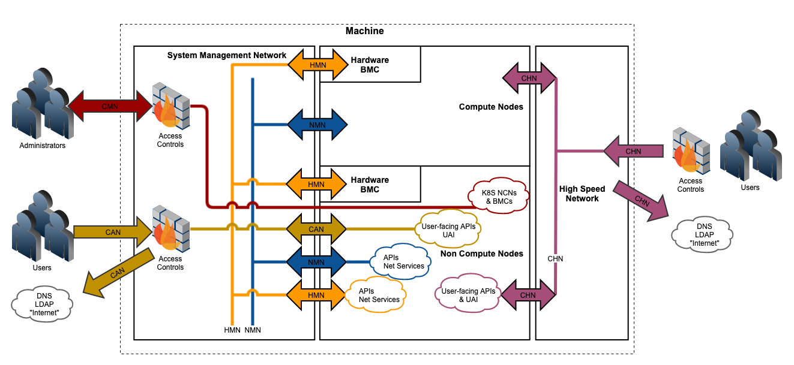
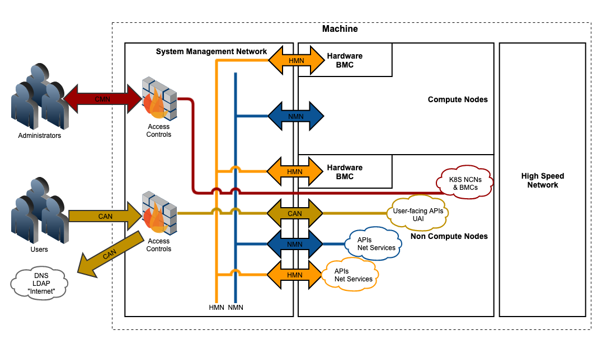
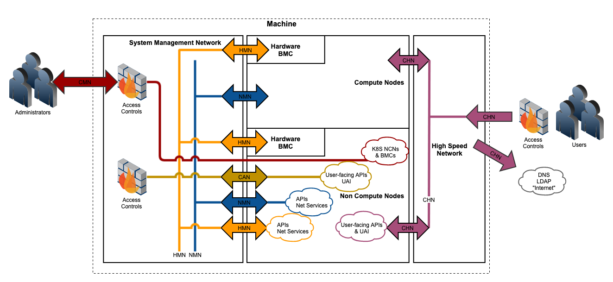

# BICAN Support Matrix - Shasta Customer Access Networks

## Data sheet - Shasta networking - Customer Access Networks

### Overview

Customer Access Networks provide the interface between Shasta system networking and the customer site network. Customer Access Networks (CANs) are routed networks with broadcast domain separation. Customer Access
Networks provide higher availability and more flexibility in accessing cloud services compared to traditional "bastion hosts", and are more in line with the cloud-native architecture of Shasta as whole.

Customer Access Networks (CANs) provide flexible networking at the edge between the site and Shasta system to do the following:

* Perform administrative tasks on the system.
* Run jobs and move job data to and from the system.
* Access site resources like DNS and LDAP from the system.

## Feature access matrix

For CSM 1.2, the notion of the CAN has been expanded to meet customer requests for increased flexibility and policy control.

| System Resource | Traffic to and from System | Management Network or CAN | High Speed Network CHN | Management Network CMN       |
| --------------- | :------------------------: | :-----------------------: | :--------------------: |:-----------------------: |
| System Cloud Resources (APIs) | Ingress                    | Jobs-related APIs         | Jobs-related APIs      | Administrative APIs          |
| Application Node Servers (UAI, UAN, re-purposed CN) | Ingress                    | Allowed                   | Allowed                | Not Allowed                  |
| Non-Compute Node (NCN) Servers | Ingress                    | Not Allowed               | Not Allowed            | Allowed                      |
| System Access to External/Site (LDAP, DNS) | Egress                     | Allowed                   | Allowed                | Not Allowed                  |

* Selection of user access for job control and data movement over the Shasta Management Network (CAN) or the High Speed Network (CHN) is made during system installation or upgrade.

* Creation of the Customer Management Network (CMN) during installation or upgrade is mandatory.

## Network overview

### Internal networks

* Node Management Network (NMN) \- Provides the internal control plane for systems management and jobs control.
* Hardware Management Network (HMN) \- Provides internal access to system baseboard management controllers (BMC/iLO) and other lower-level hardware access.

### External and edge networks

* Customer Management Network (CMN) \- Provides customer access from the site to the system for administrators.
* Customer Access Network (CAN) or Customer High Speed Network (CHN) provide:
  * Customer access from the site to the system for job control and jobs data movement.
  * Access from the system to the site for network services like DNS, LDAP, etc.

## Supported configurations

### Option A: CMN + CAN (Management Network only - Layer 2 separation)

### Option B: CMN + CHN (Administration over Management Network, User Access over High Speed Network)

Note: During installation, the High Speed Network is not configured until relatively late in the process.
Installation generally requires site access for deployment artifacts, site DNS, etc.
In order to achieve this, the CMN is used during the installation process for system traffic egress until the High Speed Network is available.

## Network capabilities

### Layer 2

* CMN, CAN, and CHN have broadcast boundaries at the edge between the system and the site.

### Layer 3

* Addressing
  * IPv4 supported (default)
  * IPv6 roadmap
* Routing
  * Static routes (default) exist on the edge router/switches.
  * Dynamic routing (OSPF) is possible at the edge.

## Network sizing and requirements

### CMN sizing and requirements

#### CMN IPv4 sizing and requirements

* Site routable
* Contiguous (CIDR block)
* Non-overlapping with internal networks (configurable during installation)
* Size estimate is the sum of:
  * Number of Non-Compute Nodes (NCNs) of type master, worker, or storage used by the Kubernetes cluster
  * Number of switches on the Management Network
  * Number of administrative API endpoints
  * Several administrative addresses for switch interfaces and routing.
  * A `/26` block is typically sufficient for systems less than approximately 4000 nodes.

### CAN or CHN sizing and requirements

#### CAN or CHN IPv4 sizing and requirements

* Site routable
* Contiguous (CIDR block)
* Non-overlapping with internal networks (configurable during installation)
* Size estimate is the sum of:
  * Number of application nodes requiring access from the site (User Access Node (UAN), login nodes, etc.)
  * Number of User Access Instances (UAI) in Kubernetes (if used).
  * Number of API endpoints
  * Several administrative addresses for switch interfaces and routing
  * NOTE: CAN or CHN sizing is largely dependent on customer-specific use cases and application node hardware.
