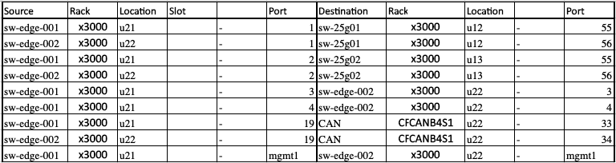
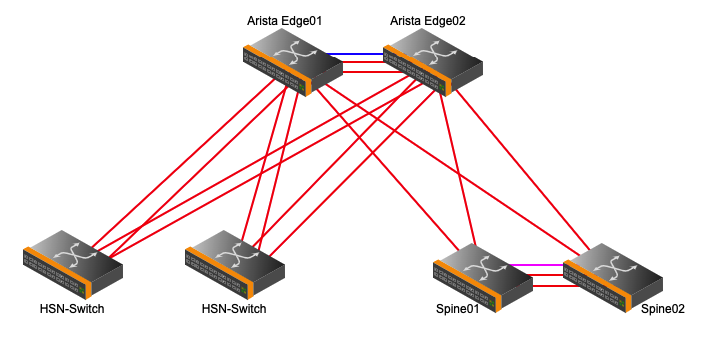

# BICAN switch configuration

Validate cabling and generate switch configurations for BICAN.

## Cabling requirements

- Customer edge router is cabled to the HSN as described in the Slingshot documentation.
- Customer edge router is cabled to the management network.
- Below is an SHCD example of how the edge switches should be cabled to the management network.
- Note: the last line with the management ports will need to be excluded from CANU validate/generate. CANU currently does not support management ports.



Topology example:



## Switch configuration

### Prerequisites

- SLS Updated
- CANU 1.6.14
- Update CCJ
- Custom switch configuration

### Custom switch configuration

- Custom switch configuration is injected into the management network switch configuration when it is generated from CANU.
- Most sites require custom configuration for the site connection.
- This configuration should be discussed and approved by the site networking team.
- The example below is using OSPF point-to-pint links between the spine and edge switches for site connectivity.

```yaml
sw-spine-001: |
  interface 1/1/55 
      no shutdown 
      vrf attach Customer
      description sw-edge-002:1/1
      ip address 192.168.80.5/31
      ip mtu 9198
      ip ospf 2 area 0.0.0.0
      ip ospf network point-to-point

  interface 1/1/56 
      no shutdown 
      vrf attach Customer
      description sw-edge-001:1/1
      ip address 192.168.80.1/31
      ip mtu 9198
      ip ospf 2 area 0.0.0.0
      ip ospf network point-to-point

sw-spine-002: |
  interface 1/1/55 
      no shutdown 
      mtu 9198
      vrf attach Customer
      description sw-edge-002:2/1
      ip address 192.168.80.7/31
      ip mtu 9198
      ip ospf 2 area 0.0.0.0
      ip ospf network point-to-point

  interface 1/1/56 
      no shutdown 
      mtu 9198
      vrf attach Customer
      description sw-edge-001:2/1
      ip address 192.168.80.3/31
      ip mtu 9198
      ip ospf 2 area 0.0.0.0
      ip ospf network point-to-point
      exit

```

### Generate

Generate switch configurations with custom configurations (Arista only).

This is an example only. More details on how to generate configurations with CANU can be found in the [Generate Switch Configurations](generate_switch_configs.md) procedure.

```bash
    canu generate network config --ccj ./ccj.json --sls-file ./sls_input_file.json --csm 1.3 --folder ./1.3 --custom-config ./custom_switch_config.yaml
    sw-edge-001 Config Generated
    sw-spine-001 Customized Configurations have been detected in the generated switch configurations
    sw-edge-002 Config Generated
    sw-spine-002 Customized Configurations have been detected in the generated switch configurations
    sw-leaf-bmc-001 Config Generated
```

1. Validate and apply switch configurations to management network switches, EXCLUDING the edge switches.  [Validate Switch Configurations](validate_switch_configs.md).
2. Apply the generated edge switch configurations. This is NOT a full configuration, the configuration generated is only what is needed for CHN. This switch should already be setup from the Slingshot documentation.

The following is an example of a full running configuration of two spines and two edge switches. This configuration should be not be copied and should be used as a general reference only. Refer to [BI-CAN Aruba/Arista Configuration
](../customer_accessible_networks/bi-can_arista_aruba_config.md) for more information.
