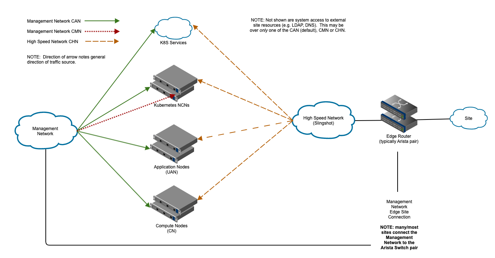

# Bifurcating the CAN - Feature Details

1. [CAN new features overview](#1-can-new-features-overview)
1. [Customer High Speed Network (CHN)](#2-customer-high-speed-network-chn)
    1. [Accessible CHN system ingress endpoints](#21-accessible-chn-system-ingress-endpoints)
    1. [Accessible CHN system egress endpoints](#22-accessible-chn-system-egress-endpoints)
    1. [Endpoint naming](#23-endpoint-naming)
        1. [Touchpoints: effects and changes](#231-touchpoints-effects-and-changes)
        1. [When naming occurs](#232-when-naming-occurs)
        1. [Ability to change post-install](#233-ability-to-change-post-install)
    1. [Endpoint addressing](#24-endpoint-addressing)
        1. [Touchpoints: effects and changes](#241-touchpoints-effects-and-changes)
        1. [When addressing occurs](#242-when-addressing-occurs)
        1. [Ability to change post-install](#243-ability-to-change-post-install)
    1. [Traffic separation and routing](#25-traffic-separation-and-routing)
        1. [Touchpoints: effects and changes](#251-touchpoints-effects-and-changes)
        1. [When configuration occurs](#252-when-configuration-occurs)
        1. [Ability to change post-install](#253-ability-to-change-post-install)
1. [Customer Management Management Network (CMN)](#3-customer-management-management-network-cmn)
    1. [Traffic separation and routing](#31-traffic-separation-and-routing)
    1. [Endpoint naming](#32-endpoint-naming)
    1. [Endpoint addressing](#33-endpoint-addressing)
    1. [Changes](#34-changes)
        1. [Touchpoints: effects and changes](#341-touchpoints-effects-and-changes)
        1. [When configuration occurs](#342-when-configuration-occurs)
        1. [Ability to change post install](#343-ability-to-change-post-install)
1. [Customer Access - external/site access](#4-customer-access---externalsite-access)
    1. [Traffic separation and routing](#41-traffic-separation-and-routing)
    1. [Changes](#42-changes)
        1. [Touchpoints: effects and changes](#421-touchpoints-effects-and-changes)
        1. [When configuration occurs](#422-when-configuration-occurs)
        1. [Ability to change post-install](#423-ability-to-change-post-install)

## 1 CAN new features overview

Bifurcation or splitting of the Customer Access Network (CAN) enables customization of customer traffic to and from the system.
Customization will be performed during installation.
In CSM 1.2, there were two new customer access networks introduced as part of the process of splitting the existing monolithic CAN:

1. **High Speed Customer Access - CHN (Customer High Speed Network)** : This feature provides the ability to connect to User Application Nodes (UAN), User Access Instance (UAI), and Compute nodes
and Kubernetes API endpoints from the customer site via the High Speed Network (HSN).
2. **Management Customer Access - CMN (Customer Management Network)** :  Using a VLAN on the Management Network, this feature allows system administrative access from the customer site.
Prior to CSM 1.2, administrative access was available on the original CAN; this feature provided a traffic path and access split.

Enabling the CHN removes the original CAN.

**During installation, the opportunity to enable the new features will be presented.**

At this time, the customers must accept:

- External administrator access to administrative endpoints moved to the Customer Management Network (CMN).
- External user access to user endpoints moved to the Customer High-speed Network (CHN).
- The CHN became the default ingress network.
- Customer access over the legacy CAN became disabled by default.

Reverting or changing any decisions will be manual.

For the feature matrix of the CAN, see [BICAN Support Matrix](bican_support_matrix.md).
Details of the Customer High Speed Network(CHN) and the Customer Management Network(CMN) are described below.

## 2 Customer High Speed Network (CHN)

Access to system resources from the customer site over the High Speed Network (HSN) is provided by the Customer Highspeed Network (CHN).
As can be seen in the diagram above, traffic ingress from the site for the CHN is over the edge routers.
Typically, these are a pair of Arista switches which provide other HSN access -- for ClusterStor, for example.

### 2.1 Accessible CHN system ingress endpoints

- Designated Application Nodes, particularly **UAN, over SSH**.
- Designated **Compute Nodes (CN)**, including those used for Compute as UAN, **over SSH**.
- Kubernetes **API endpoints over https**.

### 2.2 Accessible CHN system egress endpoints

- System access to **site external resources** , including LDAP and DNS servers.

### 2.3 Endpoint naming

A `.chn` DNS suffix will be used for all endpoints accessed over the CHN.
Endpoint naming will be resolved and maintained in the system authoritative DNS (another CSM 1.2 feature).
As part of the introduction of authoritative DNS endpoints, endpoints also had a top-level-domain appended, creating a fully qualified domain system.

Examples:

- `uan01.chn.tld` as resolved externally.
- `uan01.chn` can be resolved internal to the system (maintained via local `resolv.conf`).
- `nid000001.chn.tld`
- `api-gateway-service.chn.tld`

Where `tld` is configurable at installation and can be a subdomain of the site domain system.
Exchange of system DNS with the site may be via delegation (preferred) or zone transfer (AXFR).

Once added to CSI, names and IP addresses use the standard CSM data flow, end up in SLS, and be available for use via both DNS and DHCP services.

#### 2.3.1 Touchpoints: effects and changes

- Will require installation and administration document changes.
- The CHN requires a small change in CSI to add this network.
- Will automatically use the DNS infrastructure from previous CSM install.
- Name aliases can be added, changed, and removed via the API to SLS and become available in DNS automatically.
DNS tooling for this was released in Shasta v1.4 with [SLS](../../README.md#system-layout-service-sls).

#### 2.3.2 When naming occurs

- Installation as part of Cray Site Initialization (CSI) data.
- During site customizations.

#### 2.3.3 Ability to change post-install

- Yes - Add, remove, and change aliases.
- No - Change FQDN and domain suffixes.

### 2.4 Endpoint addressing

As of the CSM 1.2 release, CHN endpoints have **IPv4 addressing only**. IPv6 addressing is planned for a future release.
The current limitation to system introduction of IPv6 is Kubernetes Weave, as well as a vast amount of system configuration
and testing required to certify IPv6 system-wide.

The CHN by default has a private IPv4 address block.
This is intended to be changed during installation to a **customer-supplied IPv4 address block**.

#### 2.4.1 Touchpoints: effects and changes

- Installer and documentation changes to support new network and path as part of configuration.
- CSI for network generation and initial configuration.
- NCN images to support additional **subnets and routing.**
- CFS configurations for CN and UAN **addressing and routing.**
- UAI to support changes to **addressing and routing.**
- MetalLB to create new API endpoints and peer with edge router.
- Arista switch pair to create a new BGP routing instance, and add or modify existing virtual routing instance for path and access control.
- HSN required for transport of application traffic, so new procedures need to be developed for troubleshooting and support.

#### 2.4.2 When addressing occurs

Addressing occurs during installation as part of CSI data.

#### 2.4.3 Ability to change post-install

Not supported.

### 2.5 Traffic separation and routing

As of CSM 1.2, there is Layer 3 separation internal to the system but co-mingled Layer 2 between the CHN IPv4 addressing and the internal HSN private IPv4 addresses.
Isolation is within the Slingshot network as well as separated at the edge router.

#### 2.5.1 Touchpoints: effects and changes

- Edge router provides all **routing and access controls** as of CSM 1.2 (via a virtual routing instance, if Arista switch pair is used).
- Internal to the system, CHN traffic will exist in the same Layer 2 domain with internal HSN traffic until the Slingshot network supports VLAN separation.
- Compute Node (CN) and Application Node (UAN, in this case) configuration or IPv4 addressing and routing is via CFS.
  - When multiple HSN interfaces exist, the CHN will be configured on the HSN0 NIC.
- UAI addressing and routing over the HSN interfaces for the worker NCNs is required.
- API endpoints in MetalLB for the CHN will be accessible over worker NCN HSN interfaces (via ECMP Layer 3 routing).
  - MetalLB will peer with the edge routers to supply load balanced API access.

#### 2.5.2 When configuration occurs

Installation, as part of a virtual routing instance on the edge routers.

#### 2.5.3 Ability to change post-install

- Not Recommended - Edge router controls external access.
- No - Node images could be changed, but routing and IP address changes to CFS configurations would need extensive testing to certify.

## 3 Customer Management Management Network (CMN)

The original CAN released in Shasta 1.1 contained the ability to access NCN workers, masters, and storage directly via SSH for administrative purposes.
This administrative traffic was co-mingled with general user traffic for jobs.
Based on customer requests, a new mechanism for administrative access to workers, masters, and storage nodes was added in CSM 1.2.
The new Customer Management Network (CMN) is created as **a separate and distinct VLAN and subnet on the Management Network**, and uplinks at the edge to the customer network.
This new CMN network allows SSH into the NCNs and CAN access is disallowed.
NOTE: This is generally for ingress access for administrative purposes.

### 3.1 Traffic separation and routing

Enabling the CMN at installation time will have the following effects:

- Adding uplinks to the customer site similar to the original CAN.
- Creation of a new VLAN on the Management Network.
- Adding a new subnet and routing to the Management Network and NCNs.

### 3.2 Endpoint naming

If enabled during installation, a `.cmn` suffix will be generated by CSI and used in SLS and authoritative DNS.
The "plumbing" of this will occur as previously described in the CHN section.

Examples:

- SSH `ncn-w001.cmn.tld`

### 3.3 Endpoint addressing

As of the CSM 1.2 release, the CMN is only available via customer-supplied IPv4 addressing.

### 3.4 Changes

#### 3.4.1 Touchpoints: effects and changes

- CMN required beginning with CSM 1.2.
  - Customer will supply a subnet similar to the way the CAN is deployed.
  Sizing is the number of NCNs plus a couple more addresses.
- Edge access to the CMN will need to be configured with the customer site.
  - ACL and route updates on the edge switches.
  - [Arista guide.](../customer_accessible_networks/bi-can_arista_metallb_peering.md)
  - [MetalLB to Arista peering guide.](../customer_accessible_networks/bi-can_arista_metallb_peering.md)
- The Management network will require the following changes:
  - Addition of the new CMN VLAN. This should be similar to the existing CAN configuration.
  - Termination of the new CMN VLAN on ports supporting NCNs.
  - Addition of customer-supplied CMN IP addresses to the management switches to support routing.
- NCN workers, masters, and storage will require the following changes:
  - Image support for CMN VLAN, addressing, and routing.

#### 3.4.2 When configuration occurs

- During installation, as part of CSI data generation.
- During installation, as part of Management Network configuration.
- During installation, as part of NCN deployment.

#### 3.4.3 Ability to change post-install

This is not recommended and is a manual process.

## 4 Customer Access - external/site access

System access to site or external resources (such as the Internet, site DNS servers, and site LDAP servers) was previously provided over the CAN.
By default this CAN access path remains, but as of the CSM 1.2 release, it is possible during installation to select system-to-site access over the CHN or CMN.

### 4.1 Traffic separation and routing

At installation time one of the following egress routes from the system to the site must be selected: CAN (default), CHN, or CMN.

### 4.2 Changes

#### 4.2.1 Touchpoints: effects and changes

- Installer customization changes:
  - Management Network changes possibly for routing, but new ACLs may be necessary.
  - NCNs will require specific site routes to prioritize selected path over the system default (CAN).
- Dependent on CHN and CMN work.

#### 4.2.2 When configuration occurs

Configuration occurs during installation as part of the site configuration.

#### 4.2.3 Ability to change post-install

Not supported.
