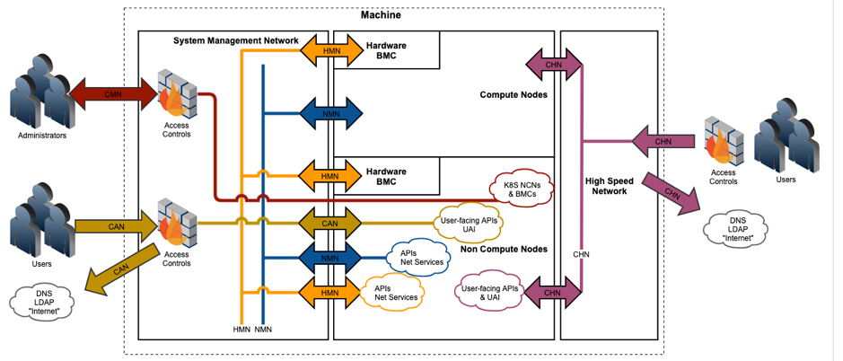

# BICAN Summary

Bifurcated CAN was designed to separate administrative network traffic and user network traffic.

## BICAN terminology

- BICAN – Bifurcated Customer Access Network
- CAN – Customer Access Network
- CMN – Customer Management Network
- CHN – Customer High Speed Network
- NMN – Node Management Network
- HMN – Hardware Management Network

## BICAN features

- Bifurcation or splitting of the Customer Access Network (CAN) enables customization of customer traffic to and from the system.
Customization will be performed during installation.
In CSM 1.2, as part of the process to split the existing monolithic CAN, two new customer access networks were introduced:
  - High Speed Customer Access - CHN: This feature added the ability to connect to Application Nodes (UAN), Compute Nodes,
and Kubernetes API endpoints from the customer site via the High Speed Network (HSN).
  - Management Customer Access - CMN:  Using a new VLAN on the Management Network, this feature allows system administrative access from the customer site.
Prior to CSM 1.2, administrative access was previously available on the original CAN; this feature provided a traffic path and access split.
