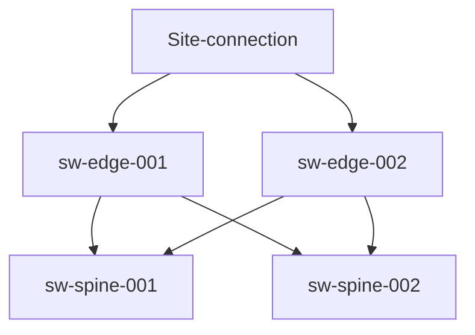
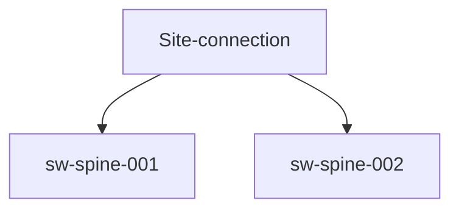

<!-- markdownlint-disable MD013 -->
# Edge switch cabling guide

This document helps network administrators and support personnel connect edge switch management network.

## Quick Summary

In some larger systems site connections are moved from spine to dedicated edge switches which allows for HSN (high speed network) to be cross connected allowing for alternative path to connect storage to customers site network.

Currently supported edge switch models:

* [Aruba 8325-32C 32 port 100G QSFP+/QSFP28 JL627A](https://buy.hpe.com/us/en/networking/switches/fixed-port-l3-managed-ethernet-switches/aruba-8325-switch-products/aruba-cx-8325-switch-series/p/1011156780?pageSize=50&sku=JL627A)

* [Arista 7060CX2](https://www.arista.com/en/products/7060x-series)

### Network topology

Network with edge switch:

Network without edge switch:

### How does edge switch connect to Shasta management network

Typically edge switches connects in Shasta management network to the spine switches (sw-spine-00x) and to customers site network.

In Shasta management network this would be called a CHN deployment. Where as management network without edge switches would be use CAN deployment type.

Please note that Site connections today are considered "custom configuration" as IP addressing and site specific cabling is beyond the scope of Shasta management network.

#### To generate a custom configuration that can be applied via CANU

* [CANU custom switch configuration](https://github.com/Cray-HPE/canu/blob/main/docs/network_configuration_and_upgrade/custom_config.md)

#### How edge switch and site connections are in SHCD

***CHN:*** The table below is an example of how the edge switch entry in the SHCD should appear if edge switches are present

***Note*** Edge switches would have their own tab in SHCD called "edge".

| Source| Rack | Location | Slot | Port | Destination | Rack | Location | Port |
|:-------|------|:------|:-------------------------|:--------------|:--------------------|:-----|:----|:---|
| sw-edge-001 | x3000 | u21 | | 1  | sw-25g01 | x3000 | u12 | 47 |
| sw-edge-002 | x3000 | u22 | | 1  | sw-25g01 | x3000 | u12 | 48 |
| sw-edge-001 | x3000 | u21 | | 2  | sw-25g02 | x3000 | u13 | 47 |
| sw-edge-002 | x3000 | u22 | | 2  | sw-25g02 | x3000 | u13 | 48 |
| sw-edge-001 | x3000 | u21 | | 31  | sw-edge-002 | x3000 | u22 | 31 |
| sw-edge-001 | x3000 | u21 | | 32  | sw-edge-002 | x3000 | u22 | 32 |
| sw-edge-001 | x3000 | u21 | | 30  | sw-edge-002 | x3000 | u22 | 30 |
| sw-edge-001 | x3000 | u21 | | 19  | SITE | SITE | SITE | 0 |
| sw-edge-002 | x3000 | u22 | | 19  | SITE | SITE | SITE | 0 |

***CAN:*** The table below is an example of how the spine switch entry in the SHCD should appear if spine switches connect to site network

| Source| Rack | Location | Slot | Port | Destination | Rack | Location | Port |
|:-------|------|:------|:-------------------------|:--------------|:--------------------|:-----|:----|:---|
| sw-25g01 | x8000 | u37 | 36 | SITE | SITE | SITE | | 0  |
| sw-25g02 | x8000 | u37 | 36 | SITE | SITE | SITE | | 0  |
