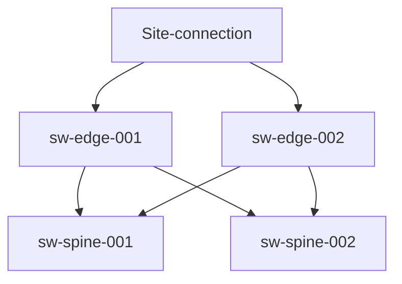
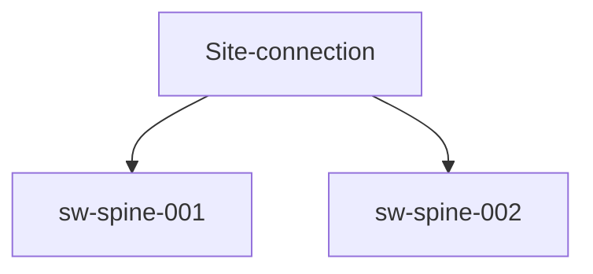

# Edge switch cabling guide

This document helps network administrators and support personnel connect edge switch management network.

## Quick summary

In some larger systems sites, connections are moved from spine to dedicated edge switches, which allows for the HSN (high speed network) to be cross-connected.
This in turn allows for an alternative path to connect storage to the customer site network.

Currently supported edge switch models:

* Aruba 8325-32C 32 port 100G QSFP+/QSFP28 JL627A
* [Arista 7060CX2](https://www.arista.com/en/products/7060x-series)

## Network topology

Network with edge switch:

```mermaid
  graph TD;
      Site-connection-->sw-edge-001;
      Site-connection-->sw-edge-002;
      sw-edge-001-->sw-spine-001;
      sw-edge-001-->sw-spine-002;
      sw-edge-002-->sw-spine-001;
      sw-edge-002-->sw-spine-002;
```

Network without edge switch:

```mermaid
  graph TD;
      Site-connection-->sw-spine-001;
      Site-connection-->sw-spine-002;
```

## How does edge switch connect to Shasta management network

Typically edge switches connect in the Shasta management network to the spine switches (`sw-spine-00x`) and to the customer site network.
In the Shasta management network, this would be called a CHN deployment. Whereas a management network without edge switches would be called a CAN deployment type.

Note that site connections today are considered "custom configuration", because IP addressing and site-specific cabling is beyond the scope of Shasta management network.

## Generate a custom configuration that can be applied via CANU

* [CANU custom switch configuration](https://github.com/Cray-HPE/canu/blob/main/docs/network_configuration_and_upgrade/custom_config.md)

## How edge switch and site connections are shown in SHCD

***CHN:*** The table below is an example of how the edge switch entry in the SHCD should appear if edge switches are present.

***Note*** Edge switches would have their own tab in SHCD called "edge".

| Source        | Rack    | Location   | Slot | Port | Destination   | Rack    | Location   | Port |
|:--------------|---------|:-----------|:-----|:-----|:--------------|:--------|:-----------|:-----|
| `sw-edge-001` | `x3000` | `u21`      |      | 1    | `sw-25g01`    | `x3000` | `u12`      | 47   |
| `sw-edge-002` | `x3000` | `u22`      |      | 1    | `sw-25g01`    | `x3000` | `u12`      | 48   |
| `sw-edge-001` | `x3000` | `u21`      |      | 2    | `sw-25g02`    | `x3000` | `u13`      | 47   |
| `sw-edge-002` | `x3000` | `u22`      |      | 2    | `sw-25g02`    | `x3000` | `u13`      | 48   |
| `sw-edge-001` | `x3000` | `u21`      |      | 31   | `sw-edge-002` | `x3000` | `u22`      | 31   |
| `sw-edge-001` | `x3000` | `u21`      |      | 32   | `sw-edge-002` | `x3000` | `u22`      | 32   |
| `sw-edge-001` | `x3000` | `u21`      |      | 30   | `sw-edge-002` | `x3000` | `u22`      | 30   |
| `sw-edge-001` | `x3000` | `u21`      |      | 19   | `SITE`        | `SITE`  | `SITE`     | 0    |
| `sw-edge-002` | `x3000` | `u22`      |      | 19   | `SITE`        | `SITE`  | `SITE`     | 0    |

***CAN:*** The table below is an example of how the spine switch entry in the SHCD should appear if spine switches connect to the site network.

| Source     | Rack    | Location   | Slot | Port   | Destination   | Rack   | Location | Port |
|:-----------|---------|:-----------|:-----|:-------|:--------------|:-------|:---------|:-----|
| `sw-25g01` | `x8000` | `u37`      | 36   | `SITE` | `SITE`        | `SITE` |          | 0    |
| `sw-25g02` | `x8000` | `u37`      | 36   | `SITE` | `SITE`        | `SITE` |          | 0    |
