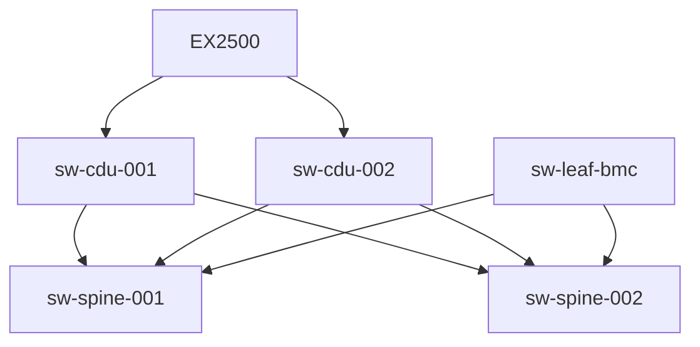

<!-- markdownlint-disable MD013 -->
# EX2500 Installation and Cabling

This document helps network administrators and support personnel connect EX2500 cabinets to the Cray EX management network.

## HPE Cray EX2500 Quick Summary

A single rack can accommodate up to 24 compute blade slots within 3 compute chassis.

One rack supports the following

* Up to 3 compute chassis
* Up to 3 power shelves with 4 rectifiers per shelf - 12 total 15kw rectifiers per rack. (Note: 1 rectifier per shelf is used for redundancy)
* 3 PDUs (1 per power shelf)
* 3 power input whips (3-phase)
* Maximum of 24 compute blades
* Maximum of 24 HPE Slingshot switch blades
* Up to 2 in-rack Coolant distribution units for a max of 141KVA cooling capacity

### How does EX2500 connect to Shasta management network

Typically EX2500 cabinet connects in Shasta management network to the CDU switches (sw-cdu-00x).

However in some smaller setups where CDU switches are not present such as "test and development", it is possible to connect the EX2500 cabinet to spine or leaf switch.

#### How to connect EX2500 if CDU switches are not present

To connect an EX2500 cabinet to a smaller system without CDU switches will require a custom switch configuration from the network administrator as this layout is currently not supported by [CANU](https://github.com/cray-hpe/canu), the CSM management network configuration generation tool.  
Please note that [custom switch configs](https://github.com/Cray-HPE/canu/blob/main/docs/network_configuration_and_upgrade/custom_config.md) should still be processed through [CANU](https://github.com/cray-hpe/canu) so that CANU does not overwrite them when generating switch configs.

***As an example:*** In a system without CDU switches, you can alternatively connect the EX2500 to spine or leaf switches.

#### How to Add a EX2500 Cabinet to the Shasta Management Network

To add an EX2500 cabinet in your system, you first need to create a "Mountain-Management" tab in the system SHCD and add the cabinet as a line item in that tab.  The SHCD will be used to generate system seed files, or update SLS, depending on when in the system lifecycle the EX2500 is being added.

##### The table below is an example of how the EX2500 entry in the SHCD should appear if CDU switches are present

| Source| Rack | Location | Slot | Port | Destination | Rack | Location | Port |
|:-------|------|:------|:-------------------------|:--------------|:--------------------|:-----|:----|:---|
| cmm0 | x8000 | c0 | | 1  | cdu0sw01 | x8000 | u37 | 1 |
| cec0 | x8000 | c0 | | 1  | cdu0sw01 | x8000 | u37 | 2 |
| cmm0 | x8000 | c0 | | 2  | cdu0sw02 | x8000 | u38 | 1 |
| cdu0sw01 | x8000 | u37 | | 48  | cdu0sw02 | x8000 | u38 | 48 |
| cdu0sw01 | x8000 | u37 | | 49  | cdu0sw02 | x8000 | u38 | 49 |
| cdu0sw01 | x8000 | u37 | | 50  | cdu0sw02 | x8000 | u38 | 50 |

##### Alternatively if CDU switches are ***not*** present and you connected EX2500 directly to spine

| Source| Rack | Location | Slot | Port | Destination | Rack | Location | Port |
|:-------|------|:------|:-------------------------|:--------------|:--------------------|:-----|:----|:---|
| cmm0 | x8000 | c0 | | 1  | sw-spine-001 | x8000 | u37 | 1 |
| cec0 | x8000 | c0 | | 1  | sw-spine-001 | x8000 | u37 | 2 |
| cmm0 | x8000 | c0 | | 2  | sw-spine-002 | x8000 | u38 | 1 |
| sw-spine-001 | x8000 | u37 | | 48  | sw-spine-002| x8000 | u38 | 48 |
| sw-spine-001 | x8000 | u37 | | 49  | sw-spine-002 | x8000 | u38 | 49 |
| sw-spine-001 | x8000 | u37 | | 50  | sw-spine-002 | x8000 | u38 | 50 |

#### To generate a custom configuration that can be applied via CANU

* [CANU custom switch configuration](https://github.com/Cray-HPE/canu/blob/main/docs/network_configuration_and_upgrade/custom_config.md)
