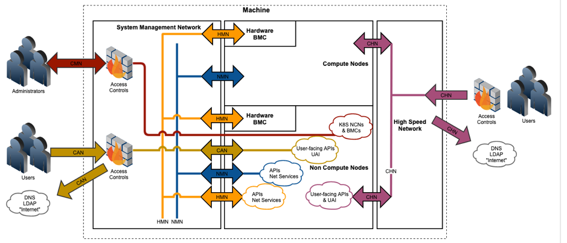

# Network Traffic Pattern Inside of the System

## Internal networks

* Node Management Network (NMN) - Provides the internal control plane for systems management and jobs control.
* Hardware Management Network (HMN) - Provides internal access to system baseboard management controllers (BMC/iLO) and other lower-level hardware access.

## External and edge networks

* Customer Management Network (CMN) - Provides customer access from the site to the system for administrators.
* Customer Access Network (CAN) or Customer High Speed Network (CHN) provide:
    * Customer access from the site to the System for job control and jobs data movement.
    * Access from the system to the site for network services like DNS, LDAP, etc.

[Back to Index](../README.md)
