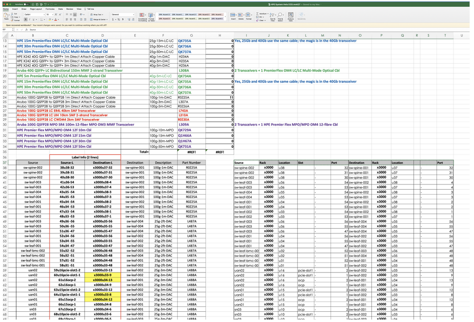

# Validate the SHCD & Create JSON topology file

Use the [CSM Automatic Network Utility (CANU)](../../../glossary.md#csm-automatic-network-utility-canu) to validate the
[Shasta Cabling Diagram (SHCD)](../../../glossary.md#shasta-cabling-diagram-shcd). SHCD validation is required to ensure that Plan of Record (PoR)
network configurations are generated. This is an iterative process to create a model of the entire network topology connection by connection.
Once the validation is complete, a machine readable JSON file should be produced.

## Topics

- [Prerequisites](#prerequisites)
- [Validation steps](#validation-steps)
- [Retrieve JSON paddle file](#retrieve-json-paddle-file)
- [Under the hood](#under-the-hood)
  - [Check warnings](#check-warnings)
  - [Check SHCD port usage](#check-shcd-port-usage)
- [Logging and updates](#logging-and-updates)

## Prerequisites

- Up-to-date SHCD.
- CANU must be installed.
  - If doing a CSM install or upgrade, a CANU RPM is located in the release tarball. For more information, see [Update CANU From CSM Tarball](canu/update_canu_from_csm_tarball.md).

## Validation steps

1. Validate the `10G_25G_40G_100G` tab.

   Select the upper left corner and lower right corner of the spreadsheet with the `Source Rack Location Slot Port Destination Rack Location Port` information.

   This is a block of data on the right hand of the worksheet and is not the calculated values used for cable labels on the left-hand side.

   

   In this example above, the `10G_25G_40G_100G` worksheet has the upper left and lower right corners of `I37` and `T107` respectively.
   Note, the above screenshot is trimmed and only the first full 68 rows are shown.

1. (`pit#`) Generate the [HMN](../../../glossary.md#hardware-management-network-hmn) paddle file.

   > **`NOTE`**
   > `-a` defines the architecture, this will be:
   >
   > - `v1` if the HPE Cray EX system is composed of Mellanox and Dell switches, typically with Gigabyte or Intel server hardware.
   > - `tds` if the HPE Cray EX system has Aruba switches with HPE servers **and NCNs are connected to the Aruba Spine switches**.
   > - `full` if the HPE Cray EX system has Aruba switches with HPE servers **and NCNs are connected to the Aruba Leaf switches**.

   ```bash
   ARCH=v1
   ```

   > **`NOTE`** The `canu` command below will start interactive mode for defining `--corners`. If
   > the `--corners` are already known, then append `--corners` with the desired corners to bypass interactive mode.

   ```bash
   canu validate shcd --json --out "${SYSTEM_NAME}-hmn-paddle.json" --tabs HMN -a "${ARCH}" --shcd <shcd_file.xlsx>
   ```

## Retrieve JSON paddle file

1. (`pit#`) Generate the full paddle file.

   > **`NOTE`** The `canu` command below will start interactive mode for defining `--corners`. If
   > the `--corners` are already known, then append `--corners` with the desired corners to bypass interactive mode.

   ```bash
   canu validate shcd --json --out "${SYSTEM_NAME}-full-paddle.json" -a "${ARCH}" --shcd <shcd_file>.xlsx
   ```

   > **`NOTE`** CANU will ensure that each cell has valid data and that the connections between devices are allowed. Errors will stop processing and must be fixed in
   > the spreadsheet before moving on. A "clean run" through a worksheet will include the model, a port-map of each node and may include warnings. See a
   > list of typical errors at the end of this document to help in fixing the worksheet data.

## Under the hood

A worksheet that runs *cleanly* will have checked that:

- Nodes are *architecturally allowed* to connect to each other.
- No overlapping ports specified.
- Node connections can be made at the appropriate speeds.

In addition, a clean run will have the following sections:

- SHCD Node Connections – A high level list of all node connections on the system.
- SHCD Port Usage – A Port-by-port detailed listing of all node connections on the system.
- Warnings:
  - A list of nodes found that are not categorized on the system.

    **`NOTE`** This list is important as it could include misspellings of nodes that should be included!

  - A list of cell-by-cell warnings of misspellings and other nit-picking items that CANU has autocorrected on the system.

### Check warnings

**Critical:** The `Warnings` output will contain a section headed `Node type could not be determined for the following`. This needs to
be carefully reviewed because it may contain site uplinks that are not tracked by CANU, and may also contain misspelled or miscategorized
nodes.

For example:

```text
Node type could not be determined for the following.

These nodes are not currently included in the model.

(This may be a missing architectural definition/lookup or a spelling error)

--------------------------------------------------------------------------------
Sheet: 10G_25G_40G_100G
Cell: I96      Name: CAN switch
Cell: I97      Name: CAN switch
Cell: O87      Name: CAN switch
Cell: O90      Name: CAN switch
Cell: O93      Name: CAN switch
Cell: O100     Name: CAN switch
Cell: O103     Name: CAN switch
Cell: I38      Name: sw-spinx-002

Sheet: HMN
Cell: R36      Name: SITE

Sheet: NMN
Cell: P16      Name: SITE
```

**From the above example, two important observations can be made:**

1. [CAN](../../../glossary.md#customer-access-network-can) and SITE uplinks are not in the "clean run" model. This means that these ports will not be configured.

1. Critically, cell `I38` has a name of `sw-spinx-002`. This should be noted as a misspelling of `sw-spine-002` and corrected.

### Check SHCD port usage

Today CANU validates many things, but a future feature is full cable specification checking of nodes (e.g. which NCN ports go to
which switches to properly form bonds). A manual review of the `SHCD Port Usage` connections list is vital.
Specifically, verify the following things:

- Both [Management NCNs](../../../glossary.md#management-nodes) (manager, worker, storage) and [Application Nodes](../../../glossary.md#application-node-an)
  ([UANs](../../../glossary.md#user-access-node-uan), `viz`, and others) follow Plan of Record (PoR) cabling.
  See [Cable Management Network Servers](cable_management_network_servers.md).

- Switch pair cabling is appropriate for VSX, MAGP, etc.

- Switch-to-switch cabling is appropriate for LAG formation.

- **Other** nodes on the network seem sane.

## Logging and updates

Once the SHCD has run cleanly through CANU and CANU output has been manually validated, changes to the SHCD should be
*committed* so that work is not lost, and other users can take advantage of the CANU changes.

1. Add an entry to the changelog on the first worksheet (`Summary`).

   The changelog should include:

   - The CANU command line used to validate the spreadsheet
   - The CANU version being used to validate the spreadsheet
   - An overview of changes made to the spreadsheet

1. Upload the SHCD to an official storage location after it has been validated.

   Either of the following options can be used:

   - `customer communication` (CAST ticket for customers)
   - SharePoint (internal systems and sometimes customer systems)
