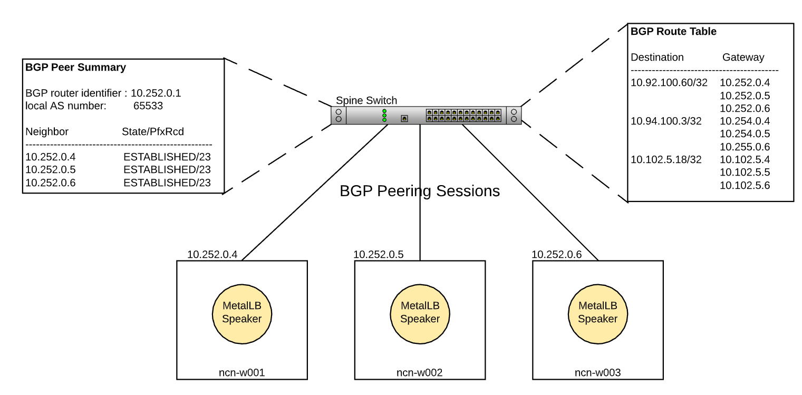

# MetalLB in BGP-Mode

MetalLB is a component in Kubernetes that manages access to `LoadBalancer` services from outside the Kubernetes cluster. There are `LoadBalancer` services on the Node Management Network \(NMNLB\),
Hardware Management Network \(HMNLB\), Customer Management Network \(CMN\), Customer High-Speed Network \(CHN\), and Customer Access Network \(CAN\).

MetalLB can run in either Layer 2 mode or BGP mode for each address pool it manages. BGP mode is used for the NMNLB, HMNLB, and CAN. This enables true load balancing \(Layer 2 mode does failover, not
load balancing\) and allows for a more robust layer 3 configuration for these networks.

In BGP mode, the MetalLB speakers will peer with the BGP router on the spine switches and advertise the service `LoadBalancer` IP addresses. If the system is configured to use the CHN for the user network, then
the speakers will also peer with the BGP router on the edge switches. The BGP routers will accept those advertised prefixes and add them to the route table. The spine and edge switches are configured with
Equal-Cost Multi-Path \(ECMP\), meaning that each of these BGP route prefixes will load balance to any of the workers that has advertised the prefix. This process allows clients outside the cluster with access
to the NMNLB, HMNLB, CMN, CHN or CAN to be able to route to these Kubernetes services.

BGP peering is only between the MetalLB speakers and the spine/edge switches. It does not do any peering beyond that.

The routes in the BGP route table will only be the IP addresses of the Kubernetes `LoadBalancer` services. This is the fifth column displayed in the output of the following command:

```bash
kubectl get service -A | grep LoadBalancer
```

For example:

```bash
NAMESPACE  NAME                                                   TYPE          CLUSTER-IP     **EXTERNAL-IP**    PORT(S)         AGE
ceph-rgw   cray-s3                                                LoadBalancer  10.31.54.80    10.102.10.129  8080:31003/TCP  36d
ims        cray-ims-40f523ac-9b99-4f76-bb37-df6eb62540c8-service  LoadBalancer  10.21.156.88   10.102.10.134  22:31604/TCP    35d
ims        cray-ims-50287398-b877-4a2b-bf18-c3618583c66f-service  LoadBalancer  10.29.254.221  10.102.10.167  22:30314/TCP    12d
ims        cray-ims-577dec6e-dbac-4363-a423-bf39ed9b9e32-service  LoadBalancer  10.22.200.115  10.102.10.158  22:32672/TCP    15d
ims        cray-ims-5b05e86e-f65b-4a5f-b5eb-2c31f0458722-service  LoadBalancer  10.25.162.244  10.102.10.160  22:32707/TCP    14d
ims        cray-ims-7ffaf10f-75ca-4ccb-b10d-1c7cd31b3d4b-service  LoadBalancer  10.20.16.190   10.102.10.132  22:31934/TCP    35d
ims        cray-ims-b1cd0827-bb51-4bcd-ac25-f64d5f7d0c44-service  LoadBalancer  10.26.69.180   10.102.10.131  22:31281/TCP    35d
ims        cray-ims-bd0698b4-a104-48eb-9714-5b5889ad7b52-service  LoadBalancer  10.18.114.136  10.102.10.135  22:31701/TCP    35d
```

MetalLB does not manage access to any of the NCNs, UANs, or compute nodes.


