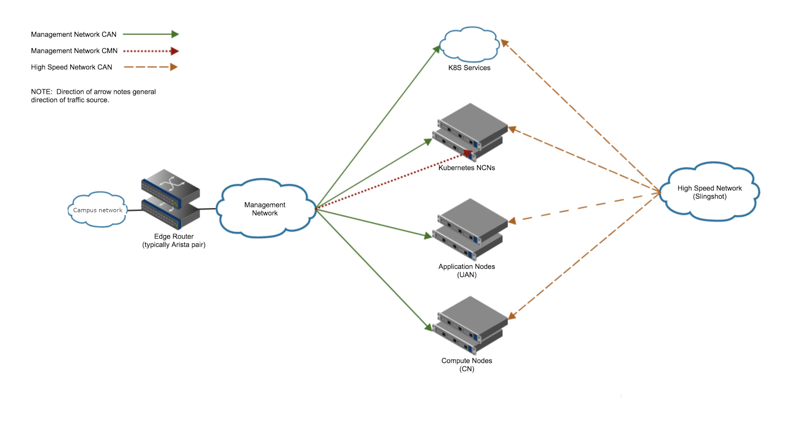

# Scenario A: network connection via management network

Description 
The example here covers outside connections achieved via management network. 

### Summary
* Create a new VRF
* Move interfaces to the new VRF
* Create a new BGP process for the new VRF
* Setup the edge router
* Configure MetalLB
* Verification step for BGP routes
* Configure default route for workers
* Verification of external communication

### Topology

[Back to Index](./index.md)