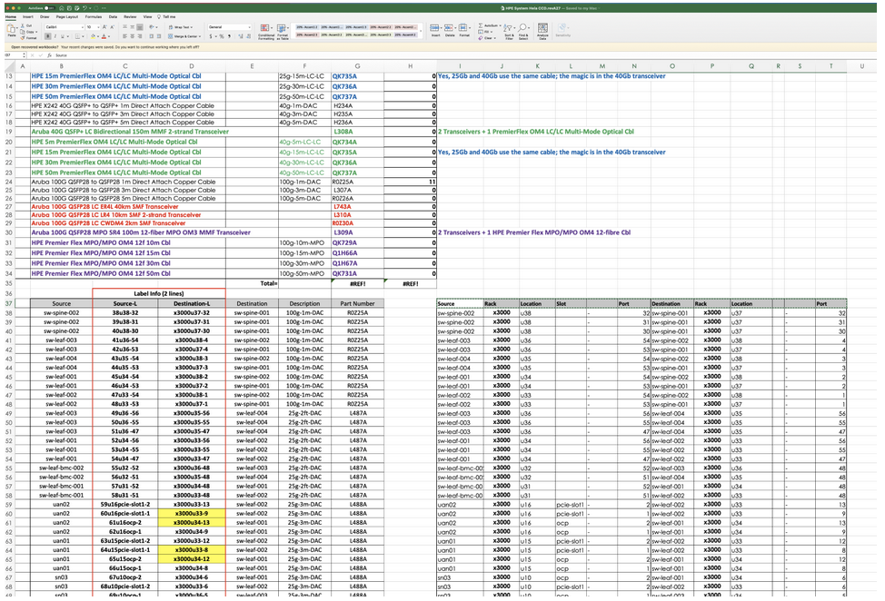

# Validate the SHCD

Use CANU (CSM Automated Network Utility) to validate the SHCD. SHCD validation is required to ensure Plan-of-Record network configurations are generated. This is an iterative process to create a model of the entire network topology connection-by-connection. 

* Open existing SHCD in Excel. 

* Save a new copy with an incremented revision number – make sure you are editing the updated version. 

* Several worksheets (tabs) are used to store the topology of the management network.  

#### Begin validation in the following order: 

* 10G_25G_40G_100G tab (or some variation thereof) contains switch-to-switch connections as well as NCN server connections to the switch. 

* NMN contains network management nodes 

* HMN contains device BMC’s and other 1G management ports. 

* MTN_TDS, Mountain-TDS-Management (or some variation thereof for Mountain cabinets). 

* PDU  

Start with the 10G_25G_40G_100G tab and select the upper left corner and lower right corner of the spreadsheet with the Source Rack Location Slot Port Destination Rack Location Port information.  

This is a block of data on the right hand of the worksheet and is not the calculated values used for cable labels on the left-hand side. 



In this example above the 10G_25G_40G_100G worksheet has the upper left and lower right corners of I37 and T107 respectively. 

Use CANU to validate this worksheet. 

```
canu validate shcd -a full --shcd ./HPE\ System\ Hela\ CCD.revA27.xlsx --tabs 10G_25G_40G_100G --corners I37,T107 
```

-a or –architecture can be tds, full or v1 (case insensitive) for: 

* ***Tds*** 	– Aruba-based Test and Development System. These are small systems characterized by Kubernetes NCNs cabling directly to the spine. 
* ***Full*** 	– Aruba-based Leaf-Spine systems, usually customer production systems. 
* ***V1*** 	– Dell and Mellanox based systems of either a TDS or Full layout. 

CANU will ensure that each cell has valid data and that the connections between devices are allowed. Errors will stop processing and must be fixed in the spreadsheet before moving on. A “clean run” through a worksheet will include the model, a port-map of each node and may include warnings. See a list of typical errors at the end of this document to help in fixing the worksheet data. 

Once the worksheet is validated you can check for any errors: 

```
canu validate shcd -a full --shcd ./HPE\ System\ Hela\ CCD.revA27.xlsx --tabs 10G_25G_40G_100G,NMN --corners I37,T107,J15,T16 --log DEBUG 
```

#### Checks and Validations 

A worksheet that runs "cleanly” will have checked that: 

Nodes are “architecturally allowed” to connect to each other. 

* No overlapping ports specified. 

* Node connections can be made at the appropriate speeds. 

A clean run will have the following sections: 

* SHCD Node Connections – A high level list of all node connections on the system. 

* SHCD Port Usage – A Port-by-port detailed listing of all node connections on the system. 

* Warnings 

	* A list of nodes found that are not categorized on the system. NOTE this list is important as it could include misspellings of nodes that should be included! 

	* A list of cell-by-cell warnings of misspellings and other nit-picking items that CANU has autocorrected on the system. 

***Critically***, the Warnings output will contain a section headed “Node type could not be determined for the following”.  This needs to be carefully reviewed because it may contain site uplinks that are not tracked by CANU but may also contain mis-spelled or mis-categorized nodes. As an example: 

```
Node type could not be determined for the following. 

These nodes are not currently included in the model. 

(This may be a missing architectural definition/lookup or a spelling error) 

-------------------------------------------------------------------------------- 
Sheet: 10G_25G_40G_100G 
Cell: I96      Name: CAN switch 
Cell: I97      Name: CAN switch 
Cell: O87      Name: CAN switch 
Cell: O90      Name: CAN switch 
Cell: O93      Name: CAN switch 
Cell: O100     Name: CAN switch 
Cell: O103     Name: CAN switch 
Cell: I38      Name: sw-spinx-002 

Sheet: HMN 
Cell: R36      Name: SITE 

Sheet: NMN 
Cell: P16      Name: SITE 
```

***From the above example two important observations can be made:***

1. CAN and SITE uplinks are not in the “clean run” model. This means that these ports will not be configured. 

2. Critically, Cell I38 has a name of “sw-spinx-002". This should be noted as a misspelling of “sw-spine-002" and corrected. 


Today CANU validates many things, but a future feature is full cable specification checking of nodes (e.g. what NCN ports go to which switches to properly form bonds).  There are several CANU roadmap items, but today a manual review of the “SHCD Port Usage” connections list is vital.  Specifically, check: 

* K8S NCN cabling (manager, worker, storage) follows PoR cabling https://github.com/Cray-HPE/docs-csm/blob/main/install/cable_management_network_servers.md 

* UAN NCN cabling (UAN, viz, and other Application Nodes) follow PoR cabling https://github.com/Cray-HPE/docs-csm/blob/main/install/cable_management_network_servers.md 

* Switch pair cabling is appropriate for VSX, MAGP etc. 

* Switch-to-switch cabling is appropriate for LAG formation. 

* 	“Other” nodes on the network seem sane. 

#### Logging and Updates 

Once the SHCD has run cleanly through CANU and CANU output has been manually validated, changes to the SHCD should be “committed” so that work is not lost, and other users can take advantage of the CANU changes.  

Add an entry to the changelog Config. Summary first worksheet.  The changelog should include: 

* The CANU command line used to validate the spreadsheet. 

* The CANU version being used to validate the spreadsheet. 

* An overview of changes made to the spreadsheet. 

After an SHCD has been validated it should be uploaded to an official storage location 

* customer communication (CAST ticket for customers) 
* or SharePoint (internal systems and sometimes customer systems). 