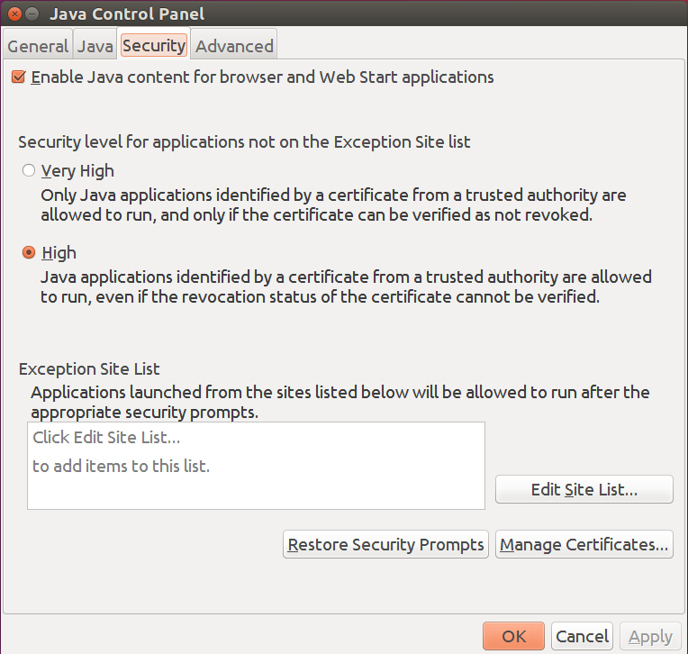
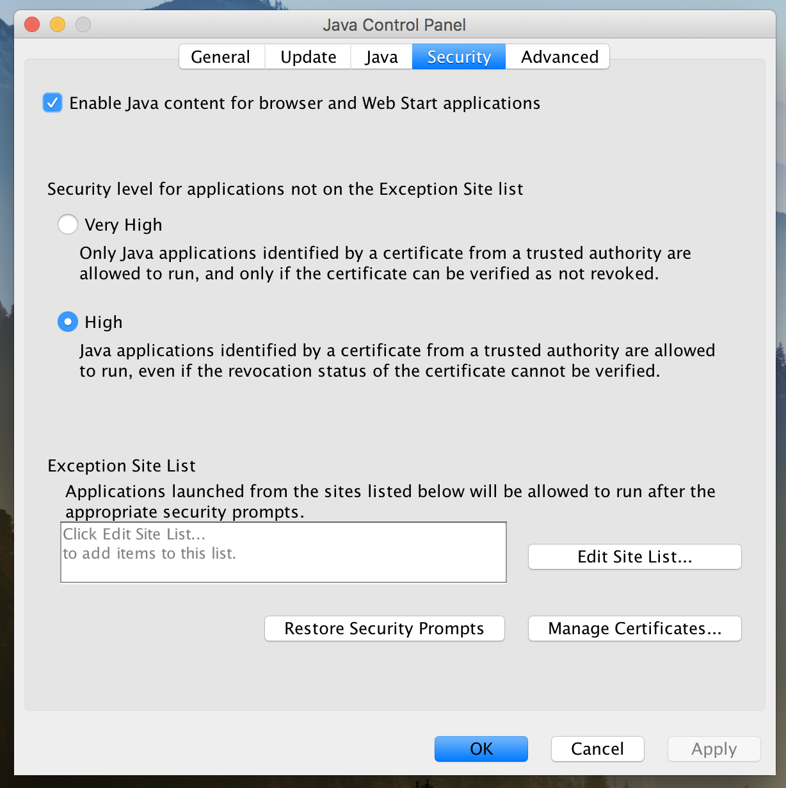
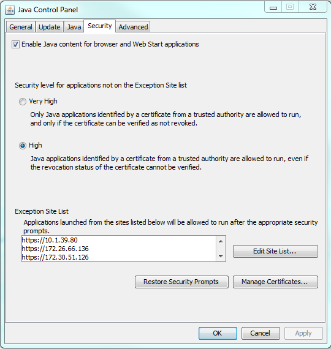

# Change Java Security Settings

If Java will not allow a connection to an Intel nodes via SOL or iKVM, change Java security settings to add an exception for the nodes's BMC IP address.

The Intel nodes ship with an insecure certificate, which causes an exception for Java when trying to connect via SOL or iKVM to these nodes. The workaround is to add the node's BMC IP address to the **Exception Site List** in the **Java Control Panel** of the machine attempting to connect to the Intel node.

To add an IP address to the **Exception Site List**:

**Java Control Panel** \> **Security** \> **Edit Site List**

The following figures show examples of the **Security** tab of the **Java Control Panel** on several different operating systems.

### Linux Java Control Panel Security Tab

### MacOS Java Control Panel Security Tab

### Windows Java Control Panel Security Tab

