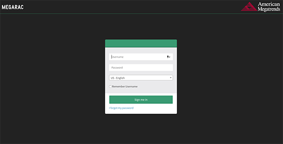
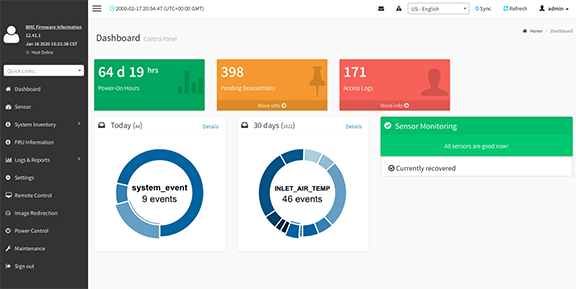
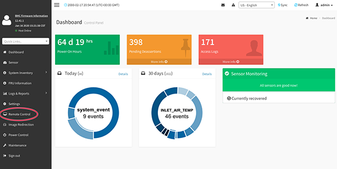
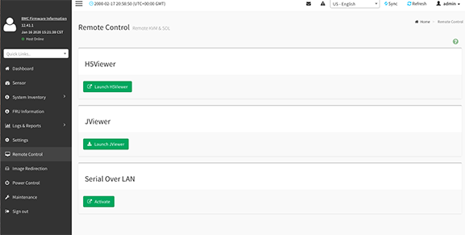

## Launch a Virtual KVM on Gigabyte Servers

This procedure shows how to launch a virtual KVM to connect to Gigabyte node. The virtual KVM can be launched on any host that is on the same network as the node's BMC. This method of connecting to a node is frequently used during system installation.

### Prerequisites

-   A laptop or workstation with a browser and access to the Internet
-   The externally visible BMC IP address of the node's integrated BMC

### Procedure

1.  Connect to the node's BMC by entering the externally visible BMC IP address in the address bar of a web browser.

    The login page appears.

    

2.  Log in to the BMC.

    On the American Megatrends **BMC Firmware Information** login page, enter the `root` user name and password for the BMC.

    The **Dashboard** page appears.

    

3.  Launch the remote console.

    1.  Click on the **Remote Control** tab.

        

    2.  Launch the desired KVM viewer.

        

        -   H5Viewer is compatible with most browsers.
        -   JViewer is an option when HTML5 is not available.
        -   Serial Over LAN should be used as a last resort option.

    The virtual KVM is ready to use. There is now a virtual KVM session connected to the node that enables control via the web similar to standing directly in front of the physical KVM.

    **Troubleshooting:** If the interface appears to lock up while working in the BMC menus \(often encountered when creating virtual drives\), it may be necessary to reset the node using **Power Control** \> **Power Reset**.

