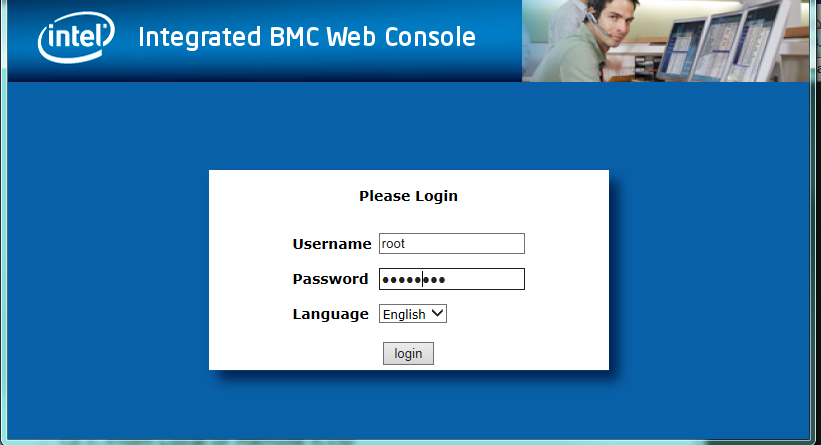
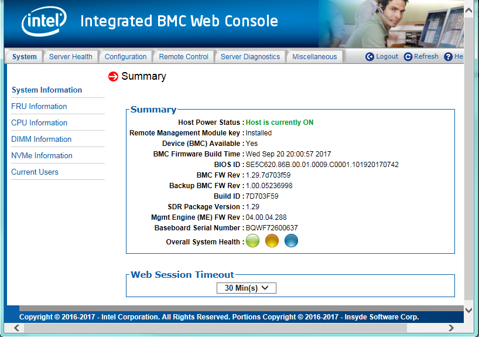
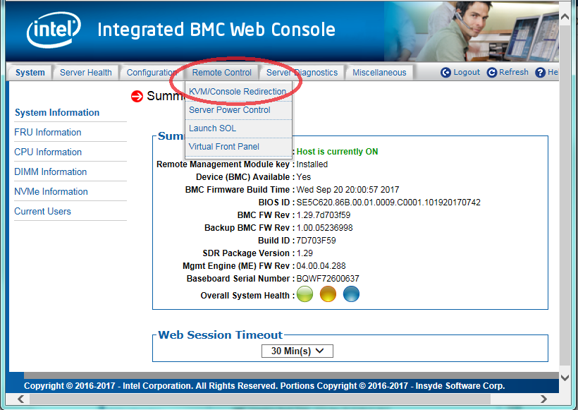
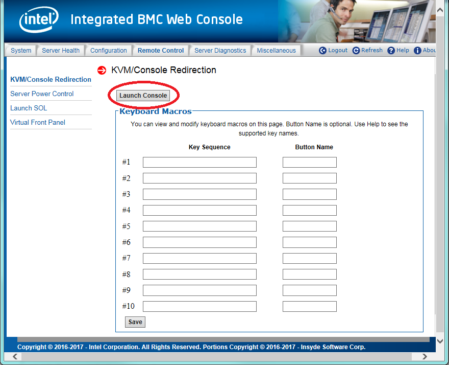
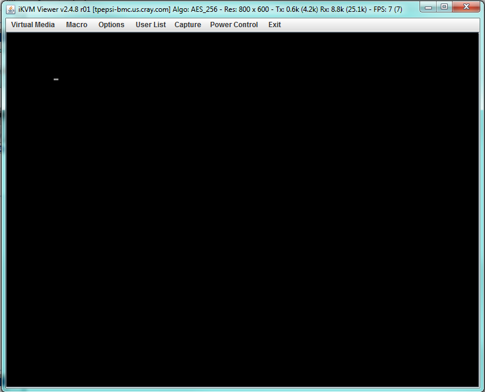

## Launch a Virtual KVM on Intel Servers

This procedure shows how to launch a virtual KVM to connect to an Intel node. The virtual KVM can be launched on any host that is on the same network as the node's BMC. This method of connecting to a node is frequently used during system installation.

### Prerequisites

- A laptop or workstation with a browser and access to the Internet
- The externally visible BMC IP address of the node's integrated BMC

### Procedure

1.  Connect to the node's BMC by entering the externally visible BMC IP address in the address bar of a web browser.

    The login page appears.

    

    **Troubleshooting:**

    - **Java exception**: If a Java exception occurs when trying to connect via SOL, see [Change Java Security Settings](Change_Java_Security_Settings.md).
    - **Unable to access BMC**: If unable to access the node's BMC and ConMan is being used, ConMan may be blocking that access. See [../conman/Troubleshoot ConMan Blocking Access to a Node BMC](../conman/Troubleshoot_ConMan_Blocking_Access_to_a_Node_BMC.md).

2.  Log in to the BMC.

    On the Intel **Integrated BMC Web Console** login page, enter the `root` user name and password for the BMC.

    The **Summary** page appears.

    

    **Trouble?**If using the Firefox browser and it takes a long time to connect, look in the corner for "TLS handshake." That is an indication of a TLS handshake issue, which can occur when the browser has too many self-signed matching certificates. To fix this, locate the cert8.db and cert9.db files on the local host and rename them to cert8.db.bak and cert9.db.bak, respectively.

3.  Launch the remote console.

    1.  On the **Remote Control** tab, click **KVM/Console Redirection**.

        

    2.  Click the **Launch Console** button near the top of the **KVM/Console Redirection** page.

        

        This launches a Java web application called iKVM Viewer.

        

    The virtual KVM \(iKVM Viewer\) is ready to use. There is now a virtual iKVM session connected to the node that enables control via the web similar to standing directly in front of the physical KVM.

    **Troubleshooting:** If the interface appears to lock up while working in the BMC menus \(often encountered when creating virtual drives\), it may be necessary to reset the node using **Power Control** \> **Power Reset**.

