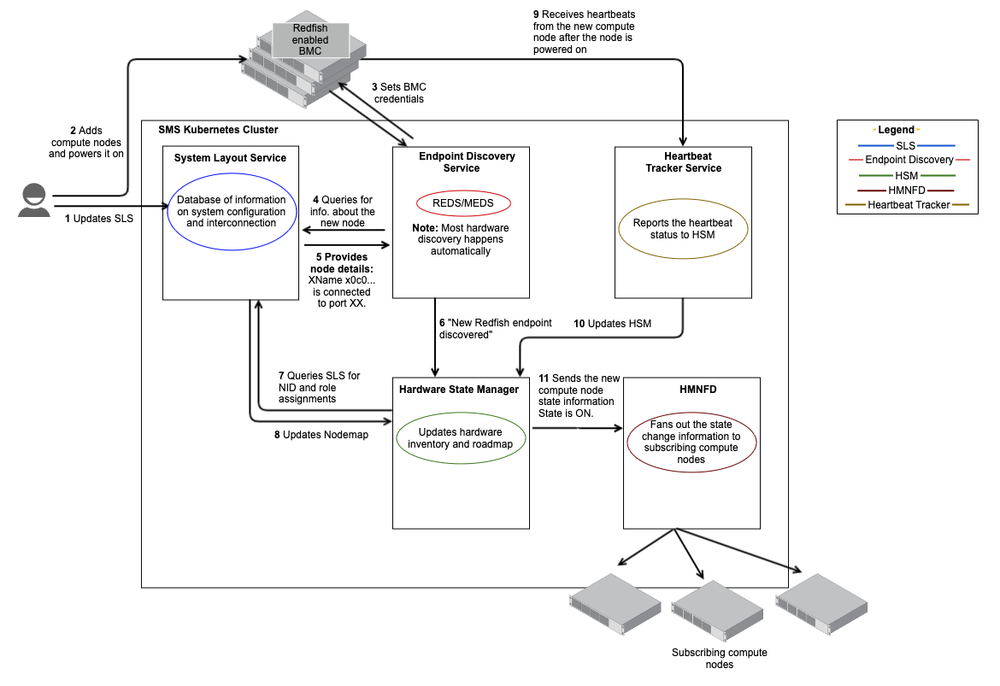
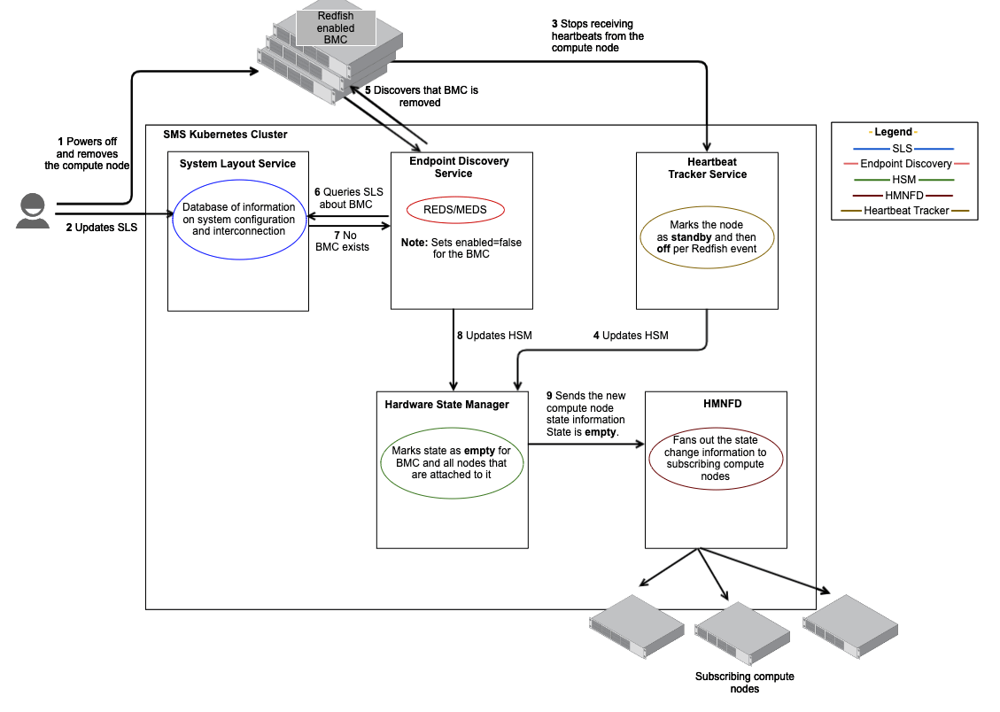

## Node Management Workflows

The following workflows are intended to be high-level overviews of node management tasks. These workflows depict how services interact with each other during node management and help to provide a quicker and deeper understanding of how the system functions.

The workflows and procedures in this section include:

  - [Add Nodes](#add-nodes)
  - [Remove Nodes](#remove-nodes)
  - [Replace Nodes](#replace-nodes)
  - [Move Nodes](#move-nodes)

### Add Nodes

   - [Add a Standard Rack Node](Add_a_Standard_Rack_Node.md)

**Use Cases:** Administrator permanently adds select compute nodes to expand the system.

**Components:** This workflow is based on the interaction of the System Layout Service \(SLS\) with other hardware management services \(HMS\).

Mentioned in this workflow:

-   System Layout Service \(SLS\) serves as a "single source of truth" for the system design. It details the physical locations of network hardware, compute nodes and cabinets. Further, it stores information about the network, such as which port on which switch should be connected to each compute node.
-   Hardware State Manager \(HSM\) monitors and interrogates hardware components in an HPE Cray EX system, tracking hardware state and inventory information, and making it available via REST queries and message bus events when changes occur.
-   HMS Notification Fanout Daemon \(hmnfd\) receives component state change notifications from the HSM. It fans notifications out to subscribers \(typically compute nodes\).
-   Endpoint Discovery Service \(REDS/MEDS\) manages initial discovery, configuration, and geolocation of Redfish-enabled BMCs. It periodically makes Redfish requests to determine if hardware is present or missing.
-   Heartbeat Tracker Service \(hbtd\) listens for heartbeats from components \(mainly compute nodes\). It tracks changes in heartbeats and conveys changes to HSM.

**Workflow Overview:** The following sequence of steps occur during this workflow.

1.  **Administrator updates SLS**

    Administrator creates a new hardware entry for the select xnames in SLS. Enter the node xnames in the SLS input file.

2.  **Administrator adds compute nodes**

    The Administrator physically adds select compute nodes and powers them on. Because the nodes are unknown, the DHCP and TFTP servers give it the special initialization ramdisk. The compute nodes performs local configuration.

    The following steps \(3-11\) occur automatically as different APIs interact with each other.

3.  **Set BMC credentials**

    The compute node requests per-node BMC credentials. This message must include the MAC address of the BMC. A new set of credentials is generated by the discovery service.

    Once the compute node is powered on, initialized, and discovered, REDS gets details about the new node like IP address, MAC address, sets the username and password for a BMC, state etc.

4.  **REDS/MEDS to SLS**

    REDS/MEDS query SLS database for information about the new node.

    For example: "What xname is connected to port XX on switch Y?"

5.  **SLS to REDS/MEDS**

    SLS updates the discovery service with the new compute node and its xname.

    For example: "XName x0c0... is connected to port XX".

6.  **REDS/MEDS to HSM**

    Discovery services update HSM about the new Redfish endpoint for the node. Details like xname and IP address of the new node are updated in HSM.

    For example: "x0c0... at IP address AAA.BBB.CCC.DDD"

7.  **HSM to SLS**

    HSM queries SLS for NID and role assignments for the new node.

8.  **SLS to HSM**

    HSM updates the Nodemap based on information received from SLS.

9.  **Node to Heartbeat Tracker Service**

    The Heartbeat Tracker Service receives heartbeats from the new compute node after the node is powered on.

10. **Heartbeat Tracker Service to HSM**

    The Heartbeat Tracker Service report the heartbeat status to HSM.

11. **HSM to HMNFD**

    HSM sends the new compute node state information with State as ON to HMNFD. HMNFD fans out these notifications to the subscribing compute nodes.

### Remove Nodes

**Use Cases:** Administrator permanently removes select compute nodes to contract the system.

**Components:** This workflow is based on the interaction of the System Layout Service \(SLS\) with other hardware management services \(HMS\).

Mentioned in this workflow:

-   System Layout Service \(SLS\) serves as a "single source of truth" for the system design. It details the physical locations of network hardware, compute nodes and cabinets. Further, it stores information about the network, such as which port on which switch should be connected to each compute node.
-   Hardware State Manager \(HSM\) monitors and interrogates hardware components in an HPE Cray EX system, tracking hardware state and inventory information, and making it available via REST queries and message bus events when changes occur.
-   HMS Notification Fanout Daemon \(hmnfd\) receives component state change notifications from the HSM. It fans notifications out to subscribers \(typically compute nodes\).
-   Endpoint Discovery Service \(REDS/MEDS\) manages initial discovery, configuration, and geolocation of Redfish-enabled BMCs. It periodically makes Redfish requests to determine if hardware is present or missing.
-   Heartbeat Tracker Service \(hbtd\) listens for heartbeats from components \(mainly compute nodes\). It tracks changes in heartbeats and conveys changes to HSM.

**Workflow Overview:** The following sequence of steps occur during this workflow.

1.  **Administrator updates SLS**

    Administrator deletes the node entries with the specific xname from SLS. Note that if deleting a parent object, then the children are also deleted from SLS. If the child object happens to be a parent, then the deletion can cascade down levels. If deleting a child object, it does not affect the parent.

2.  **Administrator physically removes the compute nodes**

    The Administrator powers off and physically removes the compute nodes.

    The following steps \(3-9\) occur automatically as different APIs interact with each other.

3.  **No heartbeats**

    The Heartbeat Tracker Service stops receiving heartbeats and marks the nodes status as `standby` and then `off` as per Redfish event.

    `Standby` status implies that the node is no longer ready and presumed dead. It typically means that the heartbeat is lost. `Off` status implies that the location is not populated with a component.

4.  **Heartbeat Tracker Service to HSM**

    The Heartbeat Tracker Service reports the heartbeat status to HSM.

5.  **REDS/MEDS detect no BMC**

    The discovery service detects that the BMC is not there.

6.  **REDS/MEDS to SLS**

    REDS/MEDS query SLS database for information about the missing BMCs.

7.  **SLS to REDS/MEDS**

    SLS updates the discovery service that the BMC was removed.

8.  **REDS/MEDS to HSM**

    Discovery services update HSM that the BMC Redfish endpoints for the nodes were removed. HSM marks the state of BMCs and the nodes as `empty`.

    `Empty` state implies that the location is not populated with a component.

9.  **HSM to HMNFD**

    HSM sends the compute node state information with State as `empty` to HMNFD. HMNFD fans out this notification to the subscribing compute nodes.

### Replace Nodes

- [Replace a Compute Blade](Replace_a_Compute_Blade.md)
- [Swap a Compute Blade with a Different System](Swap_a_Compute_Blade_with_a_Different_System.md)

### Move Nodes

- [Move a Standard Rack Node](Move_a_Standard_Rack_Node.md)
- [Move a Standard Rack Node \(Same HSN Ports\)](Move_a_Standard_Rack_Node_SameRack_SameHSNPorts.md)

