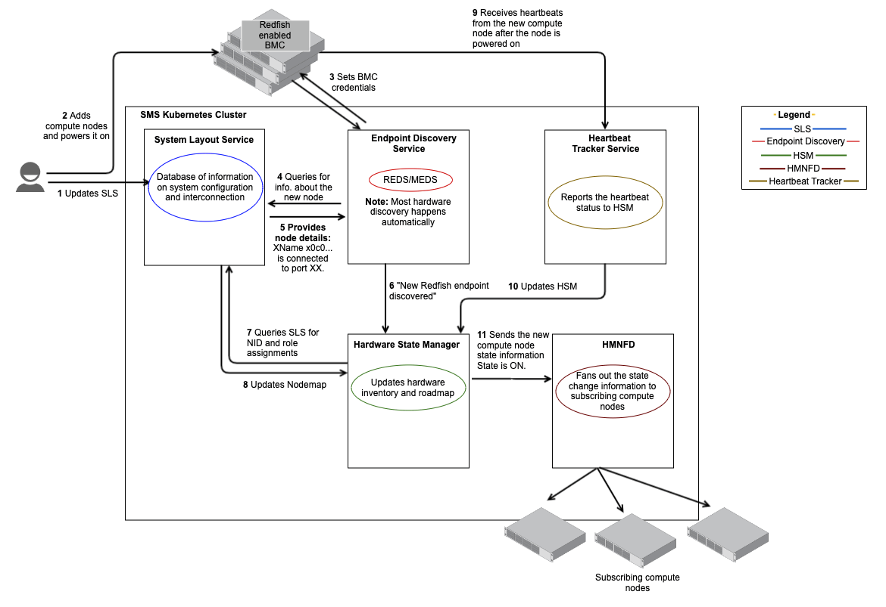
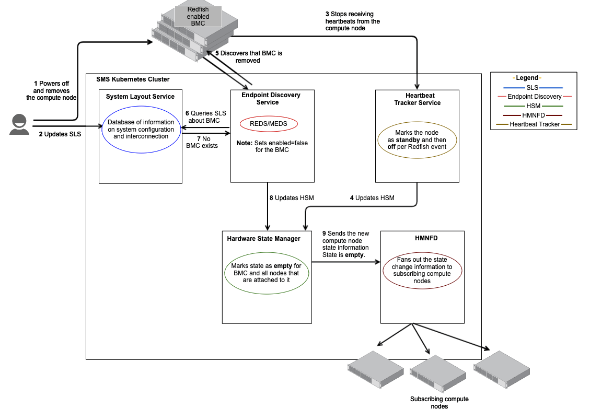

# Node Management Workflows

The following workflows are high-level overviews of node management tasks.
These workflows depict how services interact with each other during node management,
and help to provide a deeper understanding of how the system functions.

The workflows and procedures in this section include:

- [Components involved in adding or removing nodes](#components-involved-in-adding-or-removing-nodes)
- [Add nodes](#add-nodes)
- [Remove nodes](#remove-nodes)
- [Replace nodes](#replace-nodes)
- [Move nodes](#move-nodes)

## Components involved in adding or removing nodes

Both of these workflows are based on the interaction of the [System Layout Service (SLS)][sls]
with other hardware management services (e.g. [HSM][hsm], [HBTD][hbtd], [HMNFD][hmnfd],
[MEDS][meds]).

Mentioned in these workflows:

- [System Layout Service (SLS)][sls] serves as a "single source of truth" for the system design.
  It details the physical locations of network hardware, [compute nodes][cn] and cabinets. Further,
  it stores information about the network, such as which port on which switch should be connected
  to each compute node.
- [Hardware State Manager (HSM)][hsm] monitors and interrogates hardware components in an HPE Cray
  EX system, tracking hardware state and inventory information, and making it available via REST
  queries and message bus events when changes occur.
- [HMS Notification Fanout Daemon (HMNFD)][hmnfd] receives component state change notifications
  from the HSM. It fans notifications out to subscribers (typically compute nodes).
- Endpoint Discovery Service (HMS Discovery/[MEDS][meds]) manages initial discovery, configuration,
  and geolocation of Redfish-enabled [BMCs][bmc]. It periodically makes Redfish requests to determine
  if hardware is present or missing.
- [Heartbeat Tracker Service (HBTD)][hbtd] listens for heartbeats from components (mainly compute
  nodes). It tracks changes in heartbeats and conveys changes to the HSM.

## Add nodes

- [Add a Standard Rack Node](Add_a_Standard_Rack_Node.md)
- [Adding a Liquid-cooled Blade to a System](Adding_a_Liquid-cooled_blade_to_a_System.md)

### Use cases for adding nodes

Administrator permanently adds select compute nodes to expand the system.

### Components involved in adding nodes

See [Components involved in adding or removing nodes](#components-involved-in-adding-or-removing-nodes).

### Workflow overview for adding nodes



The following sequence of steps occur during this workflow.

1. Administrator updates [SLS][sls].

    Administrator creates a new hardware entry for the select component names ([xnames][xname]) in SLS.
    Administrator enters the node component names (xnames) in the SLS input file.

1. Administrator adds [compute nodes][cn].

    The administrator physically adds select compute nodes and powers them on.
    Because the nodes are unknown, the DHCP and TFTP servers give them the special initialization RAM disk.
    The compute nodes performs local configuration.

    The remaining steps occur automatically as different APIs interact with each other.

1. HMS Discovery/[MEDS][meds] to SLS and [HSM][hsm].

    For Cray EX hardware:

    1. MEDS reaches out to SLS for [Mountain][mountain]/Hill chassis that exist in the system.
    1. Calculate algorithmic MAC address for each possible controller (chassis controller,
       [node controller][nc], and switch controller) in the chassis, based off the device xname.
    1. Create Ethernet interface in HSM for each possible controller.

        For example, the following [CLI][cli] command displays the Ethernet interface in HSM
        for `x1000c0s0b0`.

        ```bash
        cray hsm inventory ethernetInterfaces list --component-id x1000c0s0b0 --format toml
        ```

        Example output for HSM Ethernet interface that was created by MEDS for node
        controller `x1000c0s0b0`:

        Example output:

        ```toml
        [[results]]
        ID = "0203e8003000"
        Description = ""
        MACAddress = "02:03:e8:00:30:00"
        LastUpdate = "2022-08-22T12:34:36.1641742Z"
        ComponentID = "x1000c0s0b0"
        Type = "NodeBMC"
        [[results.IPAddresses]]
        IPAddress = ""
        ```

    1. Controller requests an IP address from KEA via DHCP.

    1. KEA's DHCP helper updates the Ethernet interface in HSM with a IP address.

        For example, the following [CLI][cli] command displays the Ethernet interface in HSM
        for `x1000c0s0b0`.

        ```bash
        cray hsm inventory ethernetInterfaces list --component-id x1000c0s0b0 --format toml
        ```

        Example output for an HSM Ethernet interface for node controller `x1000c0s0b0`,
        after KEA's DHCP helper has updated it with an IP address:

        ```toml
        [[results]]
        ID = "0203e8003000"
        Description = ""
        MACAddress = "02:03:e8:00:30:00"
        LastUpdate = "2022-08-23T14:50:07.188282Z"
        ComponentID = "x1000c0s0b0"
        Type = "NodeBMC"
        [[results.IPAddresses]]
        IPAddress = "10.104.0.19"
        ```

    1. For all possible controllers, [MEDS][meds] performs a GET request for their Redfish root
       (e.g. `https://x1000c0s0b0/redfish/v1`).

       Once a 200 status code is received, MEDS configures NTP on the controller.

    1. For standard 19 inch rack hardware:

       1. HMS Discovery retrieves all Ethernet interfaces from HSM without a component ID set.
       1. HMS Discovery queries SLS for `MgmtSwitch` (`sw-leaf-bmc-XXX`) switches present in the system.
       1. HMS Discovery retrieves the MAC address table from each `MgmtSwitch` via SNMP.
       1. For each Ethernet interface without a component ID set:

          1. Search through the retried MAC address tables to identify which switch port the MAC address is connected to.
          1. Query SLS for a corresponding `MgmtSwitchConnector` to identify what is connected to the switch port.

             For example, determine what node controller is connected to port 35 on `leaf-bmc` switch `x3000c0w35`:

             ```bash
             cray sls hardware describe x3000c0w22j35 --format toml
             ```

             Example output:

             ```toml
             Parent = "x3000c0w22"
             Xname = "x3000c0w22j35"
             Type = "comptype_mgmt_switch_connector"
             Class = "River"
             TypeString = "MgmtSwitchConnector"
             LastUpdated = 1689284887
             LastUpdatedTime = "2023-07-13 21:48:07.146163 +0000 +0000"

             [ExtraProperties]
             NodeNics = [ "x3000c0s19b3",]
             VendorName = "ethernet1/1/35"
             ```

             The node controller `x3000c0s19b3` is connected to switch port 35 on switch `x3000c0w35`.

1. HMS Discovery/MEDS to HSM.

    Discovery services update HSM about the new Redfish endpoint for the node
    (e.g. xname and credentials).

1. HSM to SLS.

    HSM queries SLS for [NID][nid] and [role](../hardware_state_manager/HSM_Roles_and_Subroles.md)
    assignments for the new node.

1. SLS to HSM.

    HSM updates the node map based on information received from SLS.

1. Node to KEA.

    Node requests a [Node Management Network (NMN)][nmn] IP address via DHCP when it boots.

1. KEA to HSM.

    KEA's DHCP helper updates the node's MAC address in its HSM Ethernet interfaces.

1. Node to [HBTD][hbtd].

    The Heartbeat Tracker Service receives heartbeats from the new compute node after the node is powered on.

1. HBTD to HSM.

    The Heartbeat Tracker Service report the heartbeat status to HSM.

1. HSM to [HMNFD][hmnfd].

    HSM sends the new compute node state information with `State` as `ON` to HMNFD.
    HMNFD fans out these notifications to the subscribing compute nodes.

## Remove nodes

### Use cases for removing nodes

Administrator permanently removes select compute nodes to contract the system.

### Components involved in removing nodes

See [Components involved in adding or removing nodes](#components-involved-in-adding-or-removing-nodes).

### Workflow overview for removing nodes



The following sequence of steps occur during this workflow.

1. Administrator updates [SLS][sls].

    Administrator deletes the node entries with the specific component name ([xname][xname]) from SLS.
    Note that if deleting a parent object, then the children are also deleted from SLS. If the child
    object happens to be a parent, then the deletion can cascade down levels. If deleting a child
    object, it does not affect the parent.

1. Administrator physically removes the [compute nodes][cn].

    The administrator powers off and physically removes the compute nodes.

1. No heartbeats in [HBTD][hbtd].

    The Heartbeat Tracker Service stops receiving heartbeats and updates the node status, first as
    `Standby` and then `Off`, as per Redfish event.

    `Standby` status implies that the node is no longer ready and presumed dead.
    It typically means that the heartbeat is lost.
    `Off` status implies that the location is not populated with a component.

1. Administrator to [HSM][hsm].

    Administrator informs the HSM that the [BMC][bmc] Redfish endpoints for the nodes were
    removed by marking them disabled. HSM marks the state of BMCs and the nodes as `Empty`.

    `Empty` state implies that the location is not populated with a component.

1. HSM to [HMNFD][hmnfd].

    HSM sends the compute node state information with `State` as `Empty` to HMNFD.
    HMNFD fans out this notification to the subscribing compute nodes.

1. Administrator to HSM.

    For the removed node, the administrator removes the following from the HSM:

    - Redfish endpoint
    - Corresponding components
    - Ethernet interfaces

## Replace nodes

- [Replace a Compute Blade](Replace_a_Compute_Blade.md)
- [Swap a Compute Blade with a Different System](Swap_a_Compute_Blade_with_a_Different_System.md)

### Move nodes

- [Move a Standard Rack Node](Move_a_Standard_Rack_Node.md)
- [Move a Standard Rack Node (Same HSN Ports)](Move_a_Standard_Rack_Node_SameRack_SameHSNPorts.md)

<!--- Define the reference-style Markdown links used to make the page easier to edit -->

<!-- markdownlint-disable MD053 -->
<!---
    For references that are likely to appear on a lot of pages (glossary references, for example),
    we allow definitions for entries that are not used on the page, as a convenience.
-->

<!-- non-glossary common links -->

[config-cli]: ../configure_cray_cli.md
[check-latest-docs]: ../../update_product_stream/README.md#check-for-latest-documentation

<!-- glossary entries -->

[aee]: ../../glossary.md#ansible-execution-environment-aee
[an]: ../../glossary.md#application-node-an
[ara]: ../../glossary.md#ara-records-ansible-ara
[bmc]: ../../glossary.md#baseboard-management-controller-bmc
[bos]: ../../glossary.md#boot-orchestration-service-bos
[bss]: ../../glossary.md#boot-script-service-bss
[can]: ../../glossary.md#customer-access-network-can
[canu]: ../../glossary.md#csm-automatic-network-utility-canu
[capmc]: ../../glossary.md#cray-advanced-platform-monitoring-and-control-capmc
[cdu]: ../../glossary.md#coolant-distribution-unit-cdu
[cec]: ../../glossary.md#cabinet-environmental-controller-cec
[cfs]: ../../glossary.md#configuration-framework-service-cfs
[chn]: ../../glossary.md#customer-high-speed-network-chn
[cli]: ../../glossary.md#cray-cli-cray
[cmn]: ../../glossary.md#customer-management-network-cmn
[cn]: ../../glossary.md#compute-node-cn
[csi]: ../../glossary.md#cray-site-init-csi
[fas]: ../../glossary.md#firmware-action-service-fas
[hbtd]: ../../glossary.md#heartbeat-tracker-daemon-hbtd
[hmn]: ../../glossary.md#hardware-management-network-hmn
[hmnfd]: ../../glossary.md#hardware-management-notification-fanout-daemon-hmnfd
[hsm]: ../../glossary.md#hardware-state-manager-hsm
[hsn]: ../../glossary.md#high-speed-network-hsn
[ims]: ../../glossary.md#image-management-service-ims
[iuf]: ../../glossary.md#install-and-upgrade-framework-iuf
[meds]: ../../glossary.md#mountain-endpoint-discovery-service-meds
[mgmt-ncns]: ../../glossary.md#management-nodes
[mountain]: ../../glossary.md#mountain-cabinet
[nc]: ../../glossary.md#node-controller-nc
[ncn]: ../../glossary.md#non-compute-node-ncn
[nid]: ../../glossary.md#node-id-nid
[nmn]: ../../glossary.md#node-management-network-nmn
[pcs]: ../../glossary.md#power-control-service-pcs
[pdu]: ../../glossary.md#power-distribution-unit-pdu
[pit]: ../../glossary.md#pre-install-toolkit-pit
[river]: ../../glossary.md#river-cabinet
[rts]: ../../glossary.md#redfish-translation-service-rts
[s3]: ../../glossary.md#simple-storage-service-s3
[sat]: ../../glossary.md#system-admin-toolkit-sat
[sbps]: ../../glossary.md#scalable-boot-projection-service-sbps
[scsd]: ../../glossary.md#system-configuration-service-scsd
[shcd]: ../../glossary.md#shasta-cabling-diagram-shcd
[slingshot]: ../../glossary.md#slingshot
[sls]: ../../glossary.md#system-layout-service-sls
[sma]: ../../glossary.md#system-monitoring-application-sma
[smd]: ../../glossary.md#hardware-state-manager-smd
[sops]: ../../glossary.md#secrets-operations-sops
[tapms]: ../../glossary.md#tenant-and-partition-management-system-tapms
[uan]: ../../glossary.md#user-access-node-uan
[uss]: ../../glossary.md#user-services-software-uss
[vcs]: ../../glossary.md#version-control-service-vcs
[vnid]: ../../glossary.md#virtual-network-identifier-daemon-vnid
[xname]: ../../glossary.md#xname

<!-- markdownlint-restore -->
