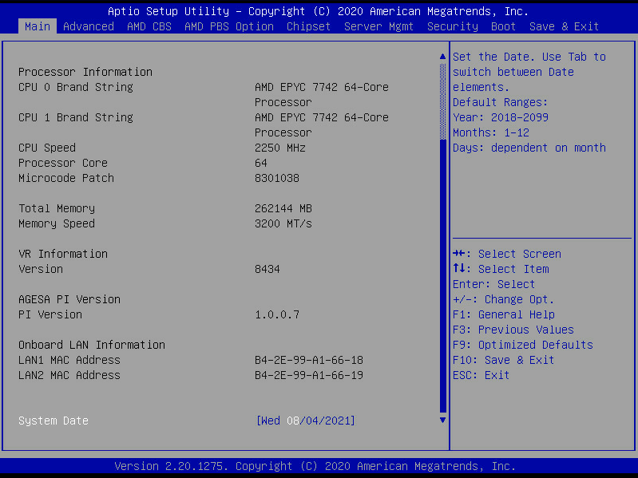

# Update the Gigabyte Node BIOS Time

Check and set the time for Gigabyte nodes.

If the console log indicates the time between the rest of the system and the compute nodes is off by several hours, then it prevents the `spire-agent` from getting a valid certificate,
which causes the node boot to drop into the `dracut` emergency shell.

## Procedure

1. (`ncn-mw#`) Connect to the node's console.

    Follow the steps in the [Log in to a Node Using ConMan](../conman/Log_in_to_a_Node_Using_ConMan.md) procedure to connect to the node's console.

1. (`ncn-mw#`) In another terminal, boot the node to BIOS.

    1. Set the `BMC` variable to the component name (xname) of the BMC for the node.

        This value will be different for each node.

        ```bash
        BMC=x3001c0s24b1
        ```

    1. Boot the node to BIOS.

        > `read -s` is used to prevent the password from being written to the screen or the shell history.

        ```bash
        USERNAME=root
        read -r -s -p "$BMC ${USERNAME} password: " IPMI_PASSWORD
        export IPMI_PASSWORD
        ipmitool -I lanplus -U "${USERNAME}" -E -H "${BMC}" chassis bootdev bios
        ipmitool -I lanplus -U "${USERNAME}" -E -H "${BMC}" chassis power off
        sleep 10
        ipmitool -I lanplus -U "${USERNAME}" -E -H "${BMC}" chassis power on
        ```

1. (`ncn-mw#`) Update the `System Date` field to match the time on the system.

   Use the terminal which is watching the console for this step.
   As the node powers on, it will complete POST (Power On Self Test) and then display the BIOS menu.

   The `System Date` field is located under the `Main` tab in the navigation bar.

   

1. Enter the `F10` key followed by the `Enter` key to save the BIOS time.

1. Exit the connection to the console by entering `&.``[Enter]`.

1. Repeat the above steps for other nodes which need their BIOS time reset.
