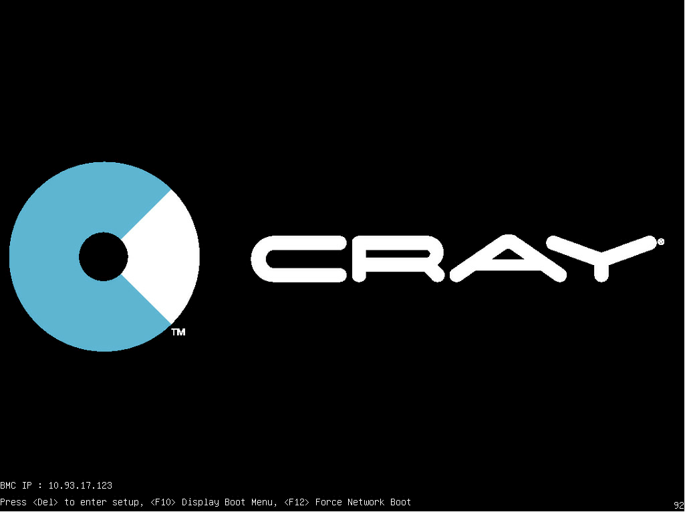
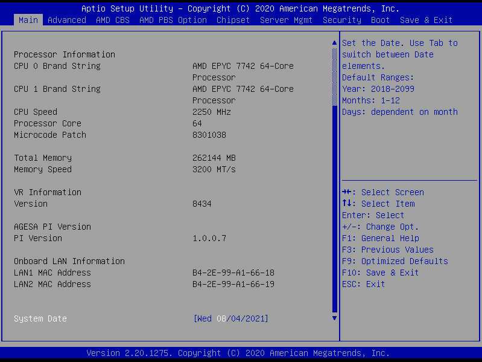

## Update the Gigabyte Server BIOS Time

Check and set the time for Gigabyte compute nodes.

If the console log indicates the time between the rest of the system and the compute nodes is off by several hours, it prevents the spire-agent from getting a valid certificate, causing the node boot to drop into the dracut emergency shell.

### Procedure

1. Enter the "Del" key during the POST call.

    

2. Update the "System Date" field to match the time on the system.

   The "System Date" field is located under the "Main" tab in the navigation bar.

   

3. Enter the "F10" key followed by the "Enter" key to save the BIOS time.