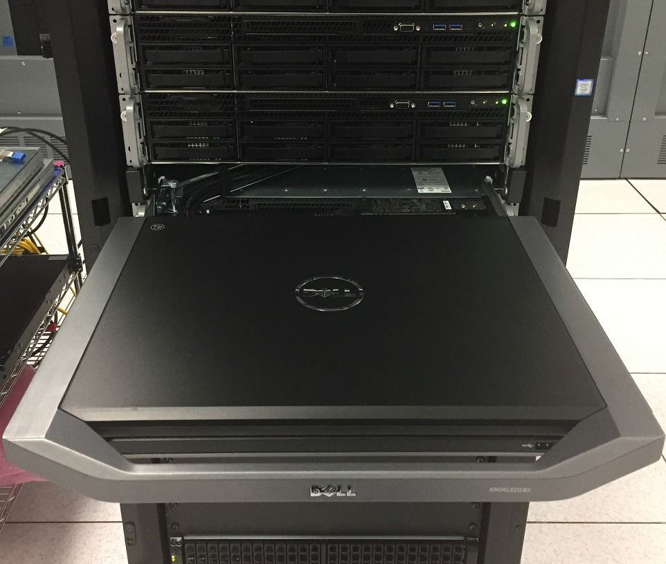
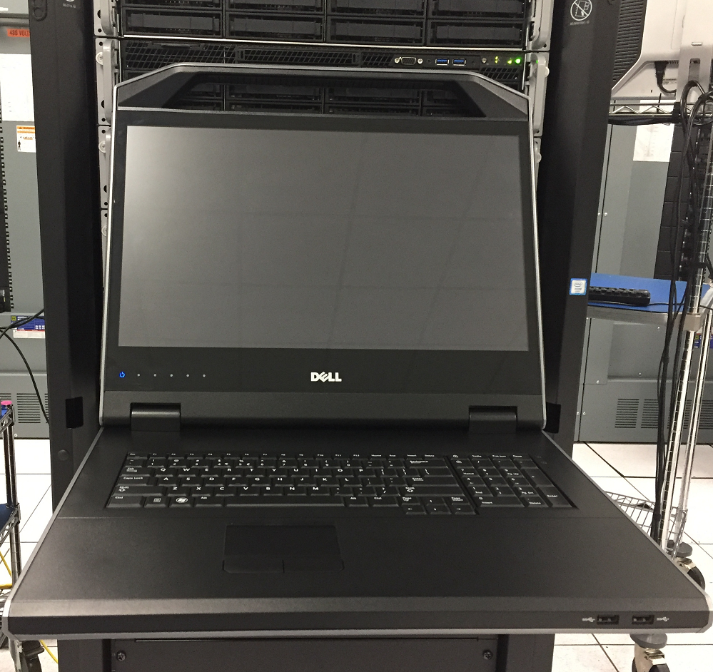
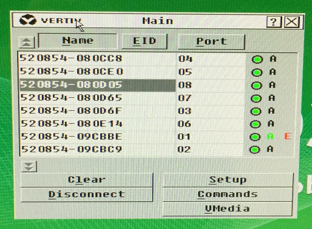

# Use the Physical KVM

For those who prefer to stand in front of the system and use a physically connected keyboard, mouse, and monitor, Cray provides a rack-mount-extendable KVM unit installed in rack unit slot 23 \(RU23\) of the management cabinet. It is connected to the first non-compute node \(NCN\) by default.

To use it, pull it out and raise the lid.

To bring up the main menu \(shown in following figure\), press **Prnt Scrn**.

Each node in the system \(except ClusterStor\) appears in the main menu associated with a port. The first NCN is port 01, the other three NCNs are ports 02–04, and the compute nodes are 05–08.

To move to any node in the system, use the arrow keys and press **Enter**. The login screen for that node will appear.

