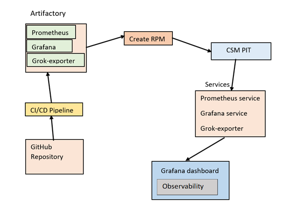
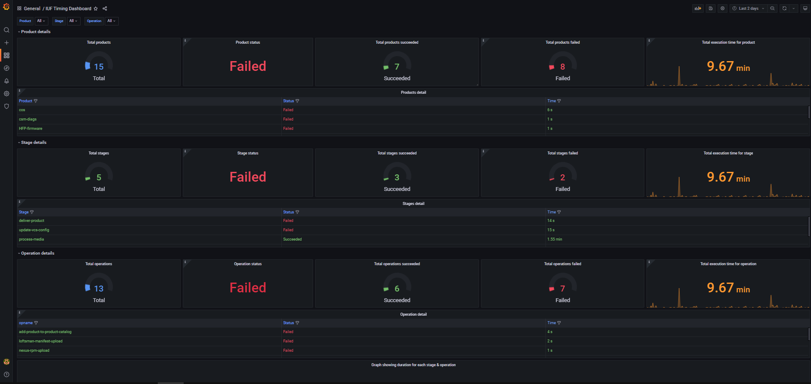
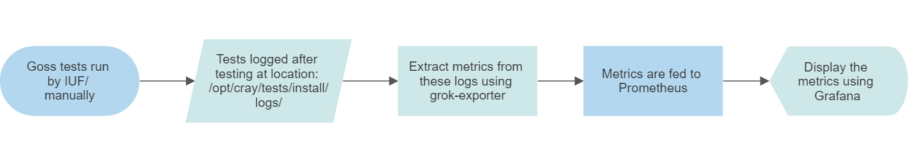
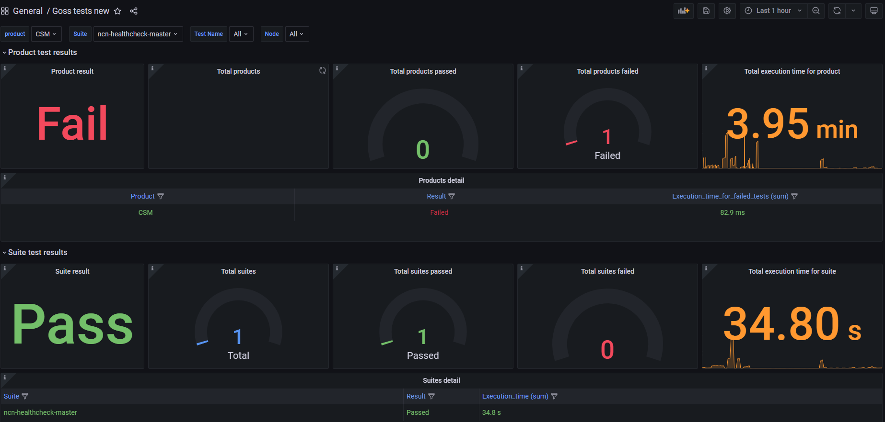
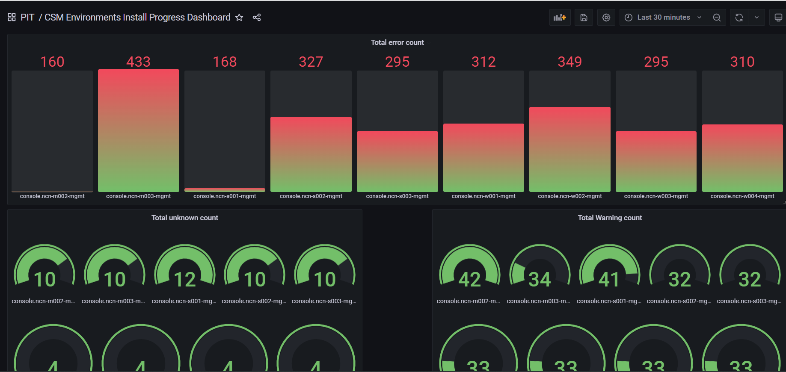
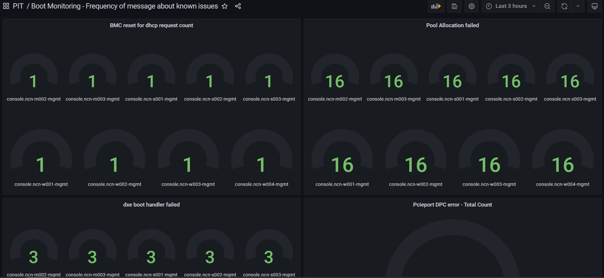

# Install and Upgrade Observability Framework

## Overview

The Install and Upgrade Observability Framework collects Goss test health check results and presents them in a visual Grafana dashboard, providing key insights into the health of the system.

The automated Time to Install (TTI) and Time to Upgrade (TTU) features provide the time and other important details for each portion of the CSM install, such as when and on what machine a given command was run.

For installs of each product stream, the observability framework records the time spent executing the install, debugging, waiting, as well as the total time duration.

The following is a list of the most important features of the framework:

- Provides a consistent framework for health checks/validation, metrics, and reporting for all product stream  installs and upgrades.
  - Inside-out views
    - Timing dashboard view that focuses on a single operation, and from that operation an administrator can zoom out to view the total product installation details.
    - Goss test dashboard view that focuses on a single test, and from that test an administrator can zoom out to view the total product test details.
  - Outside-in views
    - Timing dashboard view that shows total product details, and from that view an administrator can zoom in to focus on details of a single installation operation.
    - Goss test dashboard view that shows total product test details, and from that view an administrator can zoom in to focus on details of a single test.
  - Product stream health

- Drill down health dashboard with roll up summary of health checks.
  - Aggregate checks
    - Problem/OK counts across each product stream.
  - Functional checks
    - Product stream functional Goss suites for key areas.
    - For example: REST API, micro-service, Kubernetes, network, and database health checks for a specific product stream.
  - Granular checks
    - Individual Goss tests for component level health checks within a functional area of a given product stream.
    - For example: management switch configuration verification, routing table checks on the OS, gateway tests, and Container Network Interface (CNI) tests.

- Boot, install, and upgrade duration monitoring.
  This does automatic calculating and reporting of the time a given section of install/upgrade has taken as well as metrics on Goss test successes and failures.

- Ability to view health and duration information across different dimensions such as time, node, product stream, capacity, and others.

- Multi-interval continuous health checks.
  This defines and implements periodic scheduled health checks to occur both during and after the installation or upgrade.
  The Grafana dashboard also allows administrators to view results only for specific time periods -- the past six hours, a day, or a week.

- The framework is automatically configured and run in CSM, even during installation and upgrade of CSM itself.

- The framework includes configurable Grafana dashboards that provide key insights and Key Performance Indicators (KPIs).
  These dashboards show the frequency of errors across the system, include panels to visualize the outliers, and help to identify trends across different dimensions.

The following IUF topics are discussed in the following subsections.

- [Observability Framework during CSM installs](#observability-framework-during-csm-installs)
  - [Overview](#overview-of-observability-framework-on-pit-node)
  - [Observability workflow](#observability-framework-workflow-on-pit-node)
  - [`systemd` services](#observability-framework-systemd-services-on-pit-node)
- [IUF timing dashboard](#iuf-timing-dashboard)
  - [Features](#timing-dashboard-features)
  - [Collected timing metrics](#collected-timing-metrics)
- [Goss tests for PIT and NCN](#goss-tests-for-pit-and-ncn)
  - [Overview](#goss-test-overview)
  - [Workflow](#workflow)
  - [Log file format](#log-file-format)
  - [Grok-exporter deployment, service, and service-monitor](#grok-exporter-deployment-service-and-service-monitor)
  - [Configuration file for the grok-exporter](#configuration-file-for-the-grok-exporter)
  - [Prometheus metrics and Grafana dashboard](#prometheus-metrics-and-grafana-dashboard)
- [Error dashboard](#error-dashboard)
  - [Features](#error-dashboards-features)
  - [Error dashboards](#error-dashboards)

## Observability Framework during CSM installs

The Observability Framework is available during CSM installs once the PIT node is booted and initially configured.

### Overview of Observability Framework on PIT node

- Three different services (Prometheus, grok-exporter, and Grafana) are automatically started on the PIT node as part of its initial configuration.
  These services provide monitoring before other products are installed.
- Grok-exporter parses the unstructured data from the log files and creates Prometheus metrics.
- Prometheus is used as a time-series database for capturing the metrics.
- All Grafana dashboards are automatically configured.

### Observability Framework workflow on PIT node



### Observability Framework `systemd` services on PIT node

#### Check grok-exporter service

(`pit#`) Run the following command in order to show the status of the grok-exporter service.

```bash
systemctl status grok-exporter.service
```

Example output of the service running properly on a PIT node:

```text
● grok-exporter.service - Grok-exporter
     Loaded: loaded (/usr/lib/systemd/system/grok-exporter.service; enabled; vendor preset: disabled)
     Active: active (running) since Wed 2023-01-25 00:04:36 UTC; 6h ago
   Main PID: 22381 (conmon)
      Tasks: 2
     CGroup: /system.slice/grok-exporter.service
             ├─ 22373 /usr/bin/fuse-overlayfs -o ,lowerdir=/var/lib/containers/storage/overlay/l/QHMZY5A5LJYDXJ64OE3VRABE3W:/var/lib/containers/storage/over>
             └─ 22381 /usr/bin/conmon --api-version 1 -c 75b89abbe71f1d55033e42305dd69735f952b8b3eb29eb7cf1064dc159c9ae66 -u 75b89abbe71f1d55033e42305dd6973>

Jan 25 00:04:35 redbull-pit grok-exporter.sh[22276]:             "IOMaximumBandwidth": 0,
Jan 25 00:04:35 redbull-pit grok-exporter.sh[22276]:             "CgroupConf": null
Jan 25 00:04:35 redbull-pit grok-exporter.sh[22276]:         }
Jan 25 00:04:35 redbull-pit grok-exporter.sh[22276]:     }
Jan 25 00:04:35 redbull-pit grok-exporter.sh[22276]: ]
Jan 25 00:04:36 redbull-pit podman[22324]: 2023-01-25 00:04:36.016806447 +0000 UTC m=+0.306557966 container init 75b89abbe71f1d55033e42305dd69735f952b8b3eb2>
Jan 25 00:04:36 redbull-pit podman[22324]: 2023-01-25 00:04:36.07000859 +0000 UTC m=+0.359760105 container start 75b89abbe71f1d55033e42305dd69735f952b8b3eb2>
Jan 25 00:04:36 redbull-pit podman[22324]: grok-exporter
Jan 25 00:04:36 redbull-pit grok-exporter[22381]: Starting server on http://redbull-pit:9144/metrics
Jan 25 00:04:36 redbull-pit systemd[1]: Started Grok-exporter.
```

#### Check Prometheus service

(`pit#`) Run the following command in order to show the status of the Prometheus service.

```bash
systemctl status prometheus.service
```

Example output of the service running properly on a PIT node:

```text
● prometheus.service - Prometheus
     Loaded: loaded (/usr/lib/systemd/system/prometheus.service; enabled; vendor preset: disabled)
     Active: active (running) since Wed 2023-01-25 00:05:47 UTC; 6h ago
   Main PID: 25680 (conmon)
      Tasks: 2
     CGroup: /system.slice/prometheus.service
             ├─ 25674 /usr/bin/fuse-overlayfs -o ,lowerdir=/var/lib/containers/storage/overlay/l/NZKANI3GOO3KXVE2HIZI33JUTY:/var/lib/containers/storage/over>
             └─ 25680 /usr/bin/conmon --api-version 1 -c 8221fc0337a5bc8ac706ffeb270c18719caf2c02de8402a047670e578010921f -u 8221fc0337a5bc8ac706ffeb270c187>

Jan 25 00:05:47 redbull-pit prometheus[25680]: ts=2023-01-25T00:05:47.048Z caller=main.go:993 level=info fs_type=TMPFS_MAGIC
Jan 25 00:05:47 redbull-pit prometheus[25680]: ts=2023-01-25T00:05:47.048Z caller=main.go:996 level=info msg="TSDB started"
Jan 25 00:05:47 redbull-pit prometheus[25680]: ts=2023-01-25T00:05:47.048Z caller=main.go:1177 level=info msg="Loading configuration file" filename=/etc/pro>
Jan 25 00:05:47 redbull-pit prometheus[25680]: ts=2023-01-25T00:05:47.052Z caller=main.go:1214 level=info msg="Completed loading of configuration file" file>
Jan 25 00:05:47 redbull-pit prometheus[25680]: ts=2023-01-25T00:05:47.052Z caller=main.go:957 level=info msg="Server is ready to receive web requests."
Jan 25 00:05:47 redbull-pit prometheus[25680]: ts=2023-01-25T00:05:47.052Z caller=manager.go:937 level=info component="rule manager" msg="Starting rule mana>
Jan 25 03:06:09 redbull-pit prometheus[25680]: ts=2023-01-25T03:06:09.240Z caller=compact.go:519 level=info component=tsdb msg="write block" mint=1674605167>
Jan 25 03:06:09 redbull-pit prometheus[25680]: ts=2023-01-25T03:06:09.242Z caller=head.go:840 level=info component=tsdb msg="Head GC completed" duration=1.3>
Jan 25 05:00:09 redbull-pit prometheus[25680]: ts=2023-01-25T05:00:09.261Z caller=compact.go:519 level=info component=tsdb msg="write block" mint=1674612007>
Jan 25 05:00:09 redbull-pit prometheus[25680]: ts=2023-01-25T05:00:09.263Z caller=head.go:840 level=info component=tsdb msg="Head GC completed" duration=1.7
```

#### Check Grafana service

(`pit#`) Run the following command in order to show the status of the Grafana service.

```bash
systemctl status grafana.service
```

Example output of the service running properly on a PIT node:

```text
● grafana.service - Grafana
     Loaded: loaded (/usr/lib/systemd/system/grafana.service; enabled; vendor preset: disabled)
     Active: active (running) since Wed 2023-02-08 23:06:38 UTC; 4 days ago
   Main PID: 82549 (conmon)
      Tasks: 2
     CGroup: /system.slice/grafana.service
             ├─ 82540 /usr/bin/fuse-overlayfs -o lowerdir=/var/lib/containers/storage/overlay/l/UOU2YMGV3WT2CIASNIEDBIY6OK:/var/lib/containers/storage/overl>
             └─ 82549 /usr/bin/conmon --api-version 1 -c f45f33ad520fb278776cf528dab1fdf619f0b1323e672d29d866f728ce8e2589 -u f45f33ad520fb278776cf528dab1fdf>

Feb 08 23:06:38 redbull-pit grafana[82549]: logger=sqlstore t=2023-02-08T23:06:38.23+0000 lvl=info msg="Connecting to DB" dbtype=sqlite3
Feb 08 23:06:38 redbull-pit grafana[82549]: logger=migrator t=2023-02-08T23:06:38.25+0000 lvl=info msg="Starting DB migrations"
Feb 08 23:06:38 redbull-pit grafana[82549]: logger=migrator t=2023-02-08T23:06:38.26+0000 lvl=info msg="migrations completed" performed=0 skipped=393 durati>
Feb 08 23:06:38 redbull-pit grafana[82549]: logger=plugin.manager t=2023-02-08T23:06:38.42+0000 lvl=info msg="Plugin registered" pluginId=input
Feb 08 23:06:38 redbull-pit grafana[82549]: logger=query_data t=2023-02-08T23:06:38.43+0000 lvl=info msg="Query Service initialization"
Feb 08 23:06:38 redbull-pit grafana[82549]: logger=live.push_http t=2023-02-08T23:06:38.44+0000 lvl=info msg="Live Push Gateway initialization"
Feb 08 23:06:38 redbull-pit grafana[82549]: logger=grafanaStorageLogger t=2023-02-08T23:06:38.54+0000 lvl=info msg="storage starting"
Feb 08 23:06:38 redbull-pit grafana[82549]: logger=ngalert t=2023-02-08T23:06:38.54+0000 lvl=info msg="warming cache for startup"
Feb 08 23:06:38 redbull-pit grafana[82549]: logger=ngalert.multiorg.alertmanager t=2023-02-08T23:06:38.54+0000 lvl=info msg="starting MultiOrg Alertmanager"
Feb 08 23:06:38 redbull-pit grafana[82549]: logger=http.server t=2023-02-08T23:06:38.55+0000 lvl=info msg="HTTP Server Listen" address=[::]:3000 protocol=http>
```

## IUF timing dashboard

The IUF timing dashboard provides timing information for installs and upgrades.

### Timing dashboard features

- A dynamic top-down and bottom-up dashboard that tracks install/upgrade status and duration for any product, stage, and operation.



### Collected timing metrics

- Operation timing metrics
  - Start time
  - End time
  - Duration
  - Status
  - Product name
  - Product version
- Stage timing metrics
  - Stage name
  - Stage type
  - Stage start time (the earliest start time of the all the operations in the stage)
  - Stage end time (the latest end time of the all the operations in the stage)
  - Stage duration (the difference between the stage end time and stage start time)
  - Stage status (status is marked as succeeded if all the operations' statuses are succeeded, otherwise it is marked as failed)
- Product timing metrics
  - Product name
  - Product start time (start time of the process-media stage)
  - Product end time (start time of the post-install-check stage)
  - Product status (status is marked as succeeded if all the stages' statuses are succeeded, otherwise it is marked as failed)

## Goss tests for PIT and NCN

### Goss test overview

The observability tooling monitors the logs for Goss tests run by using the automated scripts. These scripts are regularly run during install/upgrade. For each Goss test, metrics are generated on its duration and success or failure.

This framework provides a set of quantifiable metrics used to create a visual Grafana health dashboard of all environments. This provides administrators with insight on which areas are experiencing problems.

Trend analysis of this data in Grafana across different dimensions may point out statistically where the highest frequency of issues occurs.
It also provides administrators an at-a-glance dashboard where they can visually see the complete system health. This includes the option to drill down from the aggregate view of the environment to the functional areas or the components.

Goss test logs are scraped using grok-exporter and visualized on Grafana using captured data.

Goss tests are contained in YAML file. A YAML file containing a list of Goss test files is called a test suite. These suites are run through the CSM-provided scripts to get a log file with results for the tests.

### Workflow



### Log file format

Log file entries for each node, test name, and source are stored in the following format:

```json
{
  "log_timestamp": "20230118_094205.821955",
  "Product": "CSM",
  "log_script": "print_goss_json_results.py",
  "log_message": "Test result",
  "Description": "Validates that 'cray --version' is available and executes successfully on the local system.",
  "Execution Time (nanoseconds)": 1312368478,
  "Execution Time (seconds)": 1.312368478,
  "Node": "ncn-m001",
  "Result Code": 0,
  "Result String": "PASS",
  "Source": "http://ncn-m001.hmn:8997/ncn-healthcheck-master",
  "Test Name": "Command 'cray --version' Available",
  "Test Summary": "Command: command_available_1_cray_version: exit-status: matches expectation: [0]"
}
```

### Grok-exporter deployment, service, and service-monitor

Grok-exporter is deployed on all of the Kubernetes master nodes using Kubernetes node affinity.
As background information, the service for the grok-exporter is accessible at port `9144`.
The service-monitor implementation is for Prometheus to access the metrics that are created by the grok-exporter.

### Configuration file for the grok-exporter

The configuration file for the grok-exporter provides instructions on how to parse the Goss test log files and create metrics from them.
grok-exporter version 3 configuration is used for this task and to match log expressions with regular expressions.

The following is an example configuration passed to the grok-exporter to get metrics:

```yaml
apiVersion: v1
kind: ConfigMap
metadata:
  name: example_name
  namespace: example_namespace
data:
  config.yml: |-
    global:
      config_version: 3
    input:
      type: file
      paths: 
      - /logs/goss_tests/*
      fail_on_missing_logfile: false
    grok_patterns:
      - 'REGEX [regular].*expression'
      - 'EXAMPLE [aA-zZ-].*'
    metrics:
      - type: gauge
        name: example_metric
        help: EXAMPLE METRIC HELP
        match: '{"log_file": "%{REGEX:logfile}", "TEST": "%{EXAMPLE:ex}"}'
        value: '{{`{{.logfile}}`}}'
        labels:
          example_test: '{{`{{.ex}}`}}'
    server:
     port: 9144
```

### Prometheus metrics and Grafana dashboard

The `goss_tests` metrics are displayed in Prometheus whenever Goss tests are run. Grafana dashboard is created and use these metrics to display the Goss test details visually.

Goss test dashboard features:

- The dashboard has a dropdown menu for products, suites, and tests.
- By default, all products, suites, and tests are selected for overall Goss test results.
- The overall product result, total number of products, products passed, products failed, and execution time is displayed.
- Suite results and test results are displayed on the dashboard.
- Node-wise test results are seen with failed nodes, passed nodes, and the suite/test description.



## Error dashboard

Error dashboards provide key at-a-glance insights about what is broken and needs attention.
Error dashboards have data such as total counts of errors, warnings, and failures across all the NCNs during the CSM installation process.

### Error dashboards features

- The error dashboards provide the ability to examine errors in the cluster across multiple dimensions.
- The error dashboards pull in information from a variety of sources, including the following:
  - Errors and failures encountered during upgrades and installs.
  - ConMan logs on the PIT node.
  - Goss test logs.

### Error dashboards

Dashboards tracking different types of errors during install/upgrade.

- Frequency of messages about known issues dashboard
- CSM install progress dashboard
- USB device error tracking dashboard
- Boot PXE error tracking dashboard
- Boot DHCP error tracking dashboard




