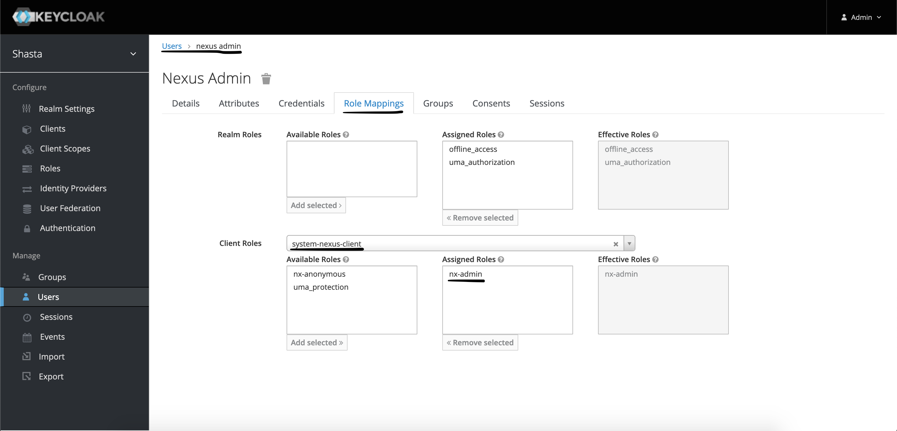

# Manage Repositories with Nexus

This section describes how to connect to Nexus with the Web UI, as well as how to access the REST API from non-compute nodes \(NCNs\) or compute nodes to manage repositories.

- [System domain name](#system-domain-name)
- [Access Nexus with the web UI](#access-nexus-with-the-web-ui)
- [Use Keycloak to create and manage accounts](#use-keycloak-to-create-and-manage-accounts)
- [Use the local Nexus admin account](#use-the-local-nexus-admin-account)
- [Access Nexus with the REST API](#access-nexus-with-the-rest-api)
  - [Pagination](#pagination)
  - [Check the status of Nexus](#check-the-status-of-nexus)
  - [List repositories](#list-repositories)
  - [List assets](#list-assets)
  - [Create a repository](#create-a-repository)
  - [Update a repository](#update-a-repository)
  - [Delete a repository](#delete-a-repository)
  - [Create a blob store](#create-a-blob-store)
  - [Delete a blob store](#delete-a-blob-store)
  - [Authenticate to access the Rest API](#authenticate-to-access-the-rest-api)

## System domain name

The `SYSTEM_DOMAIN_NAME` value found in some of the URLs on this page is expected to be the system's fully qualified domain name (FQDN).

(`ncn-mw#`) The FQDN can be found by running the following command on any Kubernetes NCN.

```bash
kubectl get secret site-init -n loftsman -o jsonpath='{.data.customizations\.yaml}' | base64 -d | yq r - spec.network.dns.external
```

Example output:

```text
system..hpc.amslabs.hpecorp.net
```

Be sure to modify the example URLs on this page by replacing `SYSTEM_DOMAIN_NAME` with the actual value found using the above command.

## Access Nexus with the web UI

Nexus is accessible using a web browser at the following URL: `https://nexus.cmn.SYSTEM_DOMAIN_NAME`

## Use Keycloak to create and manage accounts

In order to log into the Web UI or authenticate with the REST API, a user account with appropriate permissions must be created. Accounts are managed in Keycloak
(see [Configure Keycloak Accounts](../CSM_product_management/Configure_Keycloak_Account.md)). To add administrator permissions for Nexus, add the `nx-admin` role
binding to the user from the `system-nexus-client` client (see below). To add an anonymous user, add the `nx-anonymous` role binding to the user from the `system-nexus-client`
client (see below).

  

  

## Use the local Nexus admin account

(`ncn-mw#`) During the deployment or update of Nexus, a local admin account is created. To access the local admin account for Nexus on any Kubernetes NCN,
run the following commands:

```bash
kubectl -n nexus get secret nexus-admin-credential --template {{.data.username}} | base64 -d; echo
kubectl -n nexus get secret nexus-admin-credential --template {{.data.password}} | base64 -d; echo
```

The first command will print the username of the local admin account. The second command will print the password for the local admin account. (Note that the secret
will not update or stay in sync if the username or password of the local account is changed). This account has the same permissions as an account created in Keycloak
with the `nx-admin` role.

## Access Nexus with the REST API

The [Nexus REST API](https://help.sonatype.com/repomanager3/rest-and-integration-api) is available from NCNs or compute nodes at `https://packages.local/service/rest`,
as well as over the Customer Access Network (CAN) at `https://nexus.cmn.SYSTEM_DOMAIN_NAME/service/rest` (requires authentication with username and password).

Download the Open API document at `/service/rest/swagger.json` for details about the API, including specific options
to available endpoints. By default, the REST API endpoints return (or accept) JSON.

The examples in the following sections use `curl` to exercise the REST API endpoints and `jq` to parse and manipulate the
output. It is reasonable to use `curl` and `jq` to facilitate management tasks when necessary, but more complex actions may
warrant development of more full-featured tools.

The following actions are described in this section:

- [Pagination](#pagination)
- [Check the status of Nexus](#check-the-status-of-nexus)
- [List repositories](#list-repositories)
- [List assets](#list-assets)
- [Create a repository](#create-a-repository)
- [Update a repository](#update-a-repository)
- [Delete a repository](#delete-a-repository)
- [Create a blob store](#create-a-blob-store)
- [Delete a blob store](#delete-a-blob-store)
- [Authenticate to access the Rest API](#authenticate-to-access-the-rest-api)

### Pagination

Various API endpoints use the external [pagination](https://help.sonatype.com/repomanager3/rest-and-integration-api/pagination) tool to return results. When a
`continuationToken` is included in the results and is non-null, it indicates additional items are available.

The following is some example output:

```json
{
  "items": [ "..." ],
  "continuationToken": "0a1b9d05d7162aa85d7747eaa75f171c"
}
```

In this example, the next set of results may be obtained by re-requesting the same URL with the added query parameter `continuationToken=0a1b9d05d7162aa85d7747eaa75f171c`.

Various examples in the following sections may use the `paginate` helper function to iterate over paginated results:

```bash
function paginate() {
    local url="$1"
    local token
    { token="$(curl -sSk "$url" | tee /dev/fd/3 | jq -r '.continuationToken // null')"; } 3>&1
    until [[ "$token" == "null" ]]; do
        { token="$(curl -sSk "$url&continuationToken=${token}" | tee /dev/fd/3 | jq -r '.continuationToken // null')"; } 3>&1
    done
}
```

### Check the status of Nexus

(`ncn-mw#`) Send an HTTP `GET` request to `/service/rest/v1/status` to check the operating status of Nexus. An HTTP `200 OK` response indicates it is healthy:

```bash
curl -sSi https://packages.local/service/rest/v1/status
```

Example output:

```text
HTTP/2 200
date: Sat, 06 Mar 202117:27:56 GMT
server: istio-envoy
x-content-type-options: nosniff
content-length: 0
x-envoy-upstream-service-time: 6
```

(`ncn-mw#`) Before attempting to write to Nexus, it is recommended to check that Nexus is writable by sending an HTTP `GET` request to `/service/rest/v1/status/writable`:

```bash
curl -sSi https://packages.local/service/rest/v1/status/writable
```

Example output:

```text
HTTP/2 200
date: Sat, 06 Mar 202117:28:34 GMT
server: istio-envoy
x-content-type-options: nosniff
content-length: 0
x-envoy-upstream-service-time: 6
```

### List repositories

(`ncn-mw#`) Use the `/service/rest/v1/repositories` endpoint to get a basic listing of available repositories:

```bash
curl -sSk https://packages.local/service/rest/v1/repositories | jq -r '.[] | .name'
```

The `/service/rest/beta/repositories` endpoint provides a more detailed listing of available repositories.

(`ncn-mw#`) For example, the following command queries for information about the `csm-sle-15sp2` repository:

```bash
curl -sSk https://packages.local/service/rest/beta/repositories | jq -r '.[] | select(.name == "csm-sle-15sp2")'
```

Example output:

```json
{
  "name": "csm-sle-15sp2",
  "format": "raw",
  "url": "https://packages.local/repository/csm-sle-15sp2",
  "online": true,
  "storage": {
    "blobStoreName": "csm",
    "strictContentTypeValidation": false
  },
  "group": {
    "memberNames": [
      "csm-0.8.0-sle-15sp2"
    ]
  },
  "type": "group"
}
```

Neither the `v1` or `beta/repositories` endpoints are paginated.

### List assets

(`ncn-mw#`) Use the `/service/rest/v1/components` endpoint to list the assets in a specific repository \(`REPO_NAME`\). The `/service/rest/v1/components` endpoint is paginated.

```bash
paginate 'https://packages.local/service/rest/v1/components?repository=REPO_NAME' | jq -r '.items[] | .name'
```

(`ncn-mw#`) For example, to list the names of all components in the `csm-sle-15sp2` repository:

```bash
paginate "https://packages.local/service/rest/v1/components?repository=csm-sle-15sp2" | jq -r  '.items[] | .name' | sort -u
```

Example output:

```text
noarch/basecamp-1.0.1-20210126131805_a665272.noarch.rpm
noarch/csm-testing-1.3.2-20210205160852_e012960.noarch.rpm
noarch/docs-csm-1.7.4-20210206165423_2fae6fa.noarch.rpm
noarch/dracut-metal-dmk8s-1.4.7-20210129115153_7a86571.noarch.rpm
noarch/dracut-metal-luksetcd-1.0.2-20210129115153_b34f9a5.noarch.rpm
noarch/dracut-metal-mdsquash-1.4.20-20210201222655_e20e2ee.noarch.rpm
noarch/goss-servers-1.3.2-20210205160852_e012960.noarch.rpm
noarch/hpe-csm-goss-package-0.3.13-20210127124704_aae8d77.noarch.rpm
noarch/hpe-csm-scripts-0.0.4-20210125173103_a527e49.noarch.rpm
noarch/hpe-csm-yq-package-3.4.1-20210127134802_789be45.noarch.rpm
noarch/metal-ipxe-1.4.33-20210127152038_ef91cc8.noarch.rpm
noarch/metal-net-scripts-0.0.1-20210204114016_95ab47a.noarch.rpm
noarch/nexus-0.5.2-1.20210115090713_aef3950.noarch.rpm
noarch/platform-utils-0.1.2-20210115162116_1139af5.noarch.rpm
noarch/platform-utils-0.1.5-20210203170424_ca869e9.noarch.rpm
repodata/2aadc798a4f7e12e99be79e0faa8bb2c2fe05871295edda8a4045fd371e7a568-primary.xml.gz
repodata/452f91a378fa64c52534c984b90cf492e546334732c5b940b8fe5cfe2aebde29-filelists.sqlite.bz2
repodata/8dbbe7d1fceb13ccbae981aa9abe8575004df7bb3c0a74669502b5ea53a5455c-other.xml.gz
repodata/a4e95cc8a79f42b150d6c505c3f8e6bf242ee69de7849a2973dd19e0c1d8f07a-filelists.xml.gz
repodata/d3a16a9bceebf92fd640d689a8c015984d2963e4c11d7a841ec9b24cc135e99a-primary.sqlite.bz2
repodata/e9e8163a7c956f38eb37d6af3f1ac1bdae8079035843c9cd22ced9e824498da0-other.sqlite.bz2
repodata/repomd.xml
x86_64/cfs-state-reporter-1.4.4-20201204120230_c198848.x86_64.rpm
x86_64/cfs-state-reporter-1.4.6-20210128142236_6bb340b.x86_64.rpm
x86_64/cfs-trust-1.0.2-20201216135115_58f3d86.x86_64.rpm
x86_64/cfs-trust-1.0.3-20210125135157_2a234cb.x86_64.rpm
...
```

Each component item has the following structure:

```json
{
  "id": "Y3NtLXNsZS0xNXNwMjowYTFiOWQwNWQ3MTYyYWE4NWQ3NzQ3ZWFhNzVmMTcxYw",
  "repository": "csm-sle-15sp2",
  "format": "raw",
  "group": "/noarch",
  "name": "noarch/csm-testing-1.3.2-20210205160852_e012960.noarch.rpm",
  "version": null,
  "assets": [
    {
      "downloadUrl": "https://packages.local/repository/csm-sle-15sp2/noarch/csm-testing-1.3.2-20210205160852_e012960.noarch.rpm",
      "path": "noarch/csm-testing-1.3.2-20210205160852_e012960.noarch.rpm",
      "id": "Y3NtLXNsZS0xNXNwMjpiZDdmNzllMTk2NzMwNTA4NjQ1OTczNzQwYTMwZTRjMg",
      "repository": "csm-sle-15sp2",
      "format": "raw",
      "checksum": {
        "sha1": "daecc7f20e1ddd5dd50b8b40351203882e2ad1c4",
        "sha512": "5343a189a7fb10bd43033f6b36e13cb85d75e705de2fab63a18c7cda4e3e57233ee3bfe55450e497aa0fbbdf2f2d024fb2ef2c3081e529a0bde9fa843d06a288",
        "sha256": "f7f779126031bcbc266c81d5f1546852aee0fb08890b7fba07b6fafd23e79d3b",
        "md5": "2a600edec22b34cbf5886db725389ed0"
      }
    }
  ]
}
```

(`ncn-mw#`) For example, to list the download URLs for each asset in the `csm-sle-15sp2` repository:

```bash
paginate "https://packages.local/service/rest/v1/components?repository=csm-sle-15sp2" | jq -r  '.items[] | .assets[] | .downloadUrl' | sort -u
```

Example output:

```text
https://packages.local/repository/csm-sle-15sp2/noarch/basecamp-1.0.1-20210126131805_a665272.noarch.rpm
https://packages.local/repository/csm-sle-15sp2/noarch/csm-testing-1.3.2-20210205160852_e012960.noarch.rpm
https://packages.local/repository/csm-sle-15sp2/noarch/docs-csm-1.7.4-20210206165423_2fae6fa.noarch.rpm
https://packages.local/repository/csm-sle-15sp2/noarch/dracut-metal-dmk8s-1.4.7-20210129115153_7a86571.noarch.rpm
https://packages.local/repository/csm-sle-15sp2/noarch/dracut-metal-luksetcd-1.0.2-20210129115153_b34f9a5.noarch.rpm
https://packages.local/repository/csm-sle-15sp2/noarch/dracut-metal-mdsquash-1.4.20-20210201222655_e20e2ee.noarch.rpm
https://packages.local/repository/csm-sle-15sp2/noarch/goss-servers-1.3.2-20210205160852_e012960.noarch.rpm
https://packages.local/repository/csm-sle-15sp2/noarch/hpe-csm-goss-package-0.3.13-20210127124704_aae8d77.noarch.rpm
https://packages.local/repository/csm-sle-15sp2/noarch/hpe-csm-scripts-0.0.4-20210125173103_a527e49.noarch.rpm
https://packages.local/repository/csm-sle-15sp2/noarch/hpe-csm-yq-package-3.4.1-20210127134802_789be45.noarch.rpm
https://packages.local/repository/csm-sle-15sp2/noarch/metal-ipxe-1.4.33-20210127152038_ef91cc8.noarch.rpm
https://packages.local/repository/csm-sle-15sp2/noarch/metal-net-scripts-0.0.1-20210204114016_95ab47a.noarch.rpm
https://packages.local/repository/csm-sle-15sp2/noarch/nexus-0.5.2-1.20210115090713_aef3950.noarch.rpm
https://packages.local/repository/csm-sle-15sp2/noarch/platform-utils-0.1.2-20210115162116_1139af5.noarch.rpm
https://packages.local/repository/csm-sle-15sp2/noarch/platform-utils-0.1.5-20210203170424_ca869e9.noarch.rpm
https://packages.local/repository/csm-sle-15sp2/repodata/2aadc798a4f7e12e99be79e0faa8bb2c2fe05871295edda8a4045fd371e7a568-primary.xml.gz
https://packages.local/repository/csm-sle-15sp2/repodata/452f91a378fa64c52534c984b90cf492e546334732c5b940b8fe5cfe2aebde29-filelists.sqlite.bz2
https://packages.local/repository/csm-sle-15sp2/repodata/8dbbe7d1fceb13ccbae981aa9abe8575004df7bb3c0a74669502b5ea53a5455c-other.xml.gz
https://packages.local/repository/csm-sle-15sp2/repodata/a4e95cc8a79f42b150d6c505c3f8e6bf242ee69de7849a2973dd19e0c1d8f07a-filelists.xml.gz
https://packages.local/repository/csm-sle-15sp2/repodata/d3a16a9bceebf92fd640d689a8c015984d2963e4c11d7a841ec9b24cc135e99a-primary.sqlite.bz2
https://packages.local/repository/csm-sle-15sp2/repodata/e9e8163a7c956f38eb37d6af3f1ac1bdae8079035843c9cd22ced9e824498da0-other.sqlite.bz2
https://packages.local/repository/csm-sle-15sp2/repodata/repomd.xml
https://packages.local/repository/csm-sle-15sp2/x86_64/cfs-state-reporter-1.4.4-20201204120230_c198848.x86_64.rpm
https://packages.local/repository/csm-sle-15sp2/x86_64/cfs-state-reporter-1.4.6-20210128142236_6bb340b.x86_64.rpm
https://packages.local/repository/csm-sle-15sp2/x86_64/cfs-trust-1.0.2-20201216135115_58f3d86.x86_64.rpm
...
```

### Create a repository

Repositories are created by an HTTP `POST` request to the `/service/rest/beta/repositories/<format>/<type>` endpoint with an appropriate body that defines the repository settings.

For example, to create a `hosted` `yum` repository for RPMs using the `default` blob store, HTTP `POST` the following body (replace NAME as appropriate) to `/service/rest/beta/repositories/yum/hosted`:

```json
{
  "name": "NAME",
  "online": true,
  "storage": {
    "blobStoreName": "default",
    "strictContentTypeValidation": true,
    "writePolicy": "ALLOW_ONCE"
  },
  "cleanup": null,
  "yum": {
    "repodataDepth": 0,
    "deployPolicy": "STRICT"
  },
  "format": "yum",
  "type": "hosted"
}
```

The `storage` and `yum` options are used to control repository behavior.

To create a `proxy` repository to an upstream repository given by URL, HTTP `POST` the following body (replace NAME and URL as appropriate) to the `/service/rest/beta/repositories/raw/proxy` endpoint:

```json
{
  "cleanup": null,
  "format": "raw",
  "httpClient": {
    "authentication": null,
    "autoBlock": false,
    "blocked": false,
    "connection": null
  },
  "name": "NAME",
  "negativeCache": {
    "enabled": false,
    "timeToLive": 0
  },
  "online": true,
  "proxy": {
    "contentMaxAge": 1440,
    "metadataMaxAge": 5,
    "remoteUrl": "URL"
  },
  "routingRule": null,
  "storage": {
    "blobStoreName": "default",
    "strictContentTypeValidation": false
  },
  "type": "proxy"
}
```

The `proxy`, `httpClient`, and `negativeCache` options impact the proxy behavior. It may be helpful to create a repository via the Web UI, then retrieve its configuration through the
`/service/rest/beta/repositories` endpoint in order to discover how to set appropriate settings.

Installers typically define Nexus repositories in `nexus-repositories.yaml` and rely on the `nexus-repositories-create` helper script included in the `cray/cray-nexus-setup` container
image to facilitate creation.

### Update a repository

Update the configuration for a repository by sending an HTTP `PUT` request to the `/service/rest/beta/repositories/FORMAT/TYPE/NAME` endpoint.

(`ncn-mw#`) For example, if the `yum` `hosted` repository `test` is currently online and it needs to be updated to be offline instead, then send an HTTP `PUT` request to the
`/service/rest/beta/repositories/yum/hosted/test` endpoint after getting the current configuration and changing the `online` attribute to `true`:

```bash
curl -sS https://packages.local/service/rest/beta/repositories | jq '.[] | select(.name == "test")'
```

Example output:

```json
{
  "name": "test",
  "url": "https://packages.local/repository/test",
  "online": true,
  "storage": {
    "blobStoreName": "default",
    "strictContentTypeValidation": true,
    "writePolicy": "ALLOW_ONCE"
  },
  "cleanup": null,
  "yum": {
    "repodataDepth": 0,
    "deployPolicy": "STRICT"
  },
  "format": "yum",
  "type": "hosted"
}
```

```bash
curl -sS https://packages.local/service/rest/beta/repositories | \
jq '.[] | select(.name == "test") | .online = false' | \
curl -sSi -X PUT 'https://packages.local/service/rest/beta/repositories/yum/hosted/test' -H "Content-Type: application/json" -d @-
```

Example output:

```text
HTTP/2 204
date: Sat, 06 Mar 202117:55:57 GMT
server: istio-envoy
x-content-type-options: nosniff
x-envoy-upstream-service-time: 9
```

```bash
curl -sS https://packages.local/service/rest/beta/repositories | jq '.[] | select(.name == "test")'
```

Example output:

```json
{
  "name": "test",
  "url": "https://packages.local/repository/test",
  "online": false,
  "storage": {
    "blobStoreName": "default",
    "strictContentTypeValidation": true,
    "writePolicy": "ALLOW_ONCE"
  },
  "cleanup": null,
  "yum": {
    "repodataDepth": 0,
    "deployPolicy": "STRICT"
  },
  "format": "yum",
  "type": "hosted"
}
```

### Delete a repository

To delete a repository, send an HTTP `DELETE` request to the `/service/rest/beta/repositories/NAME`.

(`ncn-mw#`) For example:

```bash
curl -sfkSL -X DELETE "https://packages.local/service/rest/beta/repositories/NAME"
```

### Create a blob store

A `File` type blob store may be created by sending an HTTP `POST` request to the `/service/rest/beta/blobstores/file` with the following body (replace NAME as appropriate):

```json
{
    "name": "NAME",
    "path": "/nexus-data/blobs/NAME",
    "softQuota": null
}
```

Installers typically define Nexus blob stores in `nexus-blobstores.yaml` and rely on the `nexus-blobstores-create` helper script included in the `cray/cray-nexus-setup` container image to facilitate creation.

### Delete a blob store

To delete a blob store, send an HTTP `DELETE` request to the `/service/rest/v1/blobstores/NAME` endpoint.

(`ncn-mw#`) For example:

```bash
curl -sfkSL -X DELETE "https://packages.local/service/rest/v1/blobstores/NAME"
```

### Authenticate to access the REST API

An authenticated username and password are required to access some of the REST API functions not listed above. This username and password are the same used to sign into the Web UI.
Either the username and password of a properly permissioned Keycloak account or the Nexus local admin account must be used.

(`ncn-mw#`) Use the following function to get the Nexus local admin account after a fresh install:

```bash
function nexus-get-credential() {

    if ! command -v kubectl 1>&2 >/dev/null; then
      echo "Requires kubectl"
      return 1
    fi
    if ! command -v base64 1>&2 >/dev/null ; then
      echo "Requires base64"
      return 1
    fi

    [[ $# -gt 0 ]] || set -- -n nexus nexus-admin-credential

    kubectl get secret "${@}" >/dev/null || return $?

    NEXUS_USERNAME="$(kubectl get secret "${@}" --template {{.data.username}} | base64 -d)"
    NEXUS_PASSWORD="$(kubectl get secret "${@}" --template {{.data.password}} | base64 -d)"
}
```

Authenticate using either the Keycloak or Nexus account to use the REST API.

(`ncn-mw#`) To authenticate using the Nexus local admin account:

```bash
curl -i -sfv -u "$NEXUS_USERNAME:$NEXUS_PASSWORD" -H "accept: application/json" -X GET https://packages.local/service/rest/beta/security/user-sources
```

To authenticate using a Keycloak account:

(`ncn-mw#`) This example uses a Keycloak account with username `USERNAME` and password `PASSWORD`. Replace these values with the proper username and password before running the command.

```bash
curl -i -sfv -u "USERNAME:PASSWORD" -H "accept: application/json" -X GET https://packages.local/service/rest/beta/security/user-sources
```
